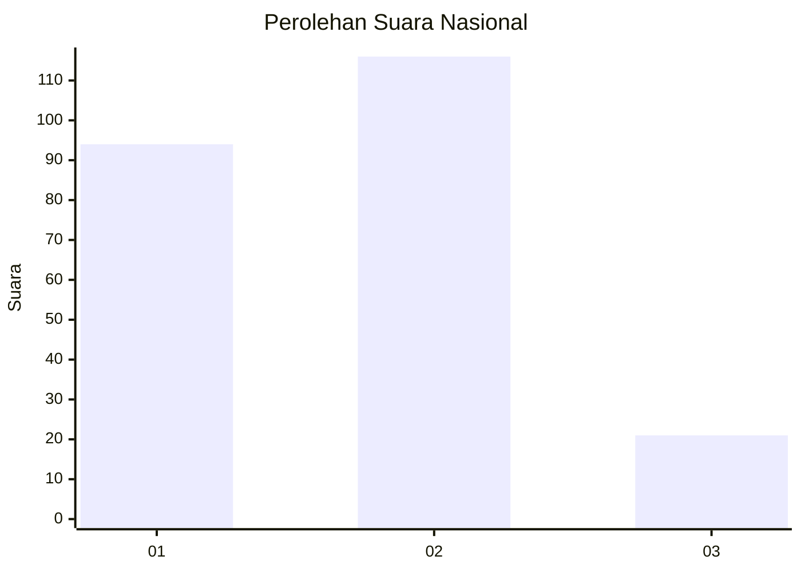
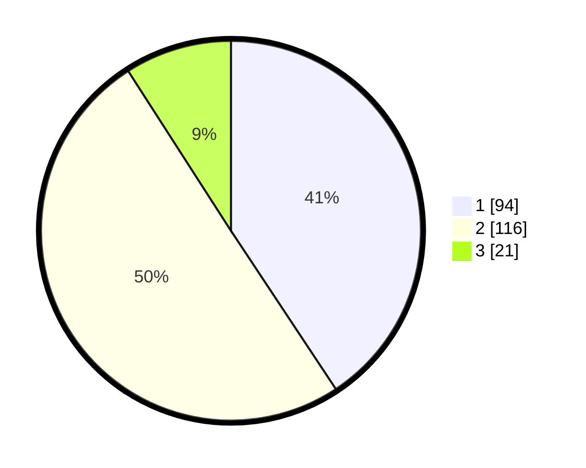

# Hasil

## Grafik

## Tabel

| No.    | Nama Paslon    | Suara | Suara (raw) | Persentase |
|:------ |:-------------- | -----:| -----------:| ----------:|
| 100025 | ANIES MUHAIMIN | 94    | [94][p-1]   | 40,69      |
| 100026 | PRABOWO GIBRAN | 116   | [116][p-2]  | 50,22      |
| 100027 | GANJAR MAHFUD  | 21    | [21][p-3]   | 9,09       |

[p-1]: https://github.com/gigit-pemilu/pemilu-2024/blob/main/pilpres/hitung-suara/sub/31-dki-jakarta/sub/72-jakarta-utara/sub/04-cilincing/sub/1006-rorotan/sub/142-tps/sub/paslon-1.txt
[p-2]: https://github.com/gigit-pemilu/pemilu-2024/blob/main/pilpres/hitung-suara/sub/31-dki-jakarta/sub/72-jakarta-utara/sub/04-cilincing/sub/1006-rorotan/sub/142-tps/sub/paslon-2.txt
[p-3]: https://github.com/gigit-pemilu/pemilu-2024/blob/main/pilpres/hitung-suara/sub/31-dki-jakarta/sub/72-jakarta-utara/sub/04-cilincing/sub/1006-rorotan/sub/142-tps/sub/paslon-3.txt

## Foto C Plano

https://sirekap-obj-formc.kpu.go.id/616c/pemilu/ppwp/31/72/04/10/06/3172041006142-20240214-222630--581fd6ab-ff7f-4d23-b3db-81915025f871.jpg

https://sirekap-obj-formc.kpu.go.id/616c/pemilu/ppwp/31/72/04/10/06/3172041006142-20240214-222729--e1260b31-092c-4d64-9af7-de75bf764b3c.jpg

https://sirekap-obj-formc.kpu.go.id/616c/pemilu/ppwp/31/72/04/10/06/3172041006142-20240214-223055--3d1e5d54-bda8-4755-bf35-d67ace3d2056.jpg

## Metadata

| Key        | Value               |
| ---------- | ------------------- |
| Time Stamp | 2024-02-21 19:00:00 |

