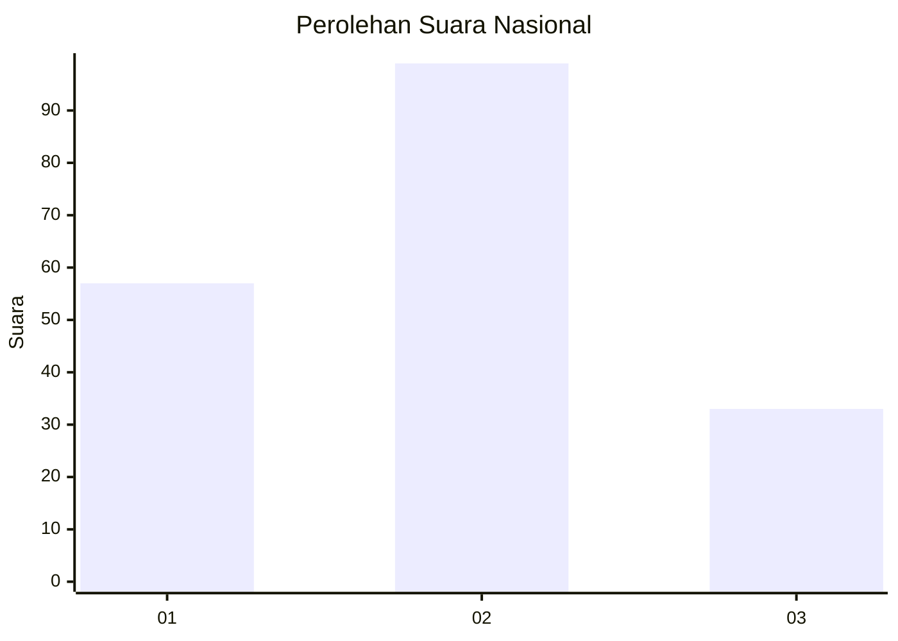
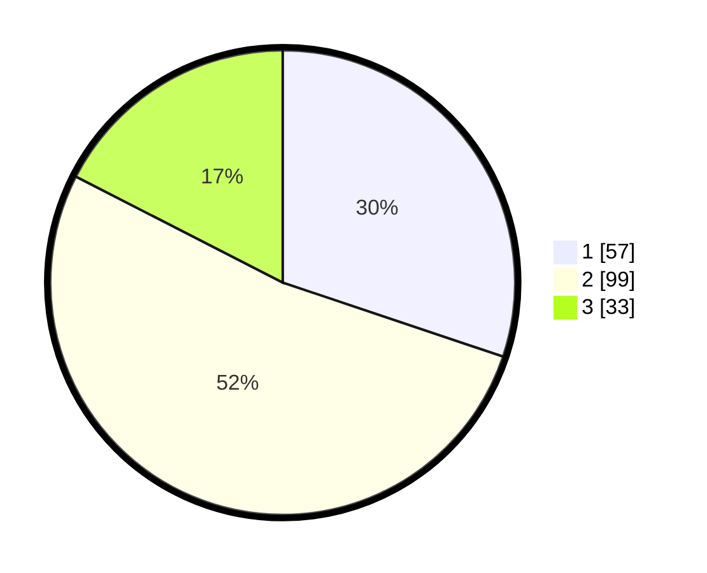

# Hasil

## Grafik

## Tabel

| No.    | Nama Paslon    | Suara | Suara (raw) | Persentase |
|:------ |:-------------- | -----:| -----------:| ----------:|
| 100025 | ANIES MUHAIMIN | 57    | [57][p-1]   | 30,16      |
| 100026 | PRABOWO GIBRAN | 99    | [99][p-2]   | 52,38      |
| 100027 | GANJAR MAHFUD  | 33    | [33][p-3]   | 17,46      |

[p-1]: https://github.com/gigit-pemilu/pemilu-2024/blob/main/pilpres/hitung-suara/sub/31-dki-jakarta/sub/72-jakarta-utara/sub/04-cilincing/sub/1007-semper-barat/sub/014-tps/sub/paslon-1.txt
[p-2]: https://github.com/gigit-pemilu/pemilu-2024/blob/main/pilpres/hitung-suara/sub/31-dki-jakarta/sub/72-jakarta-utara/sub/04-cilincing/sub/1007-semper-barat/sub/014-tps/sub/paslon-2.txt
[p-3]: https://github.com/gigit-pemilu/pemilu-2024/blob/main/pilpres/hitung-suara/sub/31-dki-jakarta/sub/72-jakarta-utara/sub/04-cilincing/sub/1007-semper-barat/sub/014-tps/sub/paslon-3.txt

## Foto C Plano

https://sirekap-obj-formc.kpu.go.id/7c59/pemilu/ppwp/31/72/04/10/07/3172041007014-20240214-220756--4ed80174-e9f4-42bc-b0a7-310bb81c03e6.jpg

https://sirekap-obj-formc.kpu.go.id/7c59/pemilu/ppwp/31/72/04/10/07/3172041007014-20240214-220841--25dd2f48-7213-4178-bc98-4d6ffd55a35a.jpg

https://sirekap-obj-formc.kpu.go.id/7c59/pemilu/ppwp/31/72/04/10/07/3172041007014-20240214-220815--20f4ac31-8221-429e-ac66-93891ead6b03.jpg

## Metadata

| Key        | Value               |
| ---------- | ------------------- |
| Time Stamp | 2024-02-21 20:00:00 |

