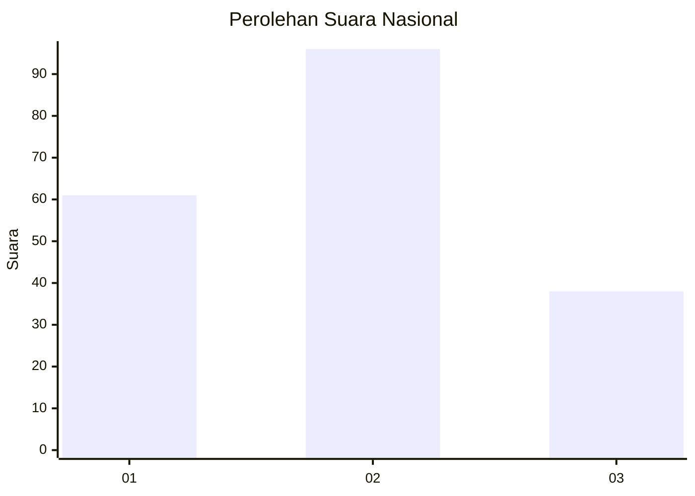
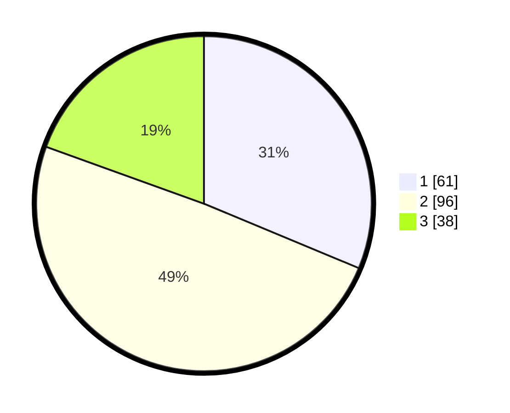

# Hasil

## Grafik

## Tabel

| No.    | Nama Paslon    | Suara | Suara (raw) | Persentase |
|:------ |:-------------- | -----:| -----------:| ----------:|
| 100025 | ANIES MUHAIMIN | 61    | [61][p-1]   | 31,28      |
| 100026 | PRABOWO GIBRAN | 96    | [96][p-2]   | 49,23      |
| 100027 | GANJAR MAHFUD  | 38    | [38][p-3]   | 19,49      |

[p-1]: https://github.com/gigit-pemilu/pemilu-2024/blob/main/pilpres/hitung-suara/sub/31-dki-jakarta/sub/72-jakarta-utara/sub/04-cilincing/sub/1007-semper-barat/sub/019-tps/sub/paslon-1.txt
[p-2]: https://github.com/gigit-pemilu/pemilu-2024/blob/main/pilpres/hitung-suara/sub/31-dki-jakarta/sub/72-jakarta-utara/sub/04-cilincing/sub/1007-semper-barat/sub/019-tps/sub/paslon-2.txt
[p-3]: https://github.com/gigit-pemilu/pemilu-2024/blob/main/pilpres/hitung-suara/sub/31-dki-jakarta/sub/72-jakarta-utara/sub/04-cilincing/sub/1007-semper-barat/sub/019-tps/sub/paslon-3.txt

## Foto C Plano

https://sirekap-obj-formc.kpu.go.id/089a/pemilu/ppwp/31/72/04/10/07/3172041007019-20240214-224217--6f5c7715-d46f-40a1-ad63-9bb681af98a0.jpg

https://sirekap-obj-formc.kpu.go.id/089a/pemilu/ppwp/31/72/04/10/07/3172041007019-20240214-222744--5c9288aa-3d47-4c90-8120-91a9ef6224b0.jpg

https://sirekap-obj-formc.kpu.go.id/089a/pemilu/ppwp/31/72/04/10/07/3172041007019-20240214-224410--bf566972-a011-4bcc-a554-4d16ed9574ea.jpg

## Metadata

| Key        | Value               |
| ---------- | ------------------- |
| Time Stamp | 2024-02-21 20:00:00 |

