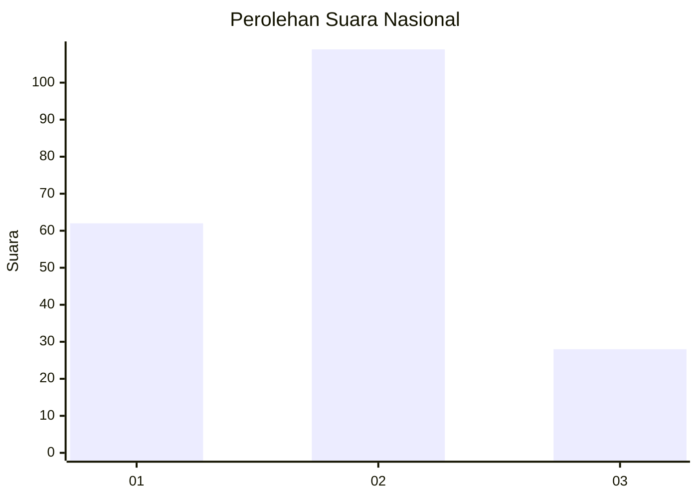
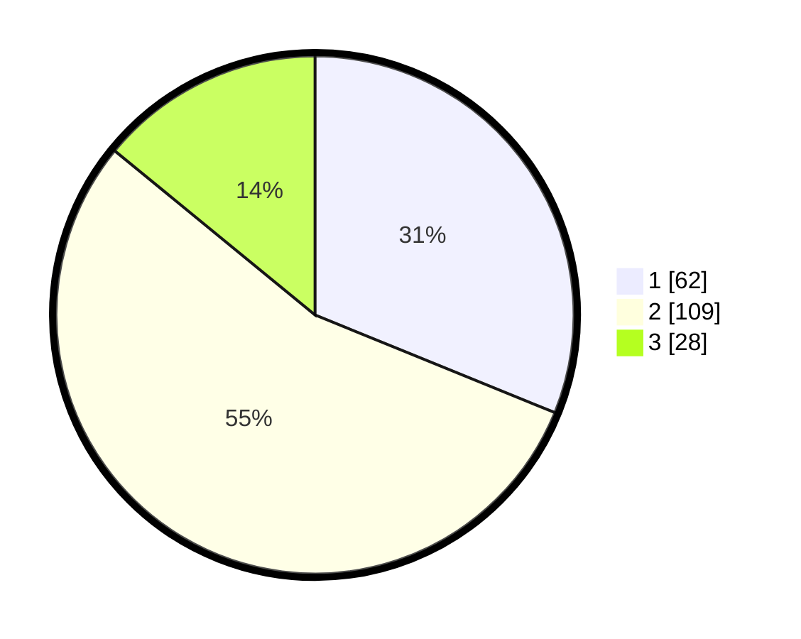

# Hasil

## Grafik

## Tabel

| No.    | Nama Paslon    | Suara | Suara (raw) | Persentase |
|:------ |:-------------- | -----:| -----------:| ----------:|
| 100025 | ANIES MUHAIMIN | 62    | [62][p-1]   | 31,16      |
| 100026 | PRABOWO GIBRAN | 109   | [109][p-2]  | 54,77      |
| 100027 | GANJAR MAHFUD  | 28    | [28][p-3]   | 14,07      |

[p-1]: https://github.com/gigit-pemilu/pemilu-2024/blob/main/pilpres/hitung-suara/sub/31-dki-jakarta/sub/72-jakarta-utara/sub/04-cilincing/sub/1007-semper-barat/sub/028-tps/sub/paslon-1.txt
[p-2]: https://github.com/gigit-pemilu/pemilu-2024/blob/main/pilpres/hitung-suara/sub/31-dki-jakarta/sub/72-jakarta-utara/sub/04-cilincing/sub/1007-semper-barat/sub/028-tps/sub/paslon-2.txt
[p-3]: https://github.com/gigit-pemilu/pemilu-2024/blob/main/pilpres/hitung-suara/sub/31-dki-jakarta/sub/72-jakarta-utara/sub/04-cilincing/sub/1007-semper-barat/sub/028-tps/sub/paslon-3.txt

## Foto C Plano

https://sirekap-obj-formc.kpu.go.id/c9ec/pemilu/ppwp/31/72/04/10/07/3172041007028-20240214-210311--60bd40ba-f530-4112-b2a6-125053da59e0.jpg

https://sirekap-obj-formc.kpu.go.id/c9ec/pemilu/ppwp/31/72/04/10/07/3172041007028-20240214-210515--b7c8b6d8-ea94-423d-9e37-e802ea6e4dd5.jpg

https://sirekap-obj-formc.kpu.go.id/c9ec/pemilu/ppwp/31/72/04/10/07/3172041007028-20240214-210641--1b625fe4-7707-44f5-b045-be58795b6324.jpg

## Metadata

| Key        | Value               |
| ---------- | ------------------- |
| Time Stamp | 2024-02-20 22:00:00 |

