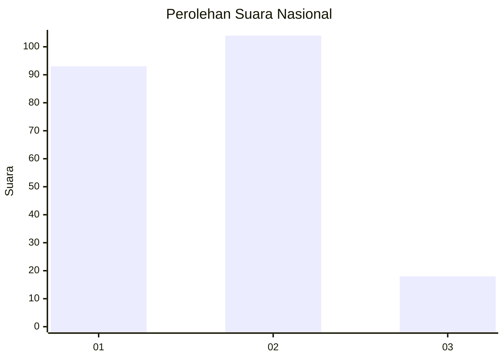
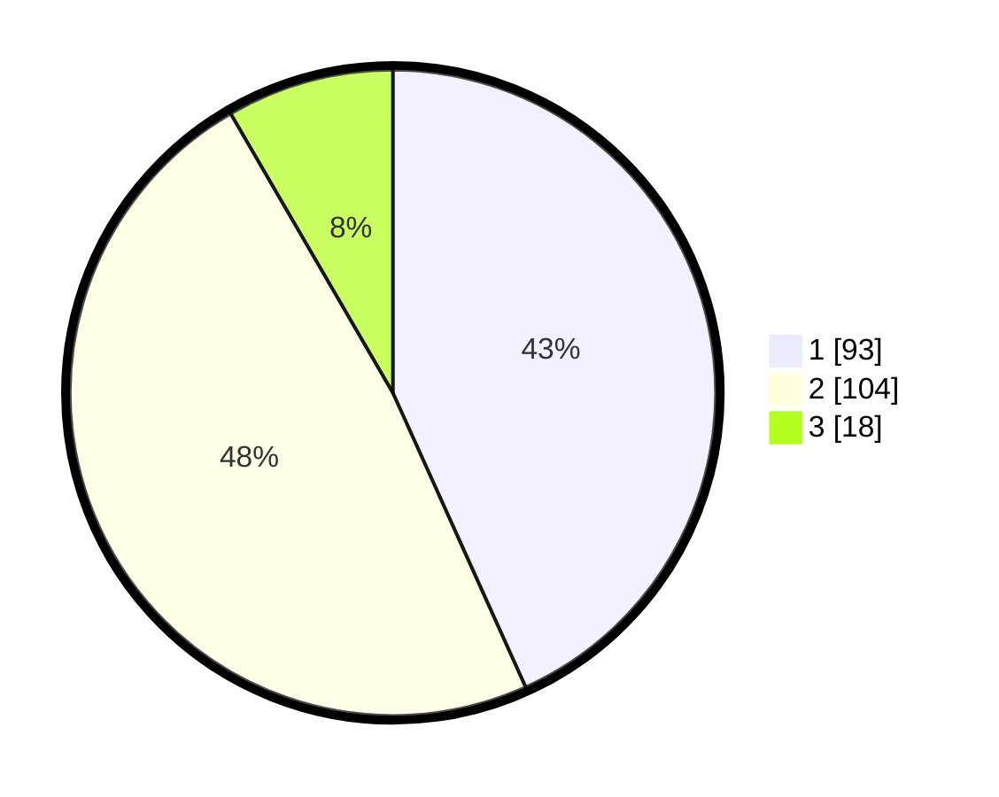

# Hasil

## Grafik

## Tabel

| No.    | Nama Paslon    | Suara | Suara (raw) | Persentase |
|:------ |:-------------- | -----:| -----------:| ----------:|
| 100025 | ANIES MUHAIMIN | 93    | [93][p-1]   | 43,26      |
| 100026 | PRABOWO GIBRAN | 104   | [104][p-2]  | 48,37      |
| 100027 | GANJAR MAHFUD  | 18    | [18][p-3]   | 8,37       |

[p-1]: https://github.com/gigit-pemilu/pemilu-2024/blob/main/pilpres/hitung-suara/sub/31-dki-jakarta/sub/72-jakarta-utara/sub/04-cilincing/sub/1007-semper-barat/sub/063-tps/sub/paslon-1.txt
[p-2]: https://github.com/gigit-pemilu/pemilu-2024/blob/main/pilpres/hitung-suara/sub/31-dki-jakarta/sub/72-jakarta-utara/sub/04-cilincing/sub/1007-semper-barat/sub/063-tps/sub/paslon-2.txt
[p-3]: https://github.com/gigit-pemilu/pemilu-2024/blob/main/pilpres/hitung-suara/sub/31-dki-jakarta/sub/72-jakarta-utara/sub/04-cilincing/sub/1007-semper-barat/sub/063-tps/sub/paslon-3.txt

## Foto C Plano

https://sirekap-obj-formc.kpu.go.id/5487/pemilu/ppwp/31/72/04/10/07/3172041007063-20240214-205806--06fd5752-fd70-411a-a4c4-984a84e5d302.jpg

https://sirekap-obj-formc.kpu.go.id/5487/pemilu/ppwp/31/72/04/10/07/3172041007063-20240214-210010--d73e850b-d3d0-4a02-ac77-8989200607df.jpg

https://sirekap-obj-formc.kpu.go.id/5487/pemilu/ppwp/31/72/04/10/07/3172041007063-20240214-210155--99a5c2f5-9ebb-407f-b3a8-da29d493493f.jpg

## Metadata

| Key        | Value               |
| ---------- | ------------------- |
| Time Stamp | 2024-02-21 17:00:00 |

