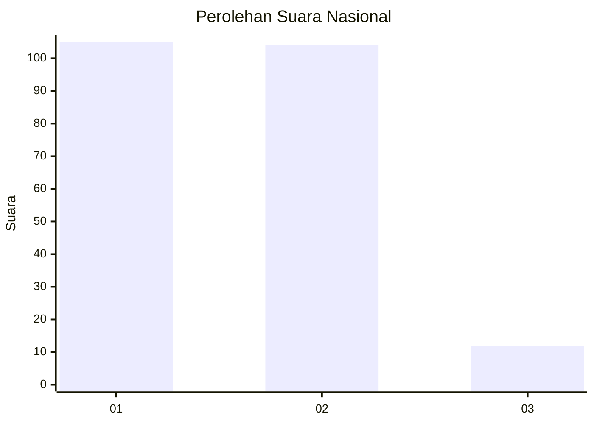
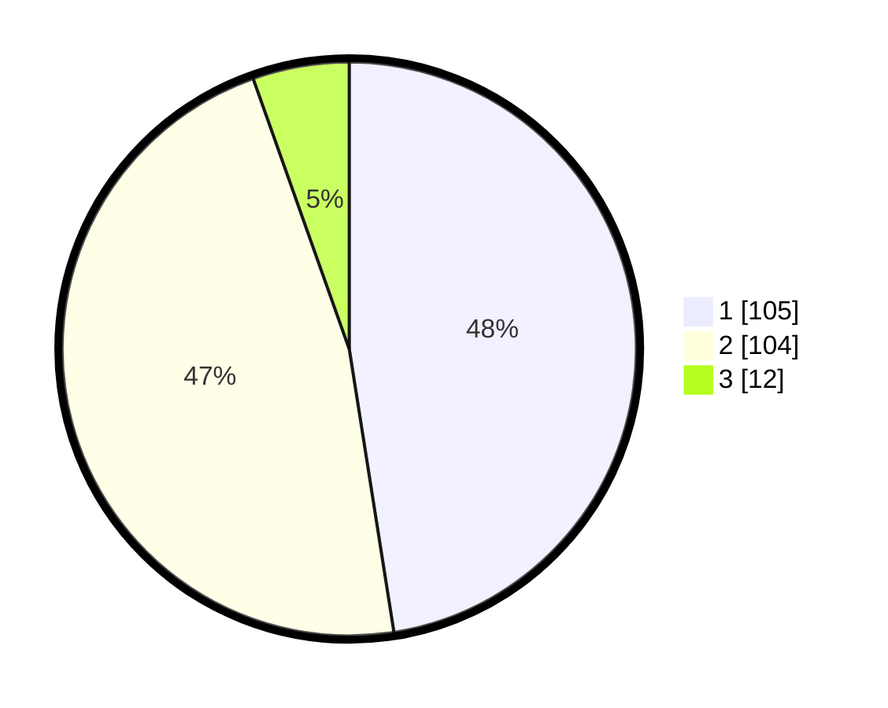

# Hasil

## Grafik

## Tabel

| No.    | Nama Paslon    | Suara | Suara (raw) | Persentase |
|:------ |:-------------- | -----:| -----------:| ----------:|
| 100025 | ANIES MUHAIMIN | 105   | [105][p-1]  | 47,51      |
| 100026 | PRABOWO GIBRAN | 104   | [104][p-2]  | 47,06      |
| 100027 | GANJAR MAHFUD  | 12    | [12][p-3]   | 5,43       |

[p-1]: https://github.com/gigit-pemilu/pemilu-2024/blob/main/pilpres/hitung-suara/sub/31-dki-jakarta/sub/72-jakarta-utara/sub/04-cilincing/sub/1007-semper-barat/sub/066-tps/sub/paslon-1.txt
[p-2]: https://github.com/gigit-pemilu/pemilu-2024/blob/main/pilpres/hitung-suara/sub/31-dki-jakarta/sub/72-jakarta-utara/sub/04-cilincing/sub/1007-semper-barat/sub/066-tps/sub/paslon-2.txt
[p-3]: https://github.com/gigit-pemilu/pemilu-2024/blob/main/pilpres/hitung-suara/sub/31-dki-jakarta/sub/72-jakarta-utara/sub/04-cilincing/sub/1007-semper-barat/sub/066-tps/sub/paslon-3.txt

## Foto C Plano

https://sirekap-obj-formc.kpu.go.id/e4e4/pemilu/ppwp/31/72/04/10/07/3172041007066-20240214-204900--e282563a-5024-4cd7-b585-ea608d140df6.jpg

https://sirekap-obj-formc.kpu.go.id/e4e4/pemilu/ppwp/31/72/04/10/07/3172041007066-20240214-205042--9d89b436-da57-4f6d-a78e-1aa15f083795.jpg

https://sirekap-obj-formc.kpu.go.id/e4e4/pemilu/ppwp/31/72/04/10/07/3172041007066-20240215-175155--c58398b4-b6e8-40f3-ba90-0bba6aab73c8.jpg

## Metadata

| Key        | Value               |
| ---------- | ------------------- |
| Time Stamp | 2024-02-21 17:00:00 |

