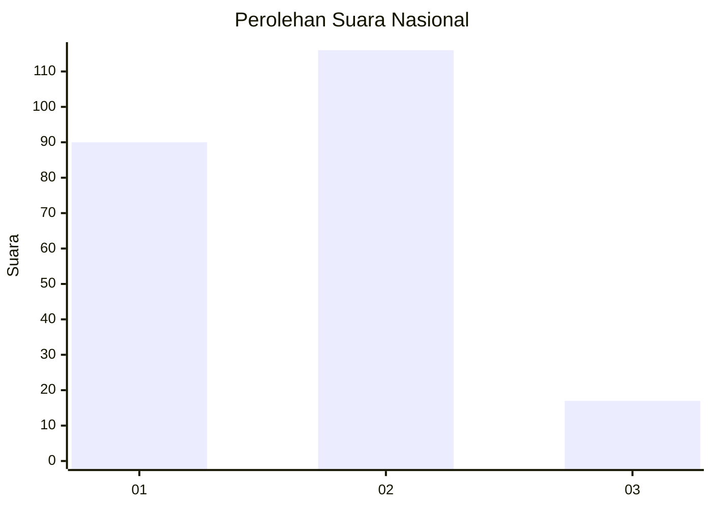

# Hasil

## Grafik

## Tabel

| No.    | Nama Paslon    | Suara | Suara (raw) | Persentase |
|:------ |:-------------- | -----:| -----------:| ----------:|
| 100025 | ANIES MUHAIMIN | 90    | [90][p-1]   | 40,36      |
| 100026 | PRABOWO GIBRAN | 116   | [116][p-2]  | 52,02      |
| 100027 | GANJAR MAHFUD  | 17    | [17][p-3]   | 7,62       |

[p-1]: https://github.com/gigit-pemilu/pemilu-2024/blob/main/pilpres/hitung-suara/sub/31-dki-jakarta/sub/72-jakarta-utara/sub/04-cilincing/sub/1007-semper-barat/sub/069-tps/sub/paslon-1.txt
[p-2]: https://github.com/gigit-pemilu/pemilu-2024/blob/main/pilpres/hitung-suara/sub/31-dki-jakarta/sub/72-jakarta-utara/sub/04-cilincing/sub/1007-semper-barat/sub/069-tps/sub/paslon-2.txt
[p-3]: https://github.com/gigit-pemilu/pemilu-2024/blob/main/pilpres/hitung-suara/sub/31-dki-jakarta/sub/72-jakarta-utara/sub/04-cilincing/sub/1007-semper-barat/sub/069-tps/sub/paslon-3.txt

## Foto C Plano

https://sirekap-obj-formc.kpu.go.id/8303/pemilu/ppwp/31/72/04/10/07/3172041007069-20240214-210145--22636739-8501-4591-8344-a5226353ef8a.jpg

https://sirekap-obj-formc.kpu.go.id/8303/pemilu/ppwp/31/72/04/10/07/3172041007069-20240214-210156--7112453d-ef42-4f5c-82fe-db44856c05bf.jpg

https://sirekap-obj-formc.kpu.go.id/8303/pemilu/ppwp/31/72/04/10/07/3172041007069-20240214-210204--9357b6d3-fcc5-41d1-9523-0e7b3b7cfd1d.jpg

## Metadata

| Key        | Value               |
| ---------- | ------------------- |
| Time Stamp | 2024-02-21 20:00:00 |

