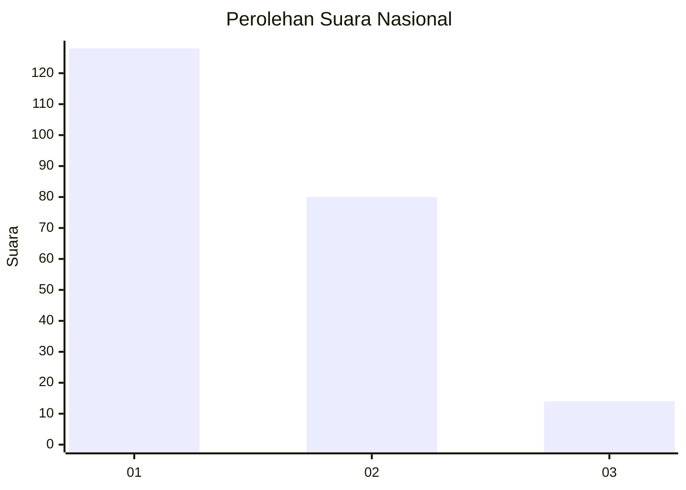
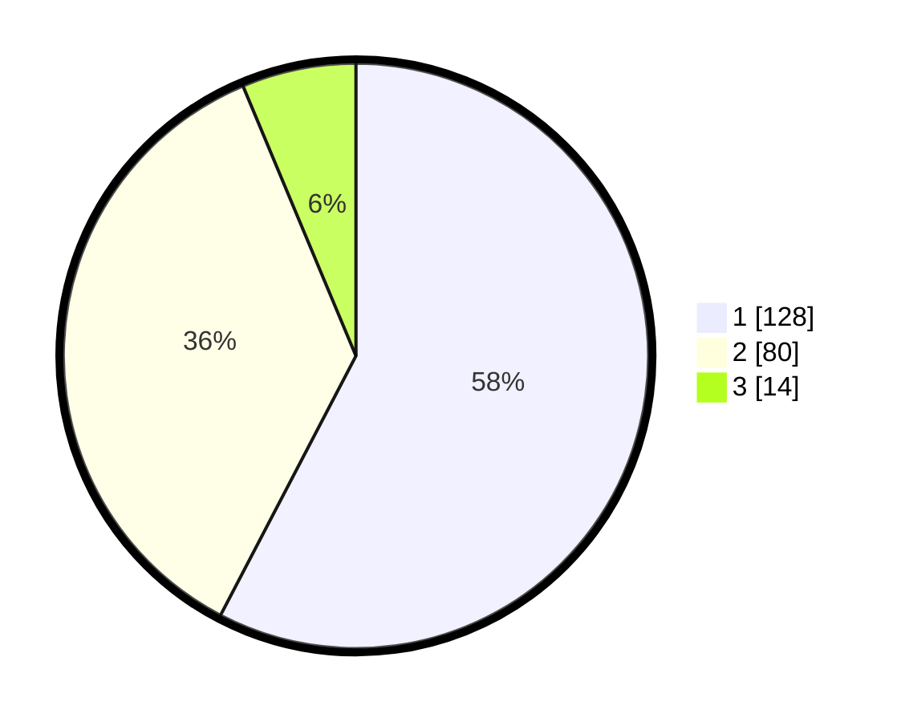

# Hasil

## Grafik

## Tabel

| No.    | Nama Paslon    | Suara | Suara (raw) | Persentase |
|:------ |:-------------- | -----:| -----------:| ----------:|
| 100025 | ANIES MUHAIMIN | 128   | [128][p-1]  | 57,66      |
| 100026 | PRABOWO GIBRAN | 80    | [80][p-2]   | 36,04      |
| 100027 | GANJAR MAHFUD  | 14    | [14][p-3]   | 6,31       |

[p-1]: https://github.com/gigit-pemilu/pemilu-2024/blob/main/pilpres/hitung-suara/sub/31-dki-jakarta/sub/72-jakarta-utara/sub/04-cilincing/sub/1007-semper-barat/sub/086-tps/sub/paslon-1.txt
[p-2]: https://github.com/gigit-pemilu/pemilu-2024/blob/main/pilpres/hitung-suara/sub/31-dki-jakarta/sub/72-jakarta-utara/sub/04-cilincing/sub/1007-semper-barat/sub/086-tps/sub/paslon-2.txt
[p-3]: https://github.com/gigit-pemilu/pemilu-2024/blob/main/pilpres/hitung-suara/sub/31-dki-jakarta/sub/72-jakarta-utara/sub/04-cilincing/sub/1007-semper-barat/sub/086-tps/sub/paslon-3.txt

## Foto C Plano

https://sirekap-obj-formc.kpu.go.id/8d88/pemilu/ppwp/31/72/04/10/07/3172041007086-20240215-083148--0d257799-2452-489e-9493-dab077594467.jpg

https://sirekap-obj-formc.kpu.go.id/8d88/pemilu/ppwp/31/72/04/10/07/3172041007086-20240218-183201--8896bda7-136c-412d-a041-b122f0a15e6c.jpg

https://sirekap-obj-formc.kpu.go.id/8d88/pemilu/ppwp/31/72/04/10/07/3172041007086-20240218-183520--fb822e34-f41a-4adb-a584-bfdc7b490a06.jpg

## Metadata

| Key        | Value               |
| ---------- | ------------------- |
| Time Stamp | 2024-02-21 17:00:00 |

