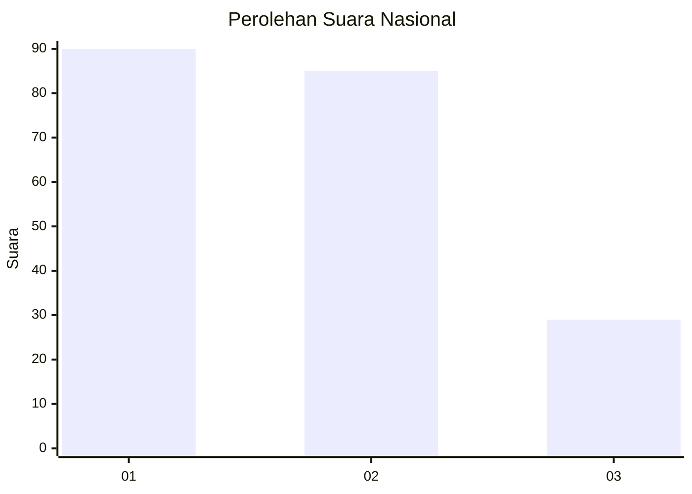
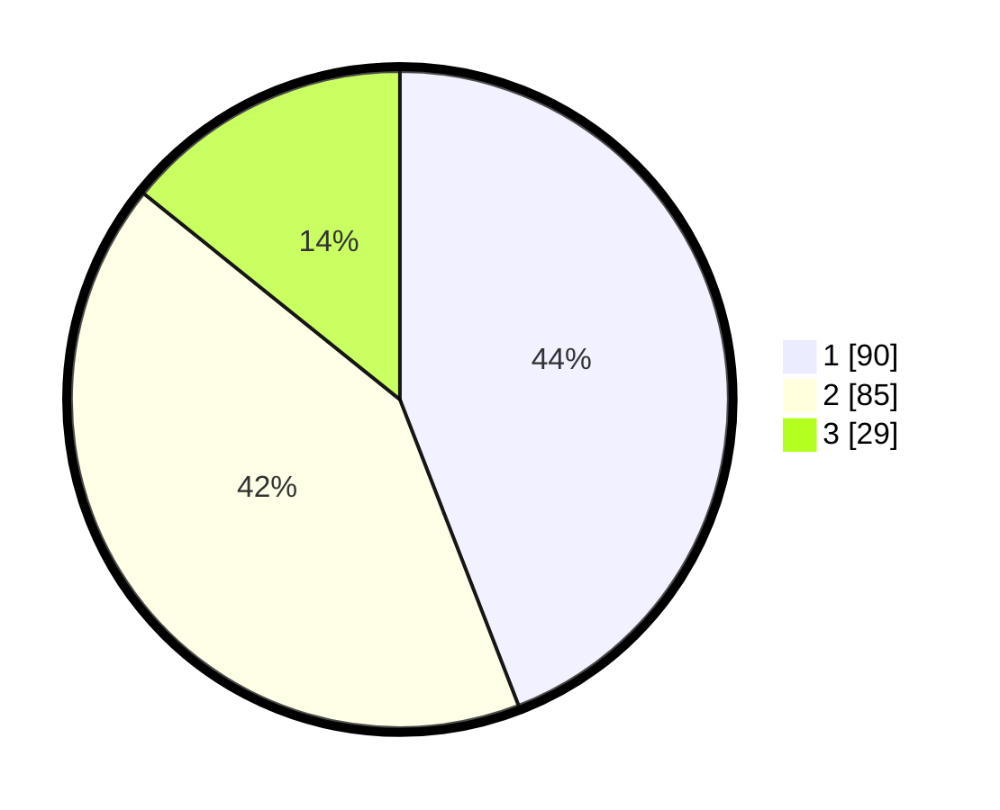

# Hasil

## Grafik

## Tabel

| No.    | Nama Paslon    | Suara | Suara (raw) | Persentase |
|:------ |:-------------- | -----:| -----------:| ----------:|
| 100025 | ANIES MUHAIMIN | 90    | [90][p-1]   | 44,12      |
| 100026 | PRABOWO GIBRAN | 85    | [85][p-2]   | 41,67      |
| 100027 | GANJAR MAHFUD  | 29    | [29][p-3]   | 14,22      |

[p-1]: https://github.com/gigit-pemilu/pemilu-2024/blob/main/pilpres/hitung-suara/sub/31-dki-jakarta/sub/72-jakarta-utara/sub/04-cilincing/sub/1007-semper-barat/sub/120-tps/sub/paslon-1.txt
[p-2]: https://github.com/gigit-pemilu/pemilu-2024/blob/main/pilpres/hitung-suara/sub/31-dki-jakarta/sub/72-jakarta-utara/sub/04-cilincing/sub/1007-semper-barat/sub/120-tps/sub/paslon-2.txt
[p-3]: https://github.com/gigit-pemilu/pemilu-2024/blob/main/pilpres/hitung-suara/sub/31-dki-jakarta/sub/72-jakarta-utara/sub/04-cilincing/sub/1007-semper-barat/sub/120-tps/sub/paslon-3.txt

## Foto C Plano

https://sirekap-obj-formc.kpu.go.id/4f46/pemilu/ppwp/31/72/04/10/07/3172041007120-20240215-004915--e1dde702-4894-40ed-8c9c-dc0850c5ed01.jpg

https://sirekap-obj-formc.kpu.go.id/4f46/pemilu/ppwp/31/72/04/10/07/3172041007120-20240215-005015--7ce36436-1b7d-4df2-bfd1-6f0a8915e8c8.jpg

https://sirekap-obj-formc.kpu.go.id/4f46/pemilu/ppwp/31/72/04/10/07/3172041007120-20240215-005107--159f9801-1af0-4f85-b3ef-dc85d40ff46d.jpg

## Metadata

| Key        | Value               |
| ---------- | ------------------- |
| Time Stamp | 2024-02-21 17:00:00 |

