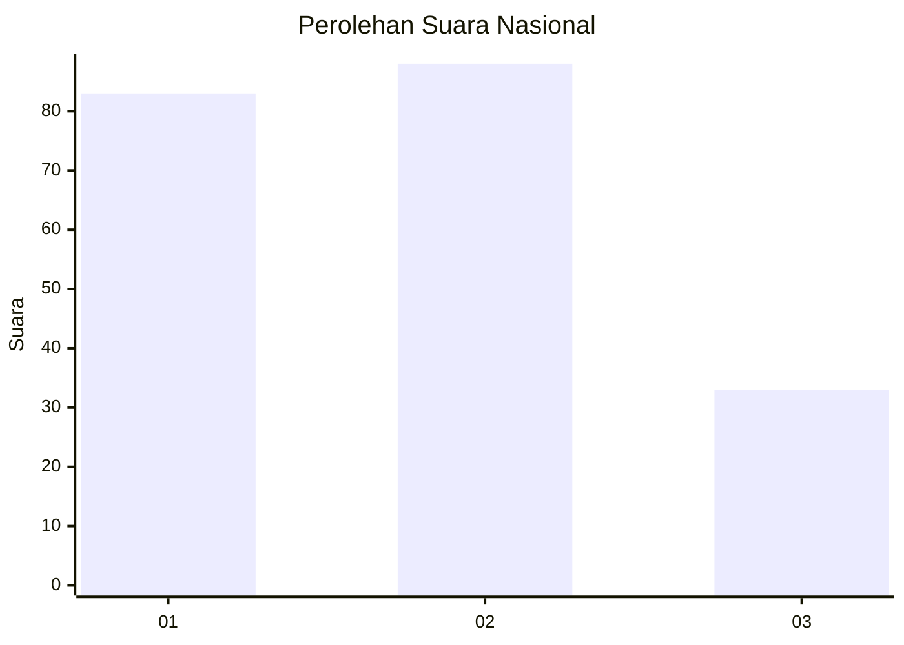
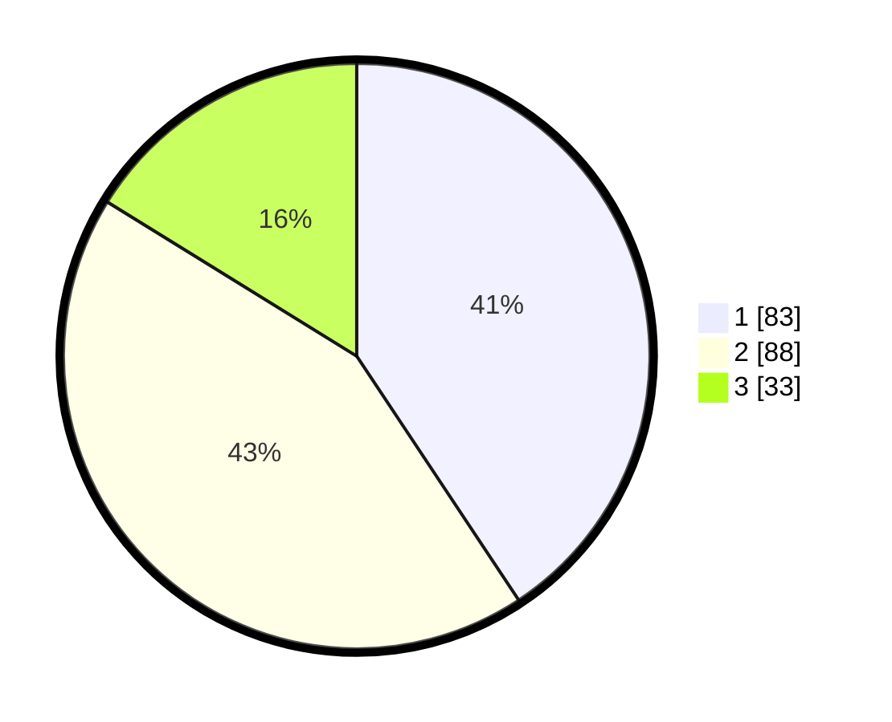

# Hasil

## Grafik

## Tabel

| No.    | Nama Paslon    | Suara | Suara (raw) | Persentase |
|:------ |:-------------- | -----:| -----------:| ----------:|
| 100025 | ANIES MUHAIMIN | 83    | [83][p-1]   | 40,69      |
| 100026 | PRABOWO GIBRAN | 88    | [88][p-2]   | 43,14      |
| 100027 | GANJAR MAHFUD  | 33    | [33][p-3]   | 16,18      |

[p-1]: https://github.com/gigit-pemilu/pemilu-2024/blob/main/pilpres/hitung-suara/sub/31-dki-jakarta/sub/72-jakarta-utara/sub/04-cilincing/sub/1007-semper-barat/sub/126-tps/sub/paslon-1.txt
[p-2]: https://github.com/gigit-pemilu/pemilu-2024/blob/main/pilpres/hitung-suara/sub/31-dki-jakarta/sub/72-jakarta-utara/sub/04-cilincing/sub/1007-semper-barat/sub/126-tps/sub/paslon-2.txt
[p-3]: https://github.com/gigit-pemilu/pemilu-2024/blob/main/pilpres/hitung-suara/sub/31-dki-jakarta/sub/72-jakarta-utara/sub/04-cilincing/sub/1007-semper-barat/sub/126-tps/sub/paslon-3.txt

## Foto C Plano

https://sirekap-obj-formc.kpu.go.id/8d48/pemilu/ppwp/31/72/04/10/07/3172041007126-20240214-203144--ea7fbf33-3f18-4839-9128-89426d9a4e26.jpg

https://sirekap-obj-formc.kpu.go.id/8d48/pemilu/ppwp/31/72/04/10/07/3172041007126-20240214-203214--5606e309-ee5a-4609-832f-47ae5de8f1e3.jpg

https://sirekap-obj-formc.kpu.go.id/8d48/pemilu/ppwp/31/72/04/10/07/3172041007126-20240214-203236--1433df78-9038-425a-a698-6d032bcdcf88.jpg

## Metadata

| Key        | Value               |
| ---------- | ------------------- |
| Time Stamp | 2024-02-21 20:00:00 |

