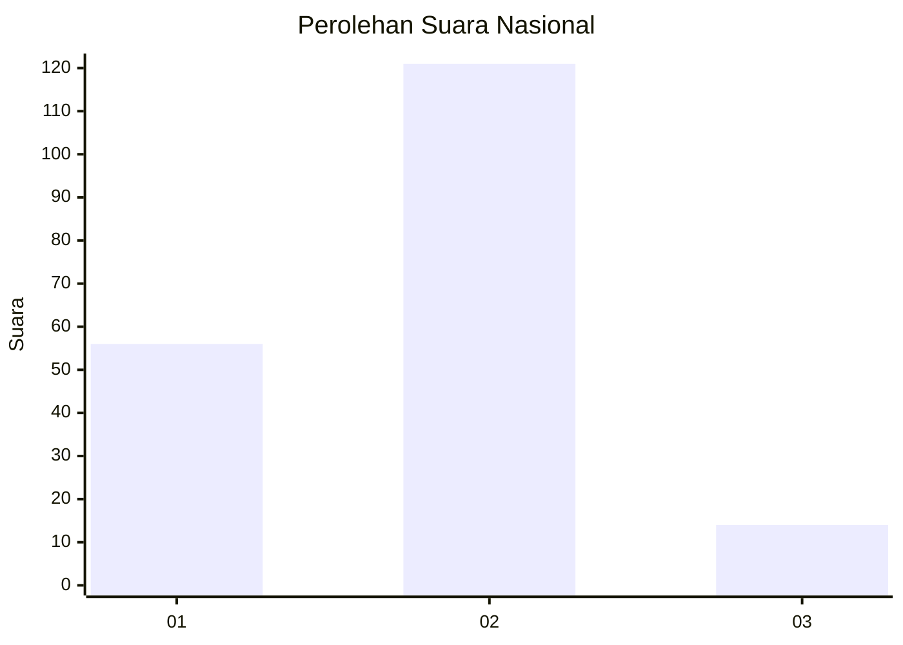
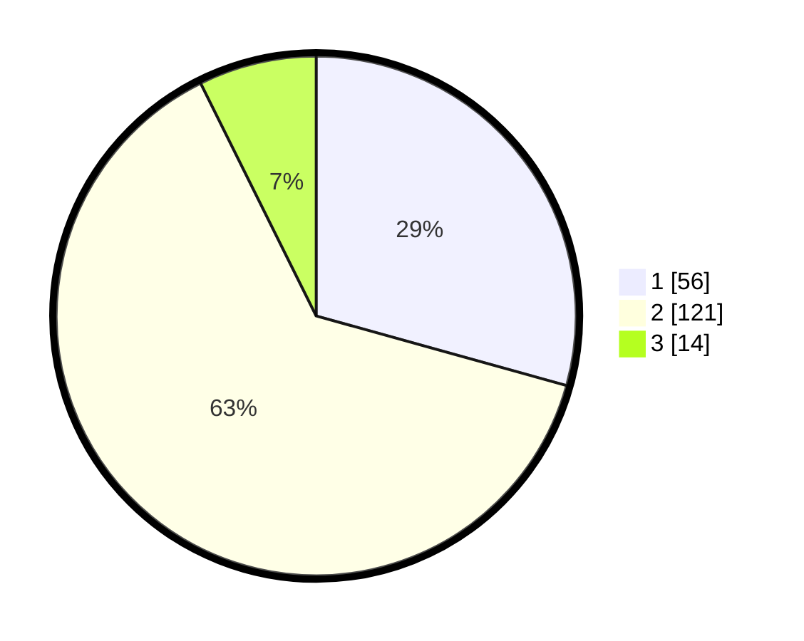

# Hasil

## Grafik

## Tabel

| No.    | Nama Paslon    | Suara | Suara (raw) | Persentase |
|:------ |:-------------- | -----:| -----------:| ----------:|
| 100025 | ANIES MUHAIMIN | 56    | [56][p-1]   | 29,32      |
| 100026 | PRABOWO GIBRAN | 121   | [121][p-2]  | 63,35      |
| 100027 | GANJAR MAHFUD  | 14    | [14][p-3]   | 7,33       |

[p-1]: https://github.com/gigit-pemilu/pemilu-2024/blob/main/pilpres/hitung-suara/sub/31-dki-jakarta/sub/72-jakarta-utara/sub/04-cilincing/sub/1007-semper-barat/sub/140-tps/sub/paslon-1.txt
[p-2]: https://github.com/gigit-pemilu/pemilu-2024/blob/main/pilpres/hitung-suara/sub/31-dki-jakarta/sub/72-jakarta-utara/sub/04-cilincing/sub/1007-semper-barat/sub/140-tps/sub/paslon-2.txt
[p-3]: https://github.com/gigit-pemilu/pemilu-2024/blob/main/pilpres/hitung-suara/sub/31-dki-jakarta/sub/72-jakarta-utara/sub/04-cilincing/sub/1007-semper-barat/sub/140-tps/sub/paslon-3.txt

## Foto C Plano

https://sirekap-obj-formc.kpu.go.id/5f72/pemilu/ppwp/31/72/04/10/07/3172041007140-20240214-212848--06d8704a-31f9-4475-835c-6621794f8a9b.jpg

https://sirekap-obj-formc.kpu.go.id/5f72/pemilu/ppwp/31/72/04/10/07/3172041007140-20240214-213151--781f5382-c59a-4add-9f03-4693e80cfe12.jpg

https://sirekap-obj-formc.kpu.go.id/5f72/pemilu/ppwp/31/72/04/10/07/3172041007140-20240215-004819--ac9aeabe-ae60-4241-a8f4-b68a57329736.jpg

## Metadata

| Key        | Value               |
| ---------- | ------------------- |
| Time Stamp | 2024-02-21 17:00:00 |

