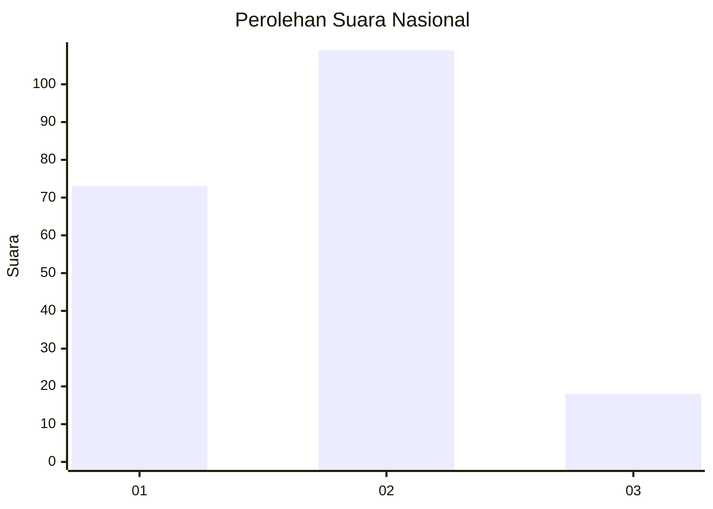

# Hasil

## Grafik

## Tabel

| No.    | Nama Paslon    | Suara | Suara (raw) | Persentase |
|:------ |:-------------- | -----:| -----------:| ----------:|
| 100025 | ANIES MUHAIMIN | 73    | [73][p-1]   | 36,50      |
| 100026 | PRABOWO GIBRAN | 109   | [109][p-2]  | 54,50      |
| 100027 | GANJAR MAHFUD  | 18    | [18][p-3]   | 9,00       |

[p-1]: https://github.com/gigit-pemilu/pemilu-2024/blob/main/pilpres/hitung-suara/sub/31-dki-jakarta/sub/72-jakarta-utara/sub/04-cilincing/sub/1007-semper-barat/sub/146-tps/sub/paslon-1.txt
[p-2]: https://github.com/gigit-pemilu/pemilu-2024/blob/main/pilpres/hitung-suara/sub/31-dki-jakarta/sub/72-jakarta-utara/sub/04-cilincing/sub/1007-semper-barat/sub/146-tps/sub/paslon-2.txt
[p-3]: https://github.com/gigit-pemilu/pemilu-2024/blob/main/pilpres/hitung-suara/sub/31-dki-jakarta/sub/72-jakarta-utara/sub/04-cilincing/sub/1007-semper-barat/sub/146-tps/sub/paslon-3.txt

## Foto C Plano

https://sirekap-obj-formc.kpu.go.id/c43c/pemilu/ppwp/31/72/04/10/07/3172041007146-20240215-001227--da827c85-0735-4264-9acf-19728c2ea02c.jpg

https://sirekap-obj-formc.kpu.go.id/c43c/pemilu/ppwp/31/72/04/10/07/3172041007146-20240215-001505--7150ab13-8160-466e-b6f9-aee24b77745f.jpg

https://sirekap-obj-formc.kpu.go.id/c43c/pemilu/ppwp/31/72/04/10/07/3172041007146-20240215-001630--3139333e-8e46-466e-9507-133efa8546df.jpg

## Metadata

| Key        | Value               |
| ---------- | ------------------- |
| Time Stamp | 2024-02-21 17:00:00 |

