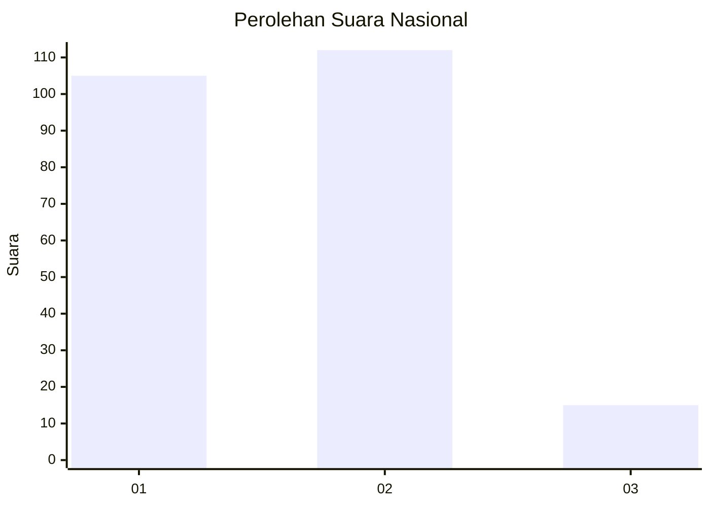
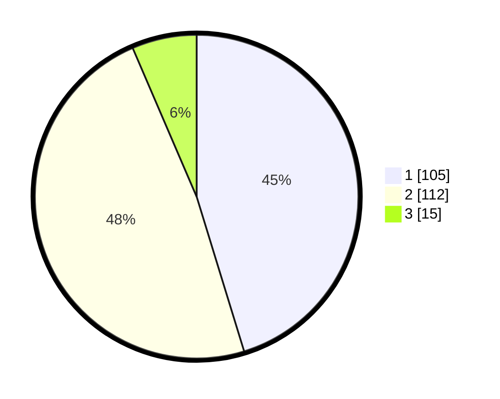

# Hasil

## Grafik

## Tabel

| No.    | Nama Paslon    | Suara | Suara (raw) | Persentase |
|:------ |:-------------- | -----:| -----------:| ----------:|
| 100025 | ANIES MUHAIMIN | 105   | [105][p-1]  | 45,26      |
| 100026 | PRABOWO GIBRAN | 112   | [112][p-2]  | 48,28      |
| 100027 | GANJAR MAHFUD  | 15    | [15][p-3]   | 6,47       |

[p-1]: https://github.com/gigit-pemilu/pemilu-2024/blob/main/pilpres/hitung-suara/sub/31-dki-jakarta/sub/72-jakarta-utara/sub/04-cilincing/sub/1007-semper-barat/sub/147-tps/sub/paslon-1.txt
[p-2]: https://github.com/gigit-pemilu/pemilu-2024/blob/main/pilpres/hitung-suara/sub/31-dki-jakarta/sub/72-jakarta-utara/sub/04-cilincing/sub/1007-semper-barat/sub/147-tps/sub/paslon-2.txt
[p-3]: https://github.com/gigit-pemilu/pemilu-2024/blob/main/pilpres/hitung-suara/sub/31-dki-jakarta/sub/72-jakarta-utara/sub/04-cilincing/sub/1007-semper-barat/sub/147-tps/sub/paslon-3.txt

## Foto C Plano

https://sirekap-obj-formc.kpu.go.id/466f/pemilu/ppwp/31/72/04/10/07/3172041007147-20240214-231959--bdc60952-5135-4d47-bb87-8d9534916622.jpg

https://sirekap-obj-formc.kpu.go.id/466f/pemilu/ppwp/31/72/04/10/07/3172041007147-20240214-235605--75120381-d0d9-4fbf-a705-2925544f3645.jpg

https://sirekap-obj-formc.kpu.go.id/466f/pemilu/ppwp/31/72/04/10/07/3172041007147-20240214-235732--be934cd8-0f42-4857-aca5-70981e560265.jpg

## Metadata

| Key        | Value               |
| ---------- | ------------------- |
| Time Stamp | 2024-02-21 17:00:00 |

