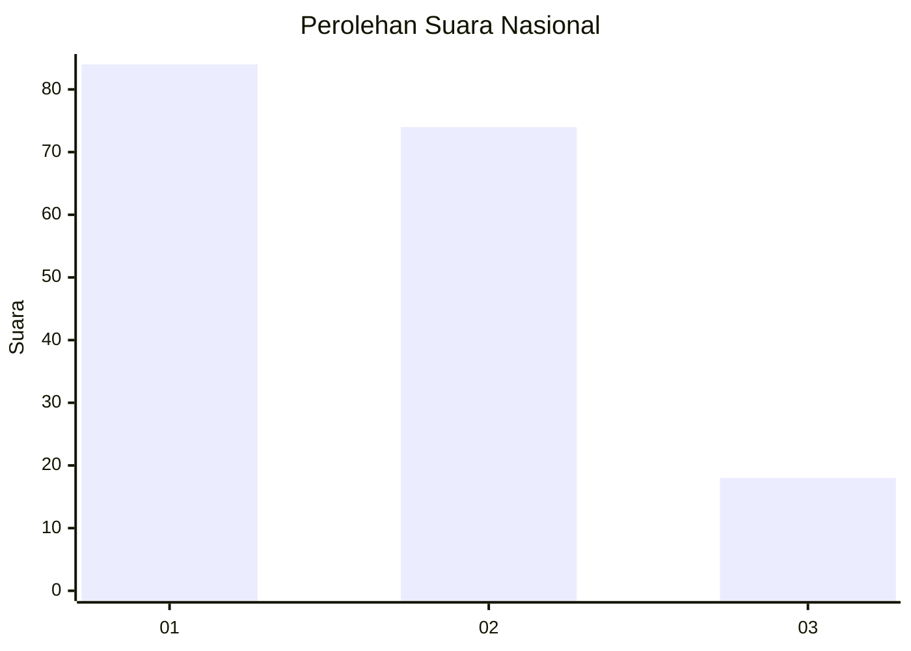
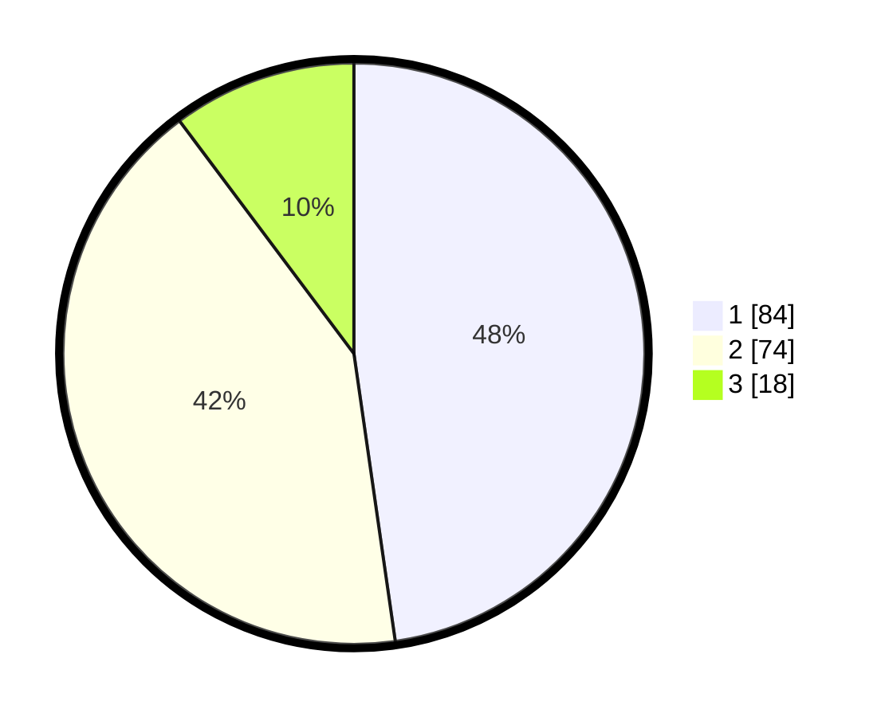

# Hasil

## Grafik

## Tabel

| No.    | Nama Paslon    | Suara | Suara (raw) | Persentase |
|:------ |:-------------- | -----:| -----------:| ----------:|
| 100025 | ANIES MUHAIMIN | 84    | [84][p-1]   | 47,73      |
| 100026 | PRABOWO GIBRAN | 74    | [74][p-2]   | 42,05      |
| 100027 | GANJAR MAHFUD  | 18    | [18][p-3]   | 10,23      |

[p-1]: https://github.com/gigit-pemilu/pemilu-2024/blob/main/pilpres/hitung-suara/sub/31-dki-jakarta/sub/72-jakarta-utara/sub/04-cilincing/sub/1007-semper-barat/sub/165-tps/sub/paslon-1.txt
[p-2]: https://github.com/gigit-pemilu/pemilu-2024/blob/main/pilpres/hitung-suara/sub/31-dki-jakarta/sub/72-jakarta-utara/sub/04-cilincing/sub/1007-semper-barat/sub/165-tps/sub/paslon-2.txt
[p-3]: https://github.com/gigit-pemilu/pemilu-2024/blob/main/pilpres/hitung-suara/sub/31-dki-jakarta/sub/72-jakarta-utara/sub/04-cilincing/sub/1007-semper-barat/sub/165-tps/sub/paslon-3.txt

## Foto C Plano

https://sirekap-obj-formc.kpu.go.id/ea2c/pemilu/ppwp/31/72/04/10/07/3172041007165-20240215-002536--f5570b17-0895-4e90-a396-16868a81548b.jpg

https://sirekap-obj-formc.kpu.go.id/ea2c/pemilu/ppwp/31/72/04/10/07/3172041007165-20240215-002601--620400e8-cdcb-4bcd-899b-223d13530a11.jpg

https://sirekap-obj-formc.kpu.go.id/ea2c/pemilu/ppwp/31/72/04/10/07/3172041007165-20240215-003413--c561df6e-e95f-4bdd-89b4-46de9eab865b.jpg

## Metadata

| Key        | Value               |
| ---------- | ------------------- |
| Time Stamp | 2024-02-20 23:00:00 |

