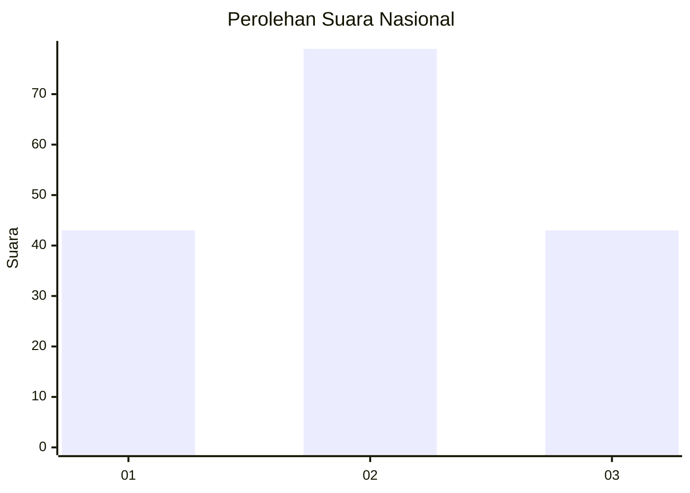
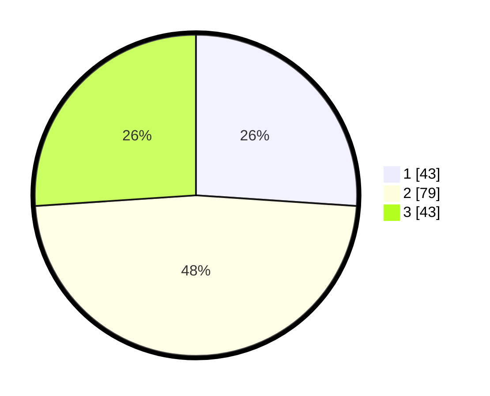

# Hasil

## Grafik

## Tabel

| No.    | Nama Paslon    | Suara | Suara (raw) | Persentase |
|:------ |:-------------- | -----:| -----------:| ----------:|
| 100025 | ANIES MUHAIMIN | 43    | [43][p-1]   | 26,06      |
| 100026 | PRABOWO GIBRAN | 79    | [79][p-2]   | 47,88      |
| 100027 | GANJAR MAHFUD  | 43    | [43][p-3]   | 26,06      |

[p-1]: https://github.com/gigit-pemilu/pemilu-2024/blob/main/pilpres/hitung-suara/sub/31-dki-jakarta/sub/72-jakarta-utara/sub/04-cilincing/sub/1007-semper-barat/sub/166-tps/sub/paslon-1.txt
[p-2]: https://github.com/gigit-pemilu/pemilu-2024/blob/main/pilpres/hitung-suara/sub/31-dki-jakarta/sub/72-jakarta-utara/sub/04-cilincing/sub/1007-semper-barat/sub/166-tps/sub/paslon-2.txt
[p-3]: https://github.com/gigit-pemilu/pemilu-2024/blob/main/pilpres/hitung-suara/sub/31-dki-jakarta/sub/72-jakarta-utara/sub/04-cilincing/sub/1007-semper-barat/sub/166-tps/sub/paslon-3.txt

## Foto C Plano

https://sirekap-obj-formc.kpu.go.id/9b80/pemilu/ppwp/31/72/04/10/07/3172041007166-20240215-005633--f9b057c0-c754-4dfe-bc11-92a3ace21979.jpg

https://sirekap-obj-formc.kpu.go.id/9b80/pemilu/ppwp/31/72/04/10/07/3172041007166-20240215-005724--13d2bb9f-39d0-4591-a595-1352e6297d21.jpg

https://sirekap-obj-formc.kpu.go.id/9b80/pemilu/ppwp/31/72/04/10/07/3172041007166-20240215-005841--458eaded-7854-47c5-8032-9d45e7802c84.jpg

## Metadata

| Key        | Value               |
| ---------- | ------------------- |
| Time Stamp | 2024-02-24 22:31:28 |

