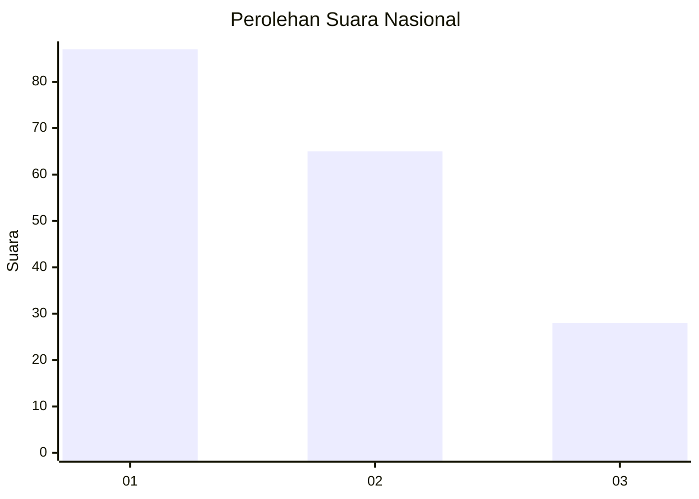
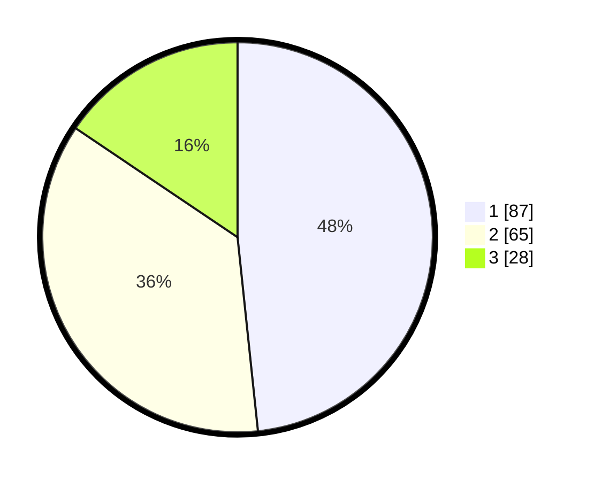

# Hasil

## Grafik

## Tabel

| No.    | Nama Paslon    | Suara | Suara (raw) | Persentase |
|:------ |:-------------- | -----:| -----------:| ----------:|
| 100025 | ANIES MUHAIMIN | 87    | [87][p-1]   | 48,33      |
| 100026 | PRABOWO GIBRAN | 65    | [65][p-2]   | 36,11      |
| 100027 | GANJAR MAHFUD  | 28    | [28][p-3]   | 15,56      |

[p-1]: https://github.com/gigit-pemilu/pemilu-2024/blob/main/pilpres/hitung-suara/sub/31-dki-jakarta/sub/72-jakarta-utara/sub/04-cilincing/sub/1007-semper-barat/sub/173-tps/sub/paslon-1.txt
[p-2]: https://github.com/gigit-pemilu/pemilu-2024/blob/main/pilpres/hitung-suara/sub/31-dki-jakarta/sub/72-jakarta-utara/sub/04-cilincing/sub/1007-semper-barat/sub/173-tps/sub/paslon-2.txt
[p-3]: https://github.com/gigit-pemilu/pemilu-2024/blob/main/pilpres/hitung-suara/sub/31-dki-jakarta/sub/72-jakarta-utara/sub/04-cilincing/sub/1007-semper-barat/sub/173-tps/sub/paslon-3.txt

## Foto C Plano

https://sirekap-obj-formc.kpu.go.id/9608/pemilu/ppwp/31/72/04/10/07/3172041007173-20240214-210322--38cb8e09-68d1-4677-90ad-2a5a2f7d6be3.jpg

https://sirekap-obj-formc.kpu.go.id/9608/pemilu/ppwp/31/72/04/10/07/3172041007173-20240214-210341--b117b303-8988-4652-b9ee-da24927e3c12.jpg

https://sirekap-obj-formc.kpu.go.id/9608/pemilu/ppwp/31/72/04/10/07/3172041007173-20240214-210403--8dc3f3c0-4c62-4dee-a96f-9c9e9e4c4809.jpg

## Metadata

| Key        | Value               |
| ---------- | ------------------- |
| Time Stamp | 2024-02-21 18:00:00 |

