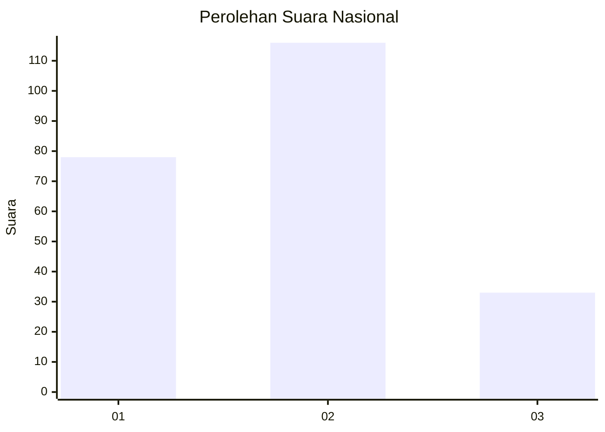
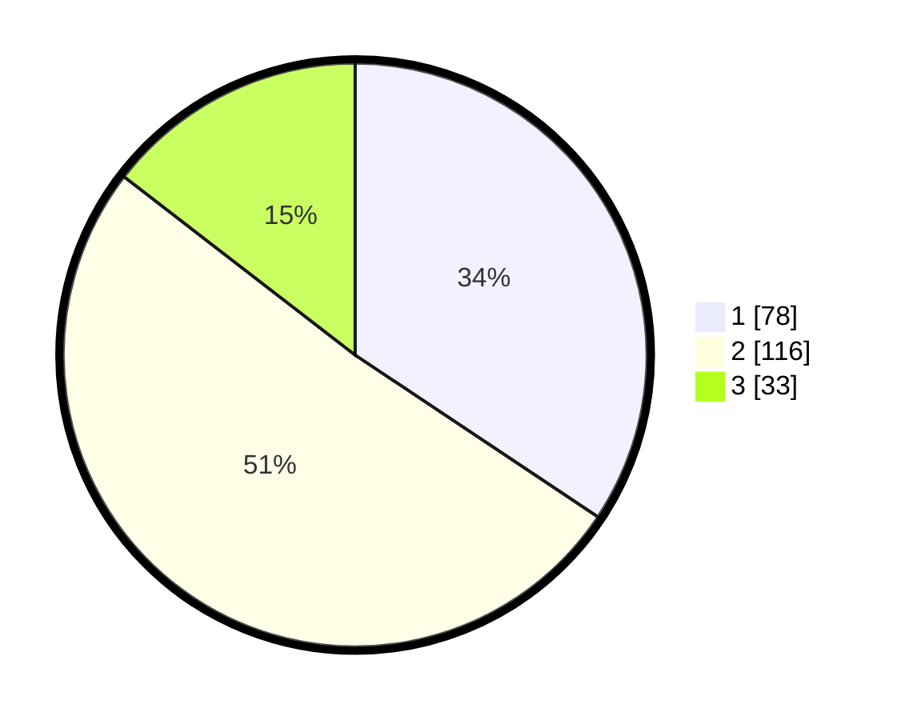

# Hasil

## Grafik

## Tabel

| No.    | Nama Paslon    | Suara | Suara (raw) | Persentase |
|:------ |:-------------- | -----:| -----------:| ----------:|
| 100025 | ANIES MUHAIMIN | 78    | [78][p-1]   | 34,36      |
| 100026 | PRABOWO GIBRAN | 116   | [116][p-2]  | 51,10      |
| 100027 | GANJAR MAHFUD  | 33    | [33][p-3]   | 14,54      |

[p-1]: https://github.com/gigit-pemilu/pemilu-2024/blob/main/pilpres/hitung-suara/sub/31-dki-jakarta/sub/72-jakarta-utara/sub/04-cilincing/sub/1007-semper-barat/sub/188-tps/sub/paslon-1.txt
[p-2]: https://github.com/gigit-pemilu/pemilu-2024/blob/main/pilpres/hitung-suara/sub/31-dki-jakarta/sub/72-jakarta-utara/sub/04-cilincing/sub/1007-semper-barat/sub/188-tps/sub/paslon-2.txt
[p-3]: https://github.com/gigit-pemilu/pemilu-2024/blob/main/pilpres/hitung-suara/sub/31-dki-jakarta/sub/72-jakarta-utara/sub/04-cilincing/sub/1007-semper-barat/sub/188-tps/sub/paslon-3.txt

## Foto C Plano

https://sirekap-obj-formc.kpu.go.id/d797/pemilu/ppwp/31/72/04/10/07/3172041007188-20240215-022635--d59e2534-2878-4e0e-bdab-2c7cf5bbf3d6.jpg

https://sirekap-obj-formc.kpu.go.id/d797/pemilu/ppwp/31/72/04/10/07/3172041007188-20240215-022833--17eab14b-7199-470a-bf3b-14e59a9b3949.jpg

https://sirekap-obj-formc.kpu.go.id/d797/pemilu/ppwp/31/72/04/10/07/3172041007188-20240215-023011--a0b15319-b885-404f-b4c7-1012b5cf963b.jpg

## Metadata

| Key        | Value               |
| ---------- | ------------------- |
| Time Stamp | 2024-02-21 18:00:00 |

