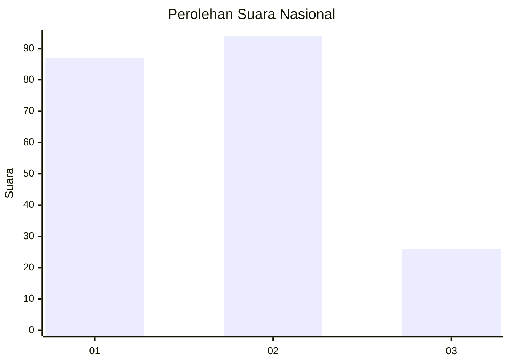
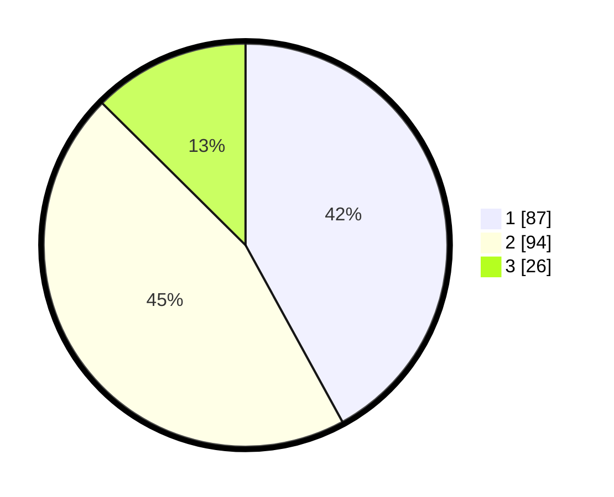

# Hasil

## Grafik

## Tabel

| No.    | Nama Paslon    | Suara | Suara (raw) | Persentase |
|:------ |:-------------- | -----:| -----------:| ----------:|
| 100025 | ANIES MUHAIMIN | 87    | [87][p-1]   | 42,03      |
| 100026 | PRABOWO GIBRAN | 94    | [94][p-2]   | 45,41      |
| 100027 | GANJAR MAHFUD  | 26    | [26][p-3]   | 12,56      |

[p-1]: https://github.com/gigit-pemilu/pemilu-2024/blob/main/pilpres/hitung-suara/sub/31-dki-jakarta/sub/72-jakarta-utara/sub/04-cilincing/sub/1007-semper-barat/sub/194-tps/sub/paslon-1.txt
[p-2]: https://github.com/gigit-pemilu/pemilu-2024/blob/main/pilpres/hitung-suara/sub/31-dki-jakarta/sub/72-jakarta-utara/sub/04-cilincing/sub/1007-semper-barat/sub/194-tps/sub/paslon-2.txt
[p-3]: https://github.com/gigit-pemilu/pemilu-2024/blob/main/pilpres/hitung-suara/sub/31-dki-jakarta/sub/72-jakarta-utara/sub/04-cilincing/sub/1007-semper-barat/sub/194-tps/sub/paslon-3.txt

## Foto C Plano

https://sirekap-obj-formc.kpu.go.id/adb0/pemilu/ppwp/31/72/04/10/07/3172041007194-20240214-205318--781401ec-3012-4393-a801-9016f9dca96e.jpg

https://sirekap-obj-formc.kpu.go.id/adb0/pemilu/ppwp/31/72/04/10/07/3172041007194-20240214-184610--03a2a19d-490b-46e8-8a62-3e0674b23873.jpg

https://sirekap-obj-formc.kpu.go.id/adb0/pemilu/ppwp/31/72/04/10/07/3172041007194-20240214-184524--fa7026f1-55c5-45d2-9333-3a99ea4db75e.jpg

## Metadata

| Key        | Value               |
| ---------- | ------------------- |
| Time Stamp | 2024-02-21 18:00:00 |

