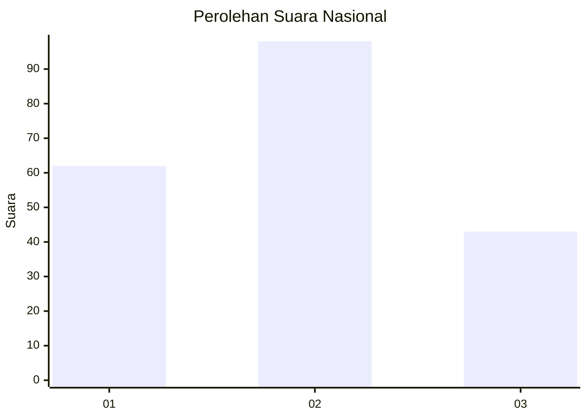
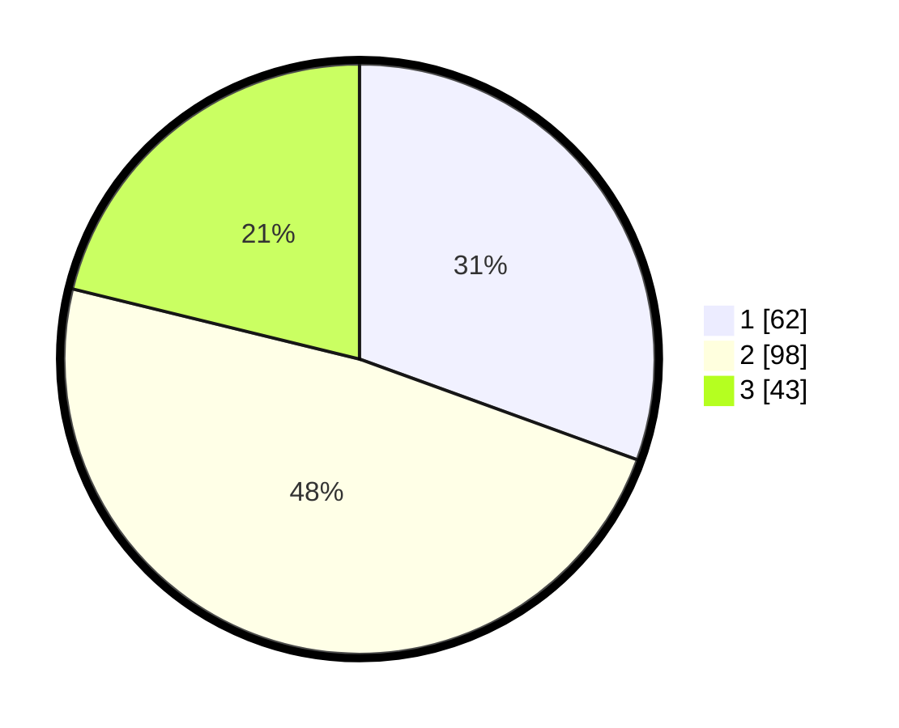

# Hasil

## Grafik

## Tabel

| No.    | Nama Paslon    | Suara | Suara (raw) | Persentase |
|:------ |:-------------- | -----:| -----------:| ----------:|
| 100025 | ANIES MUHAIMIN | 62    | [62][p-1]   | 30,54      |
| 100026 | PRABOWO GIBRAN | 98    | [98][p-2]   | 48,28      |
| 100027 | GANJAR MAHFUD  | 43    | [43][p-3]   | 21,18      |

[p-1]: https://github.com/gigit-pemilu/pemilu-2024/blob/main/pilpres/hitung-suara/sub/31-dki-jakarta/sub/72-jakarta-utara/sub/04-cilincing/sub/1007-semper-barat/sub/195-tps/sub/paslon-1.txt
[p-2]: https://github.com/gigit-pemilu/pemilu-2024/blob/main/pilpres/hitung-suara/sub/31-dki-jakarta/sub/72-jakarta-utara/sub/04-cilincing/sub/1007-semper-barat/sub/195-tps/sub/paslon-2.txt
[p-3]: https://github.com/gigit-pemilu/pemilu-2024/blob/main/pilpres/hitung-suara/sub/31-dki-jakarta/sub/72-jakarta-utara/sub/04-cilincing/sub/1007-semper-barat/sub/195-tps/sub/paslon-3.txt

## Foto C Plano

https://sirekap-obj-formc.kpu.go.id/c7f2/pemilu/ppwp/31/72/04/10/07/3172041007195-20240214-214704--7d6ed47f-df16-433d-84b9-e1a176ac2930.jpg

https://sirekap-obj-formc.kpu.go.id/c7f2/pemilu/ppwp/31/72/04/10/07/3172041007195-20240215-005801--df0a9729-4053-47c8-bccd-b6b7f389b1a9.jpg

https://sirekap-obj-formc.kpu.go.id/c7f2/pemilu/ppwp/31/72/04/10/07/3172041007195-20240215-005852--00edf929-398e-437f-b9ba-5341a25b4ad7.jpg

## Metadata

| Key        | Value               |
| ---------- | ------------------- |
| Time Stamp | 2024-02-21 20:00:00 |

