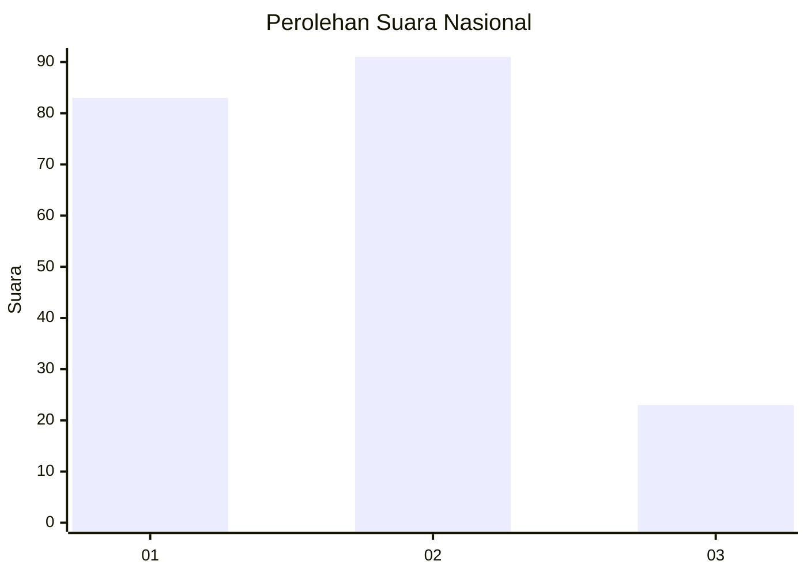
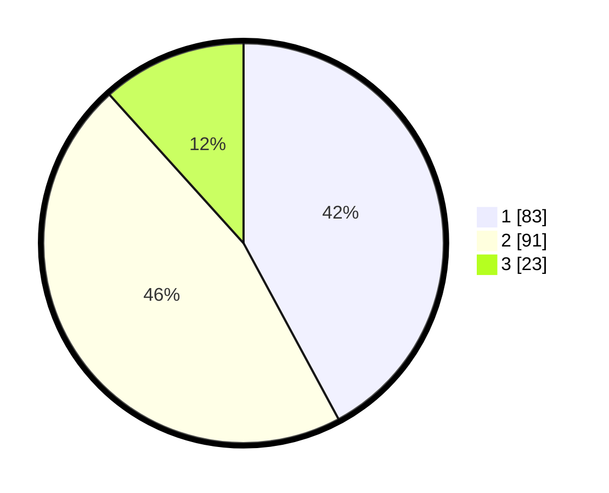

# Hasil

## Grafik

## Tabel

| No.    | Nama Paslon    | Suara | Suara (raw) | Persentase |
|:------ |:-------------- | -----:| -----------:| ----------:|
| 100025 | ANIES MUHAIMIN | 83    | [83][p-1]   | 42,13      |
| 100026 | PRABOWO GIBRAN | 91    | [91][p-2]   | 46,19      |
| 100027 | GANJAR MAHFUD  | 23    | [23][p-3]   | 11,68      |

[p-1]: https://github.com/gigit-pemilu/pemilu-2024/blob/main/pilpres/hitung-suara/sub/31-dki-jakarta/sub/72-jakarta-utara/sub/04-cilincing/sub/1007-semper-barat/sub/198-tps/sub/paslon-1.txt
[p-2]: https://github.com/gigit-pemilu/pemilu-2024/blob/main/pilpres/hitung-suara/sub/31-dki-jakarta/sub/72-jakarta-utara/sub/04-cilincing/sub/1007-semper-barat/sub/198-tps/sub/paslon-2.txt
[p-3]: https://github.com/gigit-pemilu/pemilu-2024/blob/main/pilpres/hitung-suara/sub/31-dki-jakarta/sub/72-jakarta-utara/sub/04-cilincing/sub/1007-semper-barat/sub/198-tps/sub/paslon-3.txt

## Foto C Plano

https://sirekap-obj-formc.kpu.go.id/2da8/pemilu/ppwp/31/72/04/10/07/3172041007198-20240214-222747--dcdb635c-e292-4305-a133-59f0c946aa9c.jpg

https://sirekap-obj-formc.kpu.go.id/2da8/pemilu/ppwp/31/72/04/10/07/3172041007198-20240214-223231--c4ba09ba-d8ca-4617-9bf9-21ee03cbc443.jpg

https://sirekap-obj-formc.kpu.go.id/2da8/pemilu/ppwp/31/72/04/10/07/3172041007198-20240214-223352--5c5e95b1-36ef-4cff-b0c9-f5857d963fcd.jpg

## Metadata

| Key        | Value               |
| ---------- | ------------------- |
| Time Stamp | 2024-02-21 18:00:00 |

