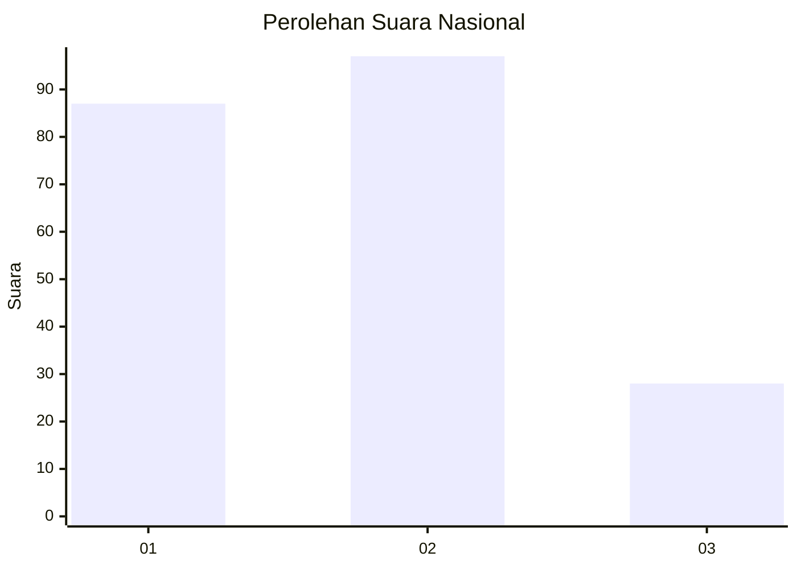
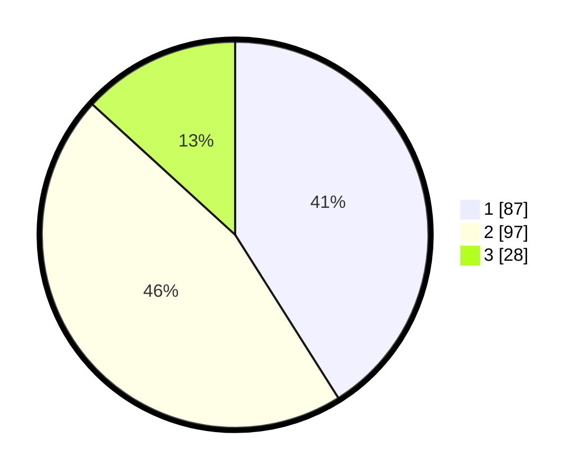

# Hasil

## Grafik

## Tabel

| No.    | Nama Paslon    | Suara | Suara (raw) | Persentase |
|:------ |:-------------- | -----:| -----------:| ----------:|
| 100025 | ANIES MUHAIMIN | 87    | [87][p-1]   | 41,04      |
| 100026 | PRABOWO GIBRAN | 97    | [97][p-2]   | 45,75      |
| 100027 | GANJAR MAHFUD  | 28    | [28][p-3]   | 13,21      |

[p-1]: https://github.com/gigit-pemilu/pemilu-2024/blob/main/pilpres/hitung-suara/sub/31-dki-jakarta/sub/72-jakarta-utara/sub/04-cilincing/sub/1007-semper-barat/sub/202-tps/sub/paslon-1.txt
[p-2]: https://github.com/gigit-pemilu/pemilu-2024/blob/main/pilpres/hitung-suara/sub/31-dki-jakarta/sub/72-jakarta-utara/sub/04-cilincing/sub/1007-semper-barat/sub/202-tps/sub/paslon-2.txt
[p-3]: https://github.com/gigit-pemilu/pemilu-2024/blob/main/pilpres/hitung-suara/sub/31-dki-jakarta/sub/72-jakarta-utara/sub/04-cilincing/sub/1007-semper-barat/sub/202-tps/sub/paslon-3.txt

## Foto C Plano

https://sirekap-obj-formc.kpu.go.id/cc23/pemilu/ppwp/31/72/04/10/07/3172041007202-20240215-005457--d0811985-4d3c-46fe-80d1-32d481c12328.jpg

https://sirekap-obj-formc.kpu.go.id/cc23/pemilu/ppwp/31/72/04/10/07/3172041007202-20240215-005526--a9ba3c02-aa98-4a4a-9eb4-6d2d644f3b3e.jpg

https://sirekap-obj-formc.kpu.go.id/cc23/pemilu/ppwp/31/72/04/10/07/3172041007202-20240215-005607--557cf025-cc91-4a9a-997c-08332bb71a59.jpg

## Metadata

| Key        | Value               |
| ---------- | ------------------- |
| Time Stamp | 2024-02-21 18:00:00 |

