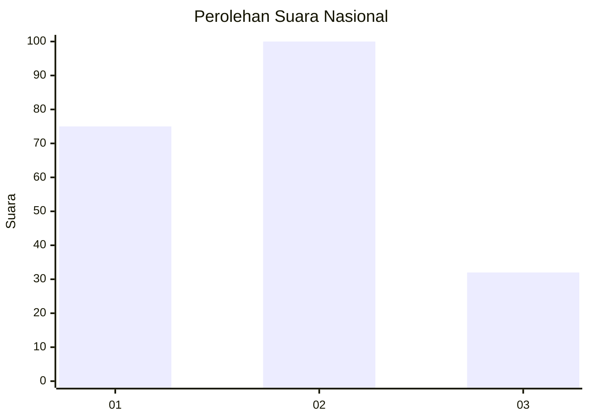
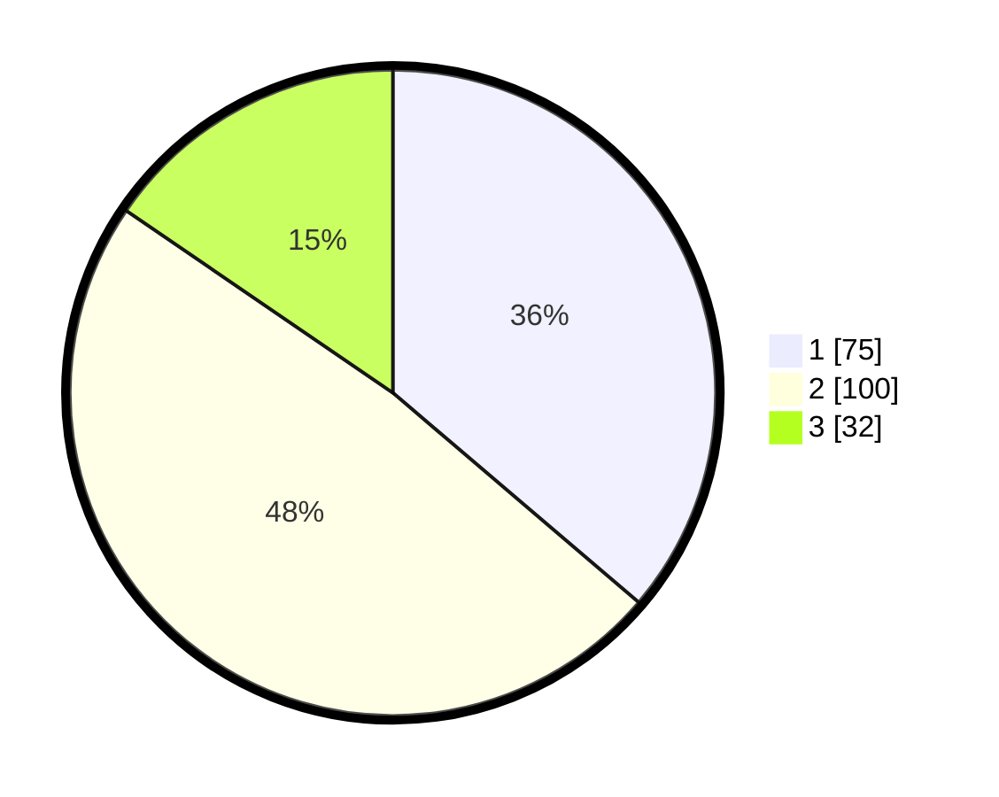

# Hasil

## Grafik

## Tabel

| No.    | Nama Paslon    | Suara | Suara (raw) | Persentase |
|:------ |:-------------- | -----:| -----------:| ----------:|
| 100025 | ANIES MUHAIMIN | 75    | [75][p-1]   | 36,23      |
| 100026 | PRABOWO GIBRAN | 100   | [100][p-2]  | 48,31      |
| 100027 | GANJAR MAHFUD  | 32    | [32][p-3]   | 15,46      |

[p-1]: https://github.com/gigit-pemilu/pemilu-2024/blob/main/pilpres/hitung-suara/sub/31-dki-jakarta/sub/72-jakarta-utara/sub/04-cilincing/sub/1007-semper-barat/sub/212-tps/sub/paslon-1.txt
[p-2]: https://github.com/gigit-pemilu/pemilu-2024/blob/main/pilpres/hitung-suara/sub/31-dki-jakarta/sub/72-jakarta-utara/sub/04-cilincing/sub/1007-semper-barat/sub/212-tps/sub/paslon-2.txt
[p-3]: https://github.com/gigit-pemilu/pemilu-2024/blob/main/pilpres/hitung-suara/sub/31-dki-jakarta/sub/72-jakarta-utara/sub/04-cilincing/sub/1007-semper-barat/sub/212-tps/sub/paslon-3.txt

## Foto C Plano

https://sirekap-obj-formc.kpu.go.id/09c2/pemilu/ppwp/31/72/04/10/07/3172041007212-20240214-205347--8ebd49f3-cb26-4901-9025-06db26d8edfc.jpg

https://sirekap-obj-formc.kpu.go.id/09c2/pemilu/ppwp/31/72/04/10/07/3172041007212-20240214-205451--81b7d685-76c7-4038-ba9a-4b5ebb0b16df.jpg

https://sirekap-obj-formc.kpu.go.id/09c2/pemilu/ppwp/31/72/04/10/07/3172041007212-20240214-205602--4afd3989-1261-4b26-abf5-8742c7715aaf.jpg

## Metadata

| Key        | Value               |
| ---------- | ------------------- |
| Time Stamp | 2024-02-21 20:00:00 |

