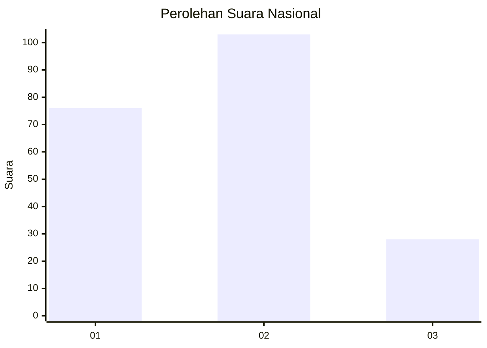
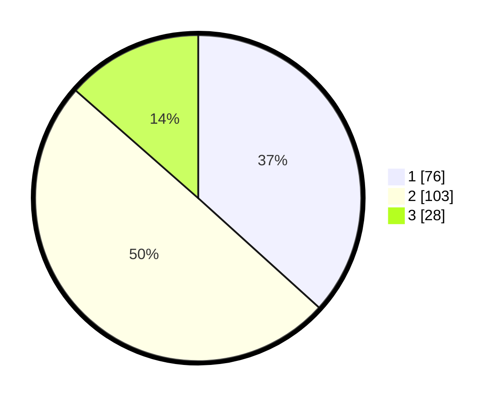

# Hasil

## Grafik

## Tabel

| No.    | Nama Paslon    | Suara | Suara (raw) | Persentase |
|:------ |:-------------- | -----:| -----------:| ----------:|
| 100025 | ANIES MUHAIMIN | 76    | [76][p-1]   | 36,71      |
| 100026 | PRABOWO GIBRAN | 103   | [103][p-2]  | 49,76      |
| 100027 | GANJAR MAHFUD  | 28    | [28][p-3]   | 13,53      |

[p-1]: https://github.com/gigit-pemilu/pemilu-2024/blob/main/pilpres/hitung-suara/sub/31-dki-jakarta/sub/72-jakarta-utara/sub/04-cilincing/sub/1007-semper-barat/sub/214-tps/sub/paslon-1.txt
[p-2]: https://github.com/gigit-pemilu/pemilu-2024/blob/main/pilpres/hitung-suara/sub/31-dki-jakarta/sub/72-jakarta-utara/sub/04-cilincing/sub/1007-semper-barat/sub/214-tps/sub/paslon-2.txt
[p-3]: https://github.com/gigit-pemilu/pemilu-2024/blob/main/pilpres/hitung-suara/sub/31-dki-jakarta/sub/72-jakarta-utara/sub/04-cilincing/sub/1007-semper-barat/sub/214-tps/sub/paslon-3.txt

## Foto C Plano

https://sirekap-obj-formc.kpu.go.id/6ec5/pemilu/ppwp/31/72/04/10/07/3172041007214-20240214-215534--dfd72981-d31f-4de5-85ee-7955ca7941b1.jpg

https://sirekap-obj-formc.kpu.go.id/6ec5/pemilu/ppwp/31/72/04/10/07/3172041007214-20240214-215934--23e144d3-d4d6-4299-8468-e20722ae9635.jpg

https://sirekap-obj-formc.kpu.go.id/6ec5/pemilu/ppwp/31/72/04/10/07/3172041007214-20240214-220259--bddf1614-639a-48bd-b229-66f4fb93dd94.jpg

## Metadata

| Key        | Value               |
| ---------- | ------------------- |
| Time Stamp | 2024-02-21 20:00:00 |

