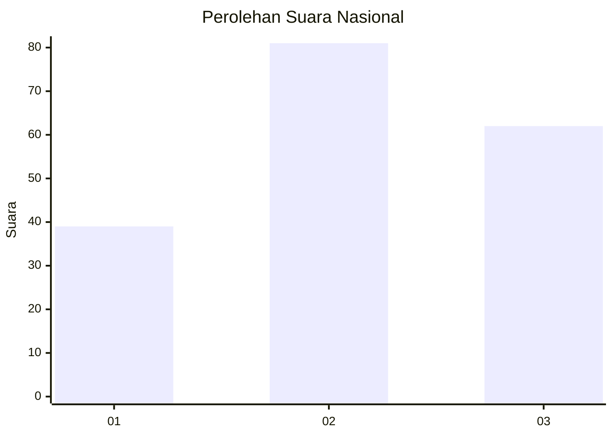
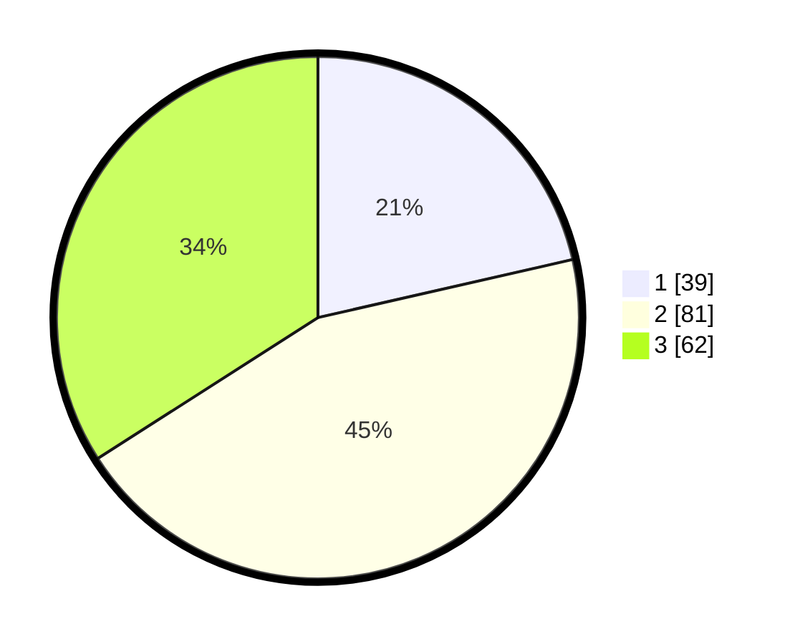

# Hasil

## Grafik

## Tabel

| No.    | Nama Paslon    | Suara | Suara (raw) | Persentase |
|:------ |:-------------- | -----:| -----------:| ----------:|
| 100025 | ANIES MUHAIMIN | 39    | [39][p-1]   | 21,43      |
| 100026 | PRABOWO GIBRAN | 81    | [81][p-2]   | 44,51      |
| 100027 | GANJAR MAHFUD  | 62    | [62][p-3]   | 34,07      |

[p-1]: https://github.com/gigit-pemilu/pemilu-2024/blob/main/pilpres/hitung-suara/sub/31-dki-jakarta/sub/72-jakarta-utara/sub/05-pademangan/sub/1001-pademangan-timur/sub/008-tps/sub/paslon-1.txt
[p-2]: https://github.com/gigit-pemilu/pemilu-2024/blob/main/pilpres/hitung-suara/sub/31-dki-jakarta/sub/72-jakarta-utara/sub/05-pademangan/sub/1001-pademangan-timur/sub/008-tps/sub/paslon-2.txt
[p-3]: https://github.com/gigit-pemilu/pemilu-2024/blob/main/pilpres/hitung-suara/sub/31-dki-jakarta/sub/72-jakarta-utara/sub/05-pademangan/sub/1001-pademangan-timur/sub/008-tps/sub/paslon-3.txt

## Foto C Plano

https://sirekap-obj-formc.kpu.go.id/8020/pemilu/ppwp/31/72/05/10/01/3172051001008-20240217-114127--a13b925d-2647-480f-97d6-7d9adea5d478.jpg

https://sirekap-obj-formc.kpu.go.id/8020/pemilu/ppwp/31/72/05/10/01/3172051001008-20240217-114155--9d8a91f8-18a3-40d9-86fc-68f8e4695962.jpg

https://sirekap-obj-formc.kpu.go.id/8020/pemilu/ppwp/31/72/05/10/01/3172051001008-20240217-114237--c1351575-1736-40df-bb53-44041ce892ab.jpg

## Metadata

| Key        | Value               |
| ---------- | ------------------- |
| Time Stamp | 2024-02-21 15:00:00 |

