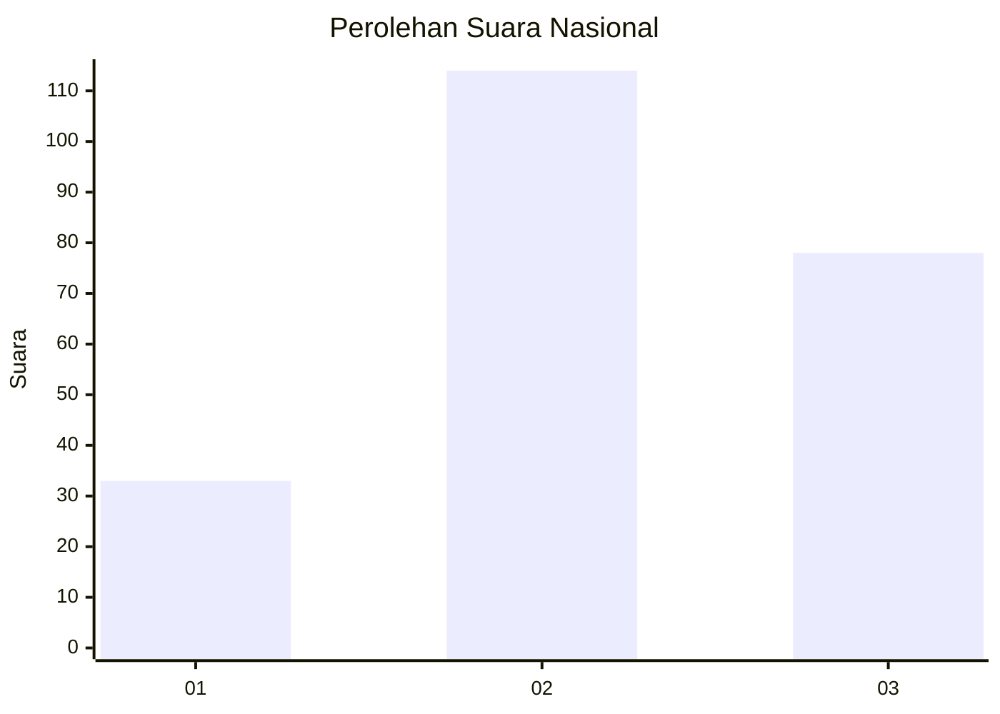
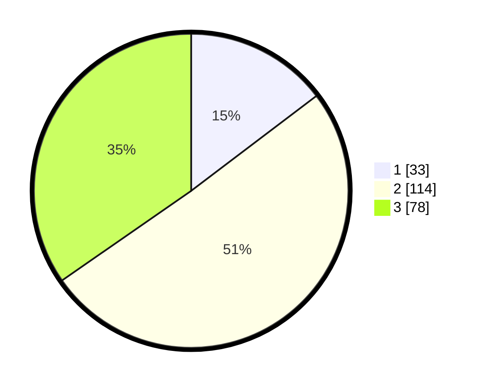

# Hasil

## Grafik

## Tabel

| No.    | Nama Paslon    | Suara | Suara (raw) | Persentase |
|:------ |:-------------- | -----:| -----------:| ----------:|
| 100025 | ANIES MUHAIMIN | 33    | [33][p-1]   | 14,67      |
| 100026 | PRABOWO GIBRAN | 114   | [114][p-2]  | 50,67      |
| 100027 | GANJAR MAHFUD  | 78    | [78][p-3]   | 34,67      |

[p-1]: https://github.com/gigit-pemilu/pemilu-2024/blob/main/pilpres/hitung-suara/sub/31-dki-jakarta/sub/72-jakarta-utara/sub/05-pademangan/sub/1001-pademangan-timur/sub/032-tps/sub/paslon-1.txt
[p-2]: https://github.com/gigit-pemilu/pemilu-2024/blob/main/pilpres/hitung-suara/sub/31-dki-jakarta/sub/72-jakarta-utara/sub/05-pademangan/sub/1001-pademangan-timur/sub/032-tps/sub/paslon-2.txt
[p-3]: https://github.com/gigit-pemilu/pemilu-2024/blob/main/pilpres/hitung-suara/sub/31-dki-jakarta/sub/72-jakarta-utara/sub/05-pademangan/sub/1001-pademangan-timur/sub/032-tps/sub/paslon-3.txt

## Foto C Plano

https://sirekap-obj-formc.kpu.go.id/0f31/pemilu/ppwp/31/72/05/10/01/3172051001032-20240216-172341--77a9c562-8a81-47ed-9599-6e3bc814e43d.jpg

https://sirekap-obj-formc.kpu.go.id/0f31/pemilu/ppwp/31/72/05/10/01/3172051001032-20240216-172357--3406b064-2eb8-410f-9faf-f9f7ace8beaf.jpg

https://sirekap-obj-formc.kpu.go.id/0f31/pemilu/ppwp/31/72/05/10/01/3172051001032-20240216-172406--46afc72d-19e1-4329-9cba-d17cdee45e6a.jpg

## Metadata

| Key        | Value               |
| ---------- | ------------------- |
| Time Stamp | 2024-02-21 14:00:00 |

