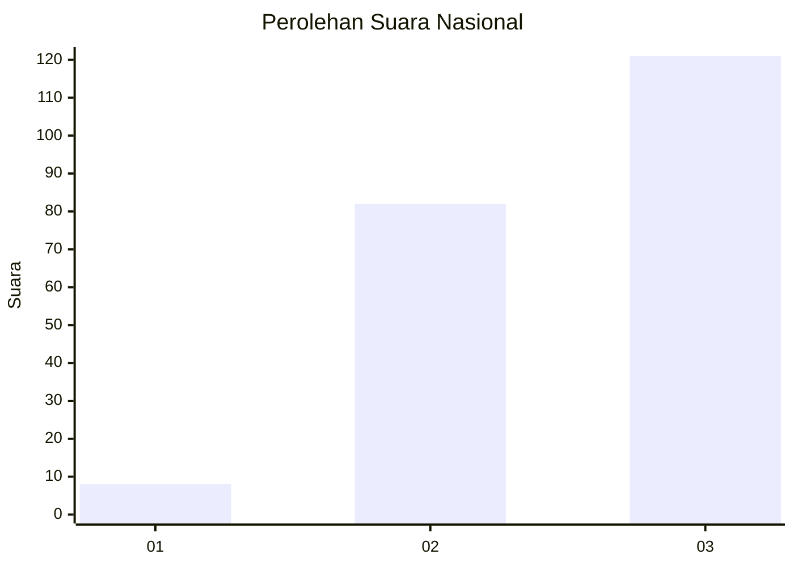
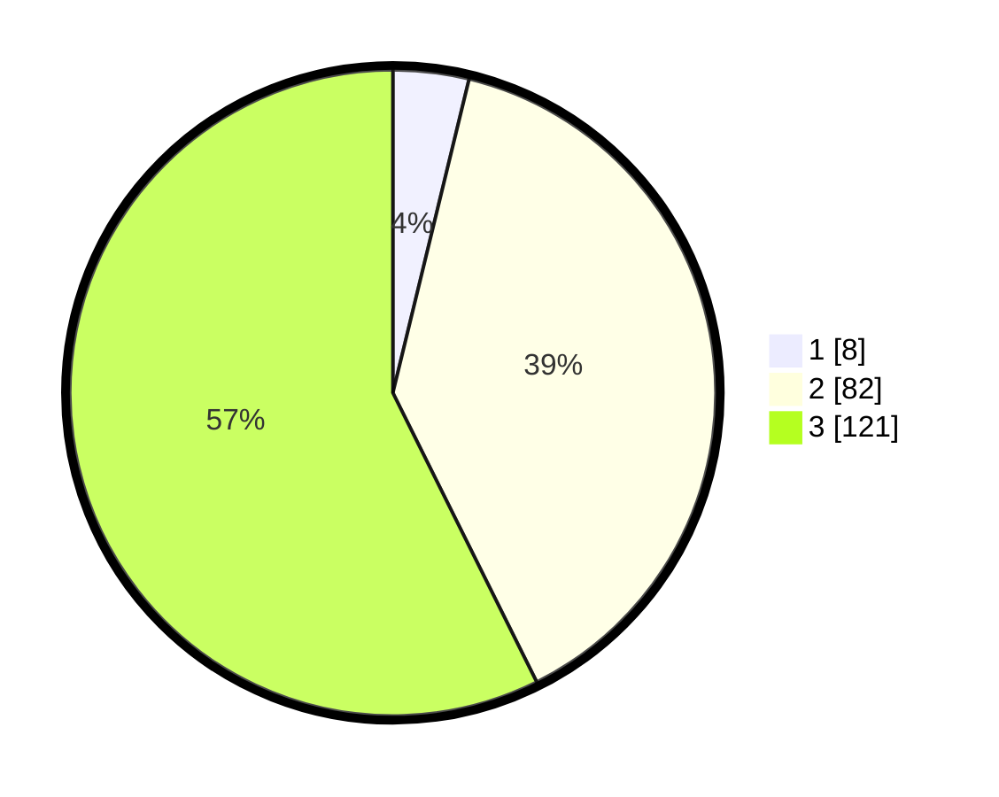

# Hasil

## Grafik

## Tabel

| No.    | Nama Paslon    | Suara | Suara (raw) | Persentase |
|:------ |:-------------- | -----:| -----------:| ----------:|
| 100025 | ANIES MUHAIMIN | 8     | [8][p-1]    | 3,79       |
| 100026 | PRABOWO GIBRAN | 82    | [82][p-2]   | 38,86      |
| 100027 | GANJAR MAHFUD  | 121   | [121][p-3]  | 57,35      |

[p-1]: https://github.com/gigit-pemilu/pemilu-2024/blob/main/pilpres/hitung-suara/sub/31-dki-jakarta/sub/72-jakarta-utara/sub/05-pademangan/sub/1001-pademangan-timur/sub/035-tps/sub/paslon-1.txt
[p-2]: https://github.com/gigit-pemilu/pemilu-2024/blob/main/pilpres/hitung-suara/sub/31-dki-jakarta/sub/72-jakarta-utara/sub/05-pademangan/sub/1001-pademangan-timur/sub/035-tps/sub/paslon-2.txt
[p-3]: https://github.com/gigit-pemilu/pemilu-2024/blob/main/pilpres/hitung-suara/sub/31-dki-jakarta/sub/72-jakarta-utara/sub/05-pademangan/sub/1001-pademangan-timur/sub/035-tps/sub/paslon-3.txt

## Foto C Plano

https://sirekap-obj-formc.kpu.go.id/c3d3/pemilu/ppwp/31/72/05/10/01/3172051001035-20240214-203146--9c0fac11-3806-451f-a9e0-94ea06b600d9.jpg

https://sirekap-obj-formc.kpu.go.id/c3d3/pemilu/ppwp/31/72/05/10/01/3172051001035-20240214-203210--059047f7-bc9b-40ed-8cb9-966eb157bb7f.jpg

https://sirekap-obj-formc.kpu.go.id/c3d3/pemilu/ppwp/31/72/05/10/01/3172051001035-20240214-203228--660493f6-3581-4311-9c0b-59a7af0d182c.jpg

## Metadata

| Key        | Value               |
| ---------- | ------------------- |
| Time Stamp | 2024-02-21 16:00:00 |

