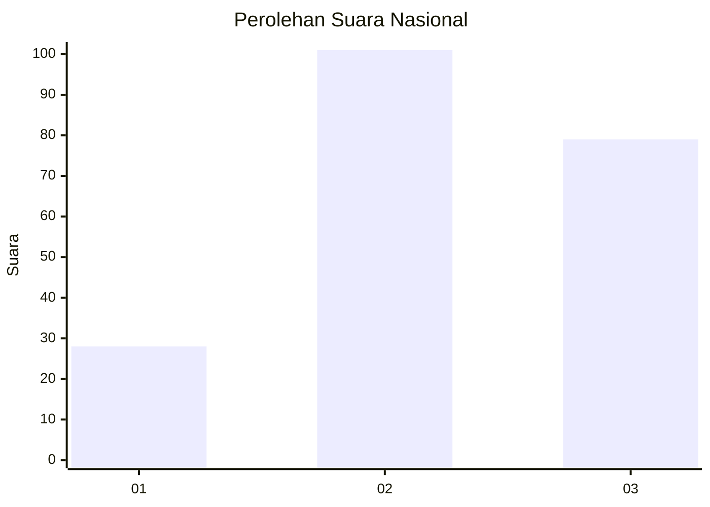
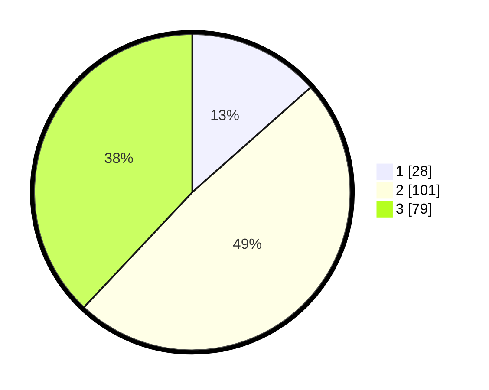

# Hasil

## Grafik

## Tabel

| No.    | Nama Paslon    | Suara | Suara (raw) | Persentase |
|:------ |:-------------- | -----:| -----------:| ----------:|
| 100025 | ANIES MUHAIMIN | 28    | [28][p-1]   | 13,46      |
| 100026 | PRABOWO GIBRAN | 101   | [101][p-2]  | 48,56      |
| 100027 | GANJAR MAHFUD  | 79    | [79][p-3]   | 37,98      |

[p-1]: https://github.com/gigit-pemilu/pemilu-2024/blob/main/pilpres/hitung-suara/sub/31-dki-jakarta/sub/72-jakarta-utara/sub/05-pademangan/sub/1001-pademangan-timur/sub/047-tps/sub/paslon-1.txt
[p-2]: https://github.com/gigit-pemilu/pemilu-2024/blob/main/pilpres/hitung-suara/sub/31-dki-jakarta/sub/72-jakarta-utara/sub/05-pademangan/sub/1001-pademangan-timur/sub/047-tps/sub/paslon-2.txt
[p-3]: https://github.com/gigit-pemilu/pemilu-2024/blob/main/pilpres/hitung-suara/sub/31-dki-jakarta/sub/72-jakarta-utara/sub/05-pademangan/sub/1001-pademangan-timur/sub/047-tps/sub/paslon-3.txt

## Foto C Plano

https://sirekap-obj-formc.kpu.go.id/a840/pemilu/ppwp/31/72/05/10/01/3172051001047-20240214-221956--4ec4f254-e202-4a95-840e-50d12e2c3f73.jpg

https://sirekap-obj-formc.kpu.go.id/a840/pemilu/ppwp/31/72/05/10/01/3172051001047-20240214-222041--79d94346-7cb9-429d-a352-c62e9686c402.jpg

https://sirekap-obj-formc.kpu.go.id/a840/pemilu/ppwp/31/72/05/10/01/3172051001047-20240214-222127--7fa655b7-40a1-4492-9db8-24c1941c2b05.jpg

## Metadata

| Key        | Value               |
| ---------- | ------------------- |
| Time Stamp | 2024-02-21 15:00:00 |

