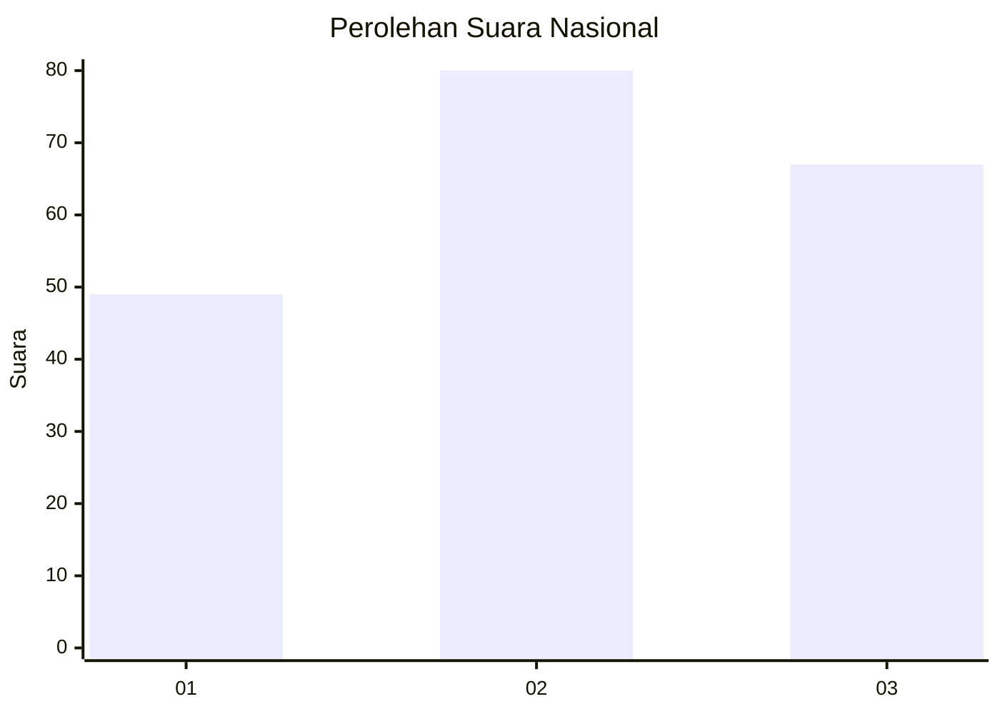
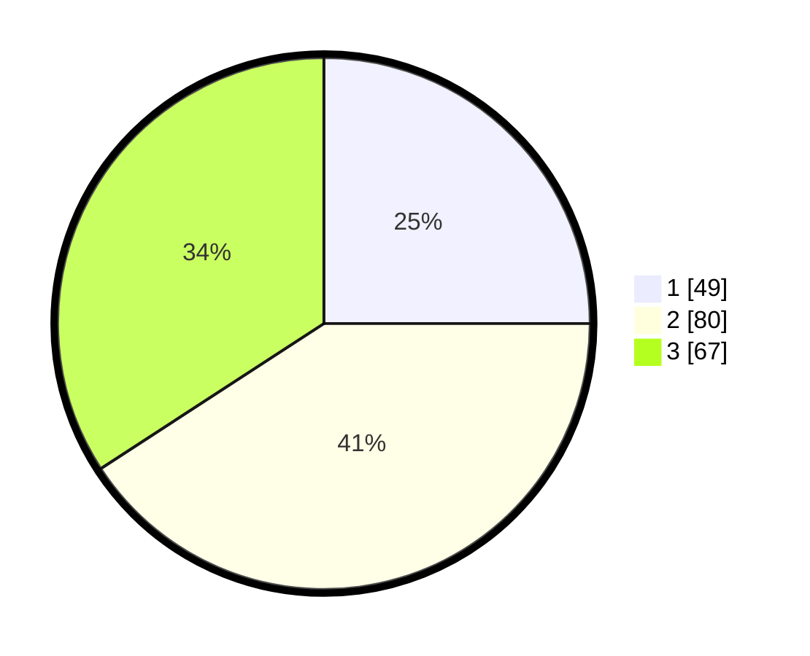

# Hasil

## Grafik

## Tabel

| No.    | Nama Paslon    | Suara | Suara (raw) | Persentase |
|:------ |:-------------- | -----:| -----------:| ----------:|
| 100025 | ANIES MUHAIMIN | 49    | [49][p-1]   | 25,00      |
| 100026 | PRABOWO GIBRAN | 80    | [80][p-2]   | 40,82      |
| 100027 | GANJAR MAHFUD  | 67    | [67][p-3]   | 34,18      |

[p-1]: https://github.com/gigit-pemilu/pemilu-2024/blob/main/pilpres/hitung-suara/sub/31-dki-jakarta/sub/72-jakarta-utara/sub/05-pademangan/sub/1001-pademangan-timur/sub/059-tps/sub/paslon-1.txt
[p-2]: https://github.com/gigit-pemilu/pemilu-2024/blob/main/pilpres/hitung-suara/sub/31-dki-jakarta/sub/72-jakarta-utara/sub/05-pademangan/sub/1001-pademangan-timur/sub/059-tps/sub/paslon-2.txt
[p-3]: https://github.com/gigit-pemilu/pemilu-2024/blob/main/pilpres/hitung-suara/sub/31-dki-jakarta/sub/72-jakarta-utara/sub/05-pademangan/sub/1001-pademangan-timur/sub/059-tps/sub/paslon-3.txt

## Foto C Plano

https://sirekap-obj-formc.kpu.go.id/123e/pemilu/ppwp/31/72/05/10/01/3172051001059-20240214-224938--647e6a81-70b8-44aa-a046-deec63a26d0a.jpg

https://sirekap-obj-formc.kpu.go.id/123e/pemilu/ppwp/31/72/05/10/01/3172051001059-20240214-225031--8b8ca8c3-7501-466d-bff2-f6eb02d337d6.jpg

https://sirekap-obj-formc.kpu.go.id/123e/pemilu/ppwp/31/72/05/10/01/3172051001059-20240214-225122--6459408d-294e-456b-adbc-6e2d9791bf80.jpg

## Metadata

| Key        | Value               |
| ---------- | ------------------- |
| Time Stamp | 2024-02-21 18:00:00 |

