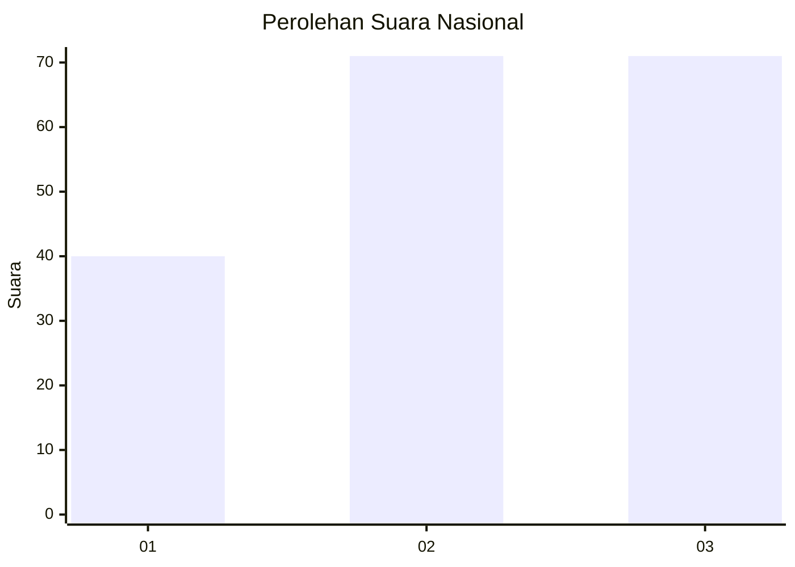
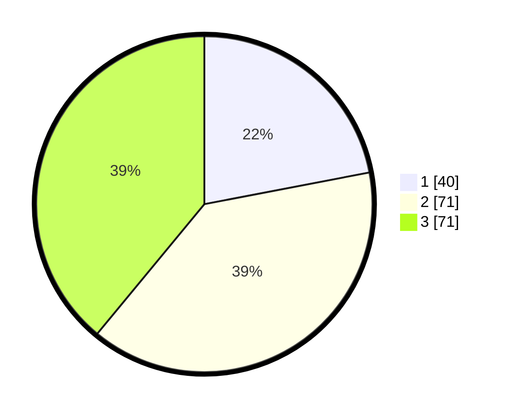

# Hasil

## Grafik

## Tabel

| No.    | Nama Paslon    | Suara | Suara (raw) | Persentase |
|:------ |:-------------- | -----:| -----------:| ----------:|
| 100025 | ANIES MUHAIMIN | 40    | [40][p-1]   | 21,98      |
| 100026 | PRABOWO GIBRAN | 71    | [71][p-2]   | 39,01      |
| 100027 | GANJAR MAHFUD  | 71    | [71][p-3]   | 39,01      |

[p-1]: https://github.com/gigit-pemilu/pemilu-2024/blob/main/pilpres/hitung-suara/sub/31-dki-jakarta/sub/72-jakarta-utara/sub/05-pademangan/sub/1001-pademangan-timur/sub/078-tps/sub/paslon-1.txt
[p-2]: https://github.com/gigit-pemilu/pemilu-2024/blob/main/pilpres/hitung-suara/sub/31-dki-jakarta/sub/72-jakarta-utara/sub/05-pademangan/sub/1001-pademangan-timur/sub/078-tps/sub/paslon-2.txt
[p-3]: https://github.com/gigit-pemilu/pemilu-2024/blob/main/pilpres/hitung-suara/sub/31-dki-jakarta/sub/72-jakarta-utara/sub/05-pademangan/sub/1001-pademangan-timur/sub/078-tps/sub/paslon-3.txt

## Foto C Plano

https://sirekap-obj-formc.kpu.go.id/3ce1/pemilu/ppwp/31/72/05/10/01/3172051001078-20240214-205517--e7377d5d-ff3f-4502-b728-2358ce6f6443.jpg

https://sirekap-obj-formc.kpu.go.id/3ce1/pemilu/ppwp/31/72/05/10/01/3172051001078-20240214-205735--2f4219da-f16c-400d-9a4d-1cac85412036.jpg

https://sirekap-obj-formc.kpu.go.id/3ce1/pemilu/ppwp/31/72/05/10/01/3172051001078-20240214-205819--549f6e5b-3775-4986-86c8-c0d520912fcf.jpg

## Metadata

| Key        | Value               |
| ---------- | ------------------- |
| Time Stamp | 2024-02-21 15:00:00 |

