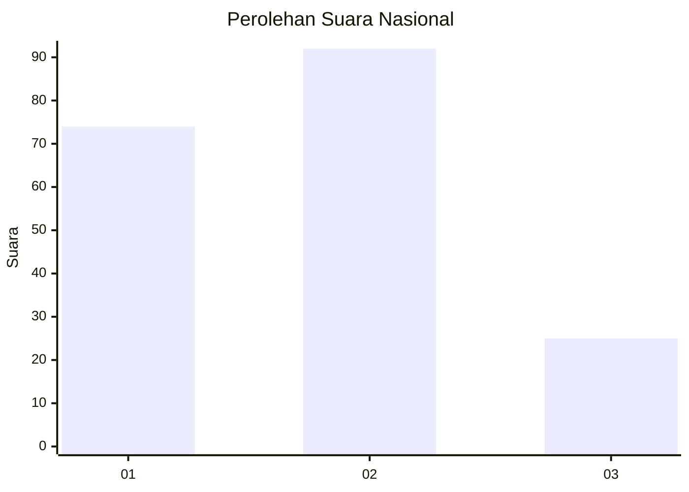
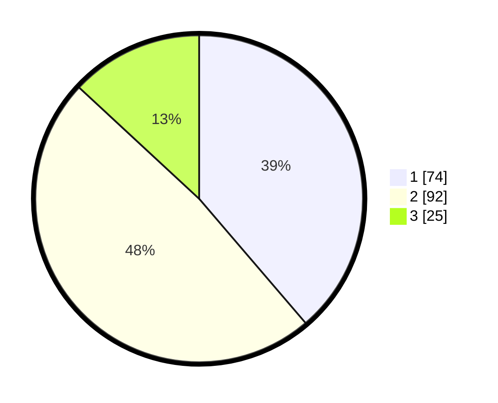

# Hasil

## Grafik

## Tabel

| No.    | Nama Paslon    | Suara | Suara (raw) | Persentase |
|:------ |:-------------- | -----:| -----------:| ----------:|
| 100025 | ANIES MUHAIMIN | 74    | [74][p-1]   | 38,74      |
| 100026 | PRABOWO GIBRAN | 92    | [92][p-2]   | 48,17      |
| 100027 | GANJAR MAHFUD  | 25    | [25][p-3]   | 13,09      |

[p-1]: https://github.com/gigit-pemilu/pemilu-2024/blob/main/pilpres/hitung-suara/sub/31-dki-jakarta/sub/72-jakarta-utara/sub/05-pademangan/sub/1001-pademangan-timur/sub/103-tps/sub/paslon-1.txt
[p-2]: https://github.com/gigit-pemilu/pemilu-2024/blob/main/pilpres/hitung-suara/sub/31-dki-jakarta/sub/72-jakarta-utara/sub/05-pademangan/sub/1001-pademangan-timur/sub/103-tps/sub/paslon-2.txt
[p-3]: https://github.com/gigit-pemilu/pemilu-2024/blob/main/pilpres/hitung-suara/sub/31-dki-jakarta/sub/72-jakarta-utara/sub/05-pademangan/sub/1001-pademangan-timur/sub/103-tps/sub/paslon-3.txt

## Foto C Plano

https://sirekap-obj-formc.kpu.go.id/4232/pemilu/ppwp/31/72/05/10/01/3172051001103-20240215-031315--c77a29e0-372b-4097-b854-e0af89166edc.jpg

https://sirekap-obj-formc.kpu.go.id/4232/pemilu/ppwp/31/72/05/10/01/3172051001103-20240215-031429--358d06f8-251d-4a4b-b220-ac3636fc2b0d.jpg

https://sirekap-obj-formc.kpu.go.id/4232/pemilu/ppwp/31/72/05/10/01/3172051001103-20240215-031529--d2f27ff4-cd5e-4144-8e54-fef8c6b81122.jpg

## Metadata

| Key        | Value               |
| ---------- | ------------------- |
| Time Stamp | 2024-02-21 17:00:00 |

