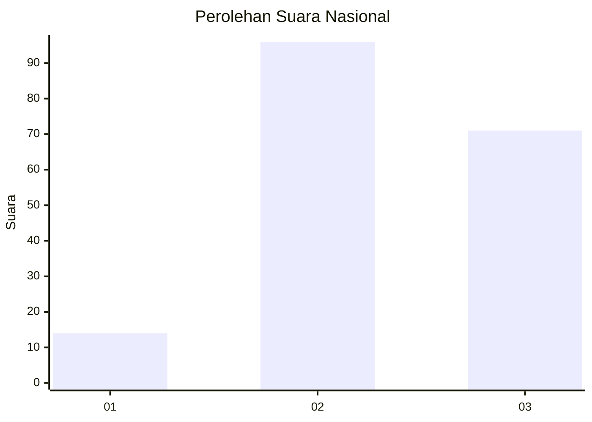
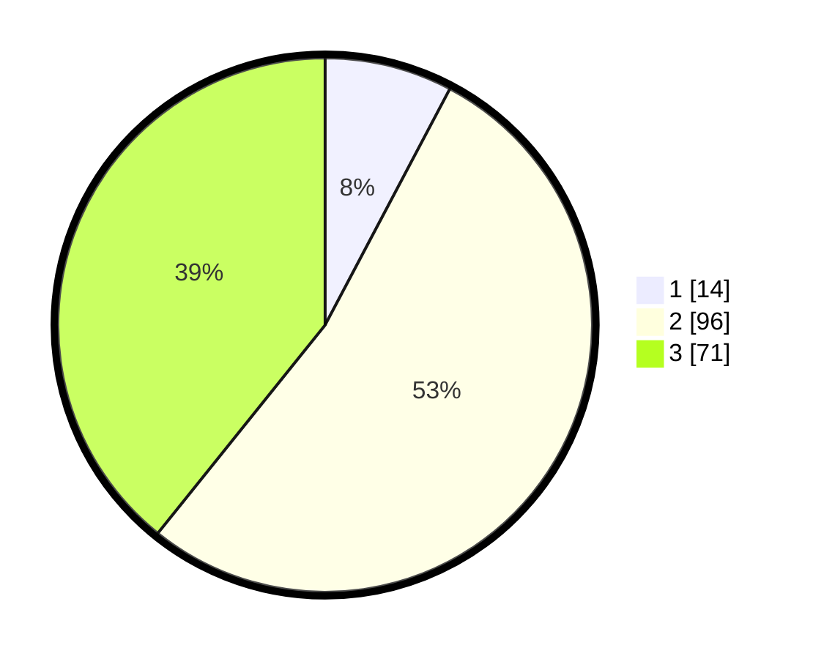

# Hasil

## Grafik

## Tabel

| No.    | Nama Paslon    | Suara | Suara (raw) | Persentase |
|:------ |:-------------- | -----:| -----------:| ----------:|
| 100025 | ANIES MUHAIMIN | 14    | [14][p-1]   | 7,73       |
| 100026 | PRABOWO GIBRAN | 96    | [96][p-2]   | 53,04      |
| 100027 | GANJAR MAHFUD  | 71    | [71][p-3]   | 39,23      |

[p-1]: https://github.com/gigit-pemilu/pemilu-2024/blob/main/pilpres/hitung-suara/sub/31-dki-jakarta/sub/72-jakarta-utara/sub/05-pademangan/sub/1002-pademangan-barat/sub/009-tps/sub/paslon-1.txt
[p-2]: https://github.com/gigit-pemilu/pemilu-2024/blob/main/pilpres/hitung-suara/sub/31-dki-jakarta/sub/72-jakarta-utara/sub/05-pademangan/sub/1002-pademangan-barat/sub/009-tps/sub/paslon-2.txt
[p-3]: https://github.com/gigit-pemilu/pemilu-2024/blob/main/pilpres/hitung-suara/sub/31-dki-jakarta/sub/72-jakarta-utara/sub/05-pademangan/sub/1002-pademangan-barat/sub/009-tps/sub/paslon-3.txt

## Foto C Plano

https://sirekap-obj-formc.kpu.go.id/87f4/pemilu/ppwp/31/72/05/10/02/3172051002009-20240215-005556--b29ef7ea-b81e-4deb-a228-a91a6913150f.jpg

https://sirekap-obj-formc.kpu.go.id/87f4/pemilu/ppwp/31/72/05/10/02/3172051002009-20240215-005556--2d5fcf6f-16ec-4c17-91bd-fad5b9f72601.jpg

https://sirekap-obj-formc.kpu.go.id/87f4/pemilu/ppwp/31/72/05/10/02/3172051002009-20240215-005531--345fc5af-0c6b-44d6-ac8c-3e5f270c963e.jpg

## Metadata

| Key        | Value               |
| ---------- | ------------------- |
| Time Stamp | 2024-02-21 18:00:00 |

