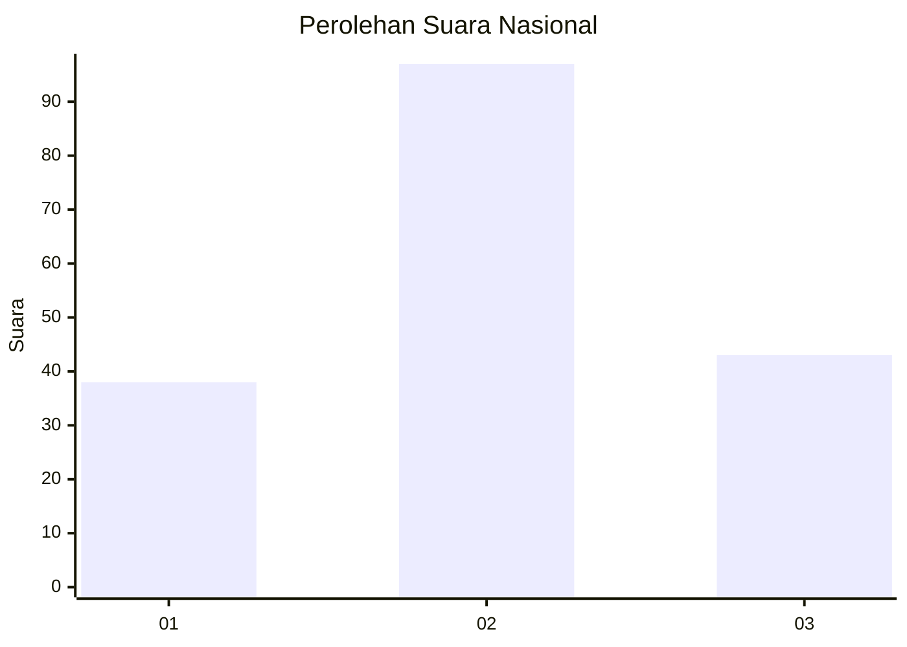
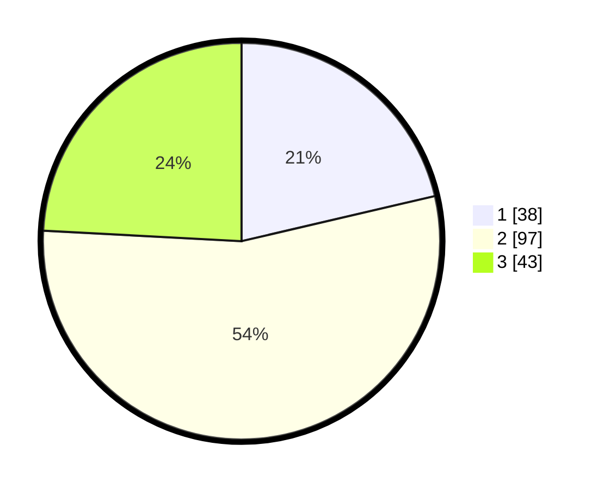

# Hasil

## Grafik

## Tabel

| No.    | Nama Paslon    | Suara | Suara (raw) | Persentase |
|:------ |:-------------- | -----:| -----------:| ----------:|
| 100025 | ANIES MUHAIMIN | 38    | [38][p-1]   | 21,35      |
| 100026 | PRABOWO GIBRAN | 97    | [97][p-2]   | 54,49      |
| 100027 | GANJAR MAHFUD  | 43    | [43][p-3]   | 24,16      |

[p-1]: https://github.com/gigit-pemilu/pemilu-2024/blob/main/pilpres/hitung-suara/sub/31-dki-jakarta/sub/72-jakarta-utara/sub/05-pademangan/sub/1002-pademangan-barat/sub/013-tps/sub/paslon-1.txt
[p-2]: https://github.com/gigit-pemilu/pemilu-2024/blob/main/pilpres/hitung-suara/sub/31-dki-jakarta/sub/72-jakarta-utara/sub/05-pademangan/sub/1002-pademangan-barat/sub/013-tps/sub/paslon-2.txt
[p-3]: https://github.com/gigit-pemilu/pemilu-2024/blob/main/pilpres/hitung-suara/sub/31-dki-jakarta/sub/72-jakarta-utara/sub/05-pademangan/sub/1002-pademangan-barat/sub/013-tps/sub/paslon-3.txt

## Foto C Plano

https://sirekap-obj-formc.kpu.go.id/30fc/pemilu/ppwp/31/72/05/10/02/3172051002013-20240214-224715--f56c50b5-52fd-404b-a317-e89c3d76b11b.jpg

https://sirekap-obj-formc.kpu.go.id/30fc/pemilu/ppwp/31/72/05/10/02/3172051002013-20240214-224912--90922f2b-59d7-41f5-8fc5-6ff52deae291.jpg

https://sirekap-obj-formc.kpu.go.id/30fc/pemilu/ppwp/31/72/05/10/02/3172051002013-20240214-225038--c5735659-cae3-4a8a-b04f-ca1b1bbdb243.jpg

## Metadata

| Key        | Value               |
| ---------- | ------------------- |
| Time Stamp | 2024-02-20 17:00:00 |

