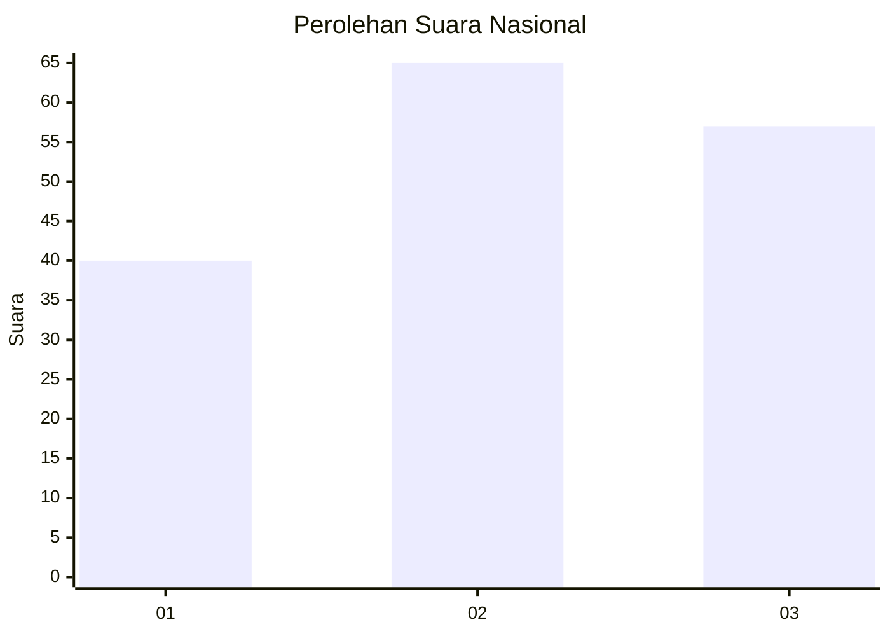
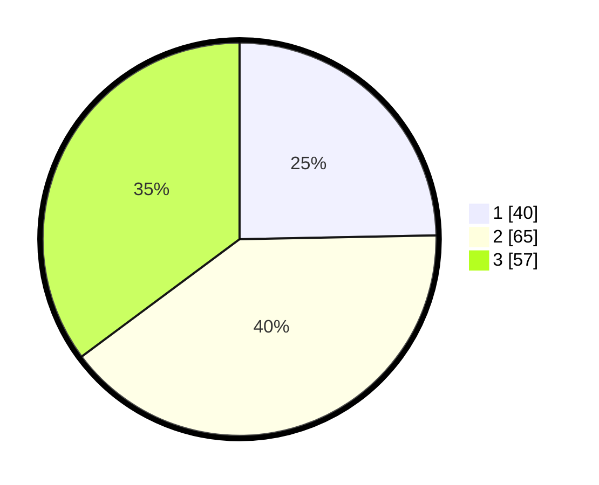

# Hasil

## Grafik

## Tabel

| No.    | Nama Paslon    | Suara | Suara (raw) | Persentase |
|:------ |:-------------- | -----:| -----------:| ----------:|
| 100025 | ANIES MUHAIMIN | 40    | [40][p-1]   | 24,69      |
| 100026 | PRABOWO GIBRAN | 65    | [65][p-2]   | 40,12      |
| 100027 | GANJAR MAHFUD  | 57    | [57][p-3]   | 35,19      |

[p-1]: https://github.com/gigit-pemilu/pemilu-2024/blob/main/pilpres/hitung-suara/sub/31-dki-jakarta/sub/72-jakarta-utara/sub/05-pademangan/sub/1002-pademangan-barat/sub/014-tps/sub/paslon-1.txt
[p-2]: https://github.com/gigit-pemilu/pemilu-2024/blob/main/pilpres/hitung-suara/sub/31-dki-jakarta/sub/72-jakarta-utara/sub/05-pademangan/sub/1002-pademangan-barat/sub/014-tps/sub/paslon-2.txt
[p-3]: https://github.com/gigit-pemilu/pemilu-2024/blob/main/pilpres/hitung-suara/sub/31-dki-jakarta/sub/72-jakarta-utara/sub/05-pademangan/sub/1002-pademangan-barat/sub/014-tps/sub/paslon-3.txt

## Foto C Plano

https://sirekap-obj-formc.kpu.go.id/f33a/pemilu/ppwp/31/72/05/10/02/3172051002014-20240214-224728--8b3ee6ec-9d61-443b-aef5-52f541e63013.jpg

https://sirekap-obj-formc.kpu.go.id/f33a/pemilu/ppwp/31/72/05/10/02/3172051002014-20240214-224748--cf575947-8117-45a9-9606-fadf2c016785.jpg

https://sirekap-obj-formc.kpu.go.id/f33a/pemilu/ppwp/31/72/05/10/02/3172051002014-20240214-224756--64339756-2edb-4096-a174-49cd99124512.jpg

## Metadata

| Key        | Value               |
| ---------- | ------------------- |
| Time Stamp | 2024-02-21 15:00:00 |

