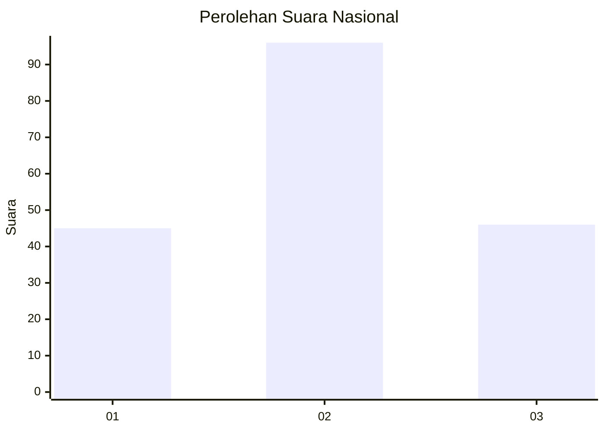
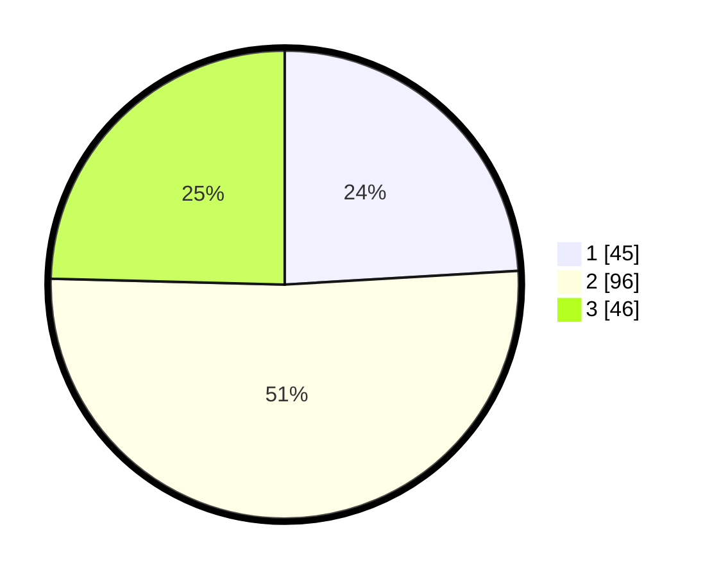

# Hasil

## Grafik

## Tabel

| No.    | Nama Paslon    | Suara | Suara (raw) | Persentase |
|:------ |:-------------- | -----:| -----------:| ----------:|
| 100025 | ANIES MUHAIMIN | 45    | [45][p-1]   | 24,06      |
| 100026 | PRABOWO GIBRAN | 96    | [96][p-2]   | 51,34      |
| 100027 | GANJAR MAHFUD  | 46    | [46][p-3]   | 24,60      |

[p-1]: https://github.com/gigit-pemilu/pemilu-2024/blob/main/pilpres/hitung-suara/sub/31-dki-jakarta/sub/72-jakarta-utara/sub/05-pademangan/sub/1002-pademangan-barat/sub/017-tps/sub/paslon-1.txt
[p-2]: https://github.com/gigit-pemilu/pemilu-2024/blob/main/pilpres/hitung-suara/sub/31-dki-jakarta/sub/72-jakarta-utara/sub/05-pademangan/sub/1002-pademangan-barat/sub/017-tps/sub/paslon-2.txt
[p-3]: https://github.com/gigit-pemilu/pemilu-2024/blob/main/pilpres/hitung-suara/sub/31-dki-jakarta/sub/72-jakarta-utara/sub/05-pademangan/sub/1002-pademangan-barat/sub/017-tps/sub/paslon-3.txt

## Foto C Plano

https://sirekap-obj-formc.kpu.go.id/4e28/pemilu/ppwp/31/72/05/10/02/3172051002017-20240214-212056--91cd0e81-6331-483b-92be-581d0f24ea49.jpg

https://sirekap-obj-formc.kpu.go.id/4e28/pemilu/ppwp/31/72/05/10/02/3172051002017-20240214-212208--5a58ea91-d3af-4916-a0ad-f340ceb59ecd.jpg

https://sirekap-obj-formc.kpu.go.id/4e28/pemilu/ppwp/31/72/05/10/02/3172051002017-20240214-212319--cf5c383d-5a76-41e0-9f41-f08f5c7eca11.jpg

## Metadata

| Key        | Value               |
| ---------- | ------------------- |
| Time Stamp | 2024-02-21 18:00:00 |

