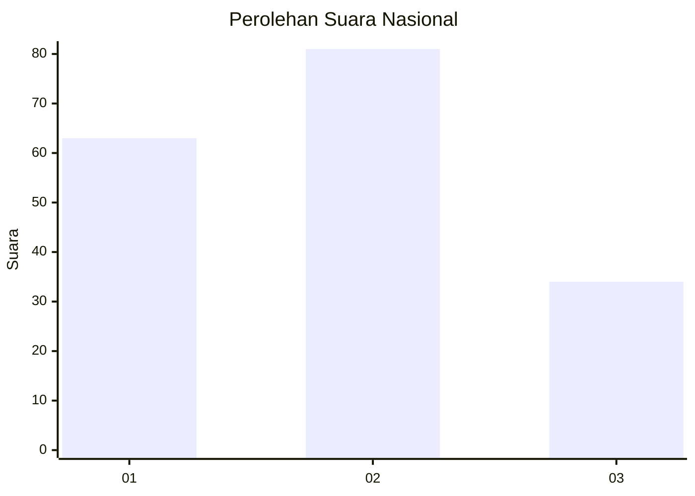
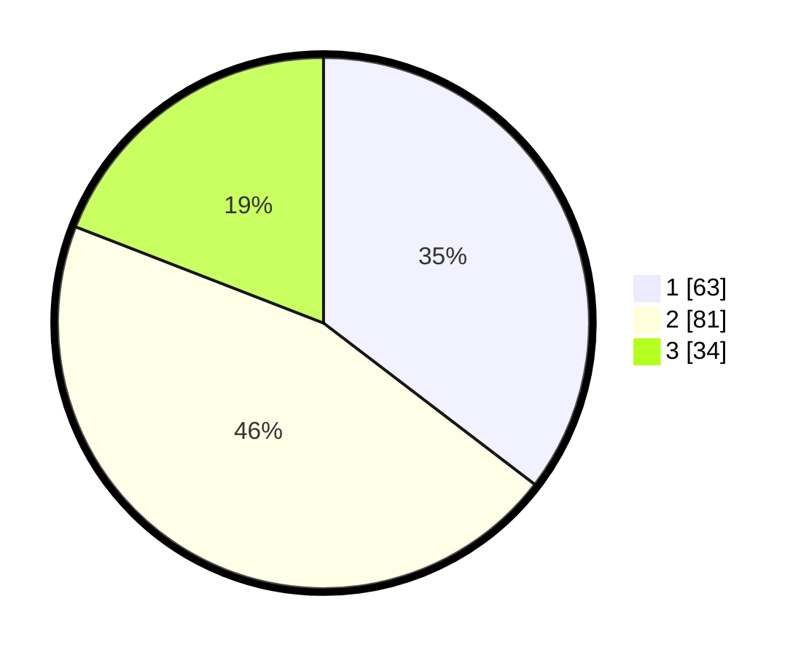

# Hasil

## Grafik

## Tabel

| No.    | Nama Paslon    | Suara | Suara (raw) | Persentase |
|:------ |:-------------- | -----:| -----------:| ----------:|
| 100025 | ANIES MUHAIMIN | 63    | [63][p-1]   | 35,39      |
| 100026 | PRABOWO GIBRAN | 81    | [81][p-2]   | 45,51      |
| 100027 | GANJAR MAHFUD  | 34    | [34][p-3]   | 19,10      |

[p-1]: https://github.com/gigit-pemilu/pemilu-2024/blob/main/pilpres/hitung-suara/sub/31-dki-jakarta/sub/72-jakarta-utara/sub/05-pademangan/sub/1002-pademangan-barat/sub/035-tps/sub/paslon-1.txt
[p-2]: https://github.com/gigit-pemilu/pemilu-2024/blob/main/pilpres/hitung-suara/sub/31-dki-jakarta/sub/72-jakarta-utara/sub/05-pademangan/sub/1002-pademangan-barat/sub/035-tps/sub/paslon-2.txt
[p-3]: https://github.com/gigit-pemilu/pemilu-2024/blob/main/pilpres/hitung-suara/sub/31-dki-jakarta/sub/72-jakarta-utara/sub/05-pademangan/sub/1002-pademangan-barat/sub/035-tps/sub/paslon-3.txt

## Foto C Plano

https://sirekap-obj-formc.kpu.go.id/46c3/pemilu/ppwp/31/72/05/10/02/3172051002035-20240214-224640--ccb43a84-5938-45c7-8830-1b594924629c.jpg

https://sirekap-obj-formc.kpu.go.id/46c3/pemilu/ppwp/31/72/05/10/02/3172051002035-20240214-224409--4d4315c4-cdd8-497f-b3ab-160b5a2895de.jpg

https://sirekap-obj-formc.kpu.go.id/46c3/pemilu/ppwp/31/72/05/10/02/3172051002035-20240214-224212--9517e1bb-6488-4ced-82d9-c51620983568.jpg

## Metadata

| Key        | Value               |
| ---------- | ------------------- |
| Time Stamp | 2024-02-21 15:00:00 |

