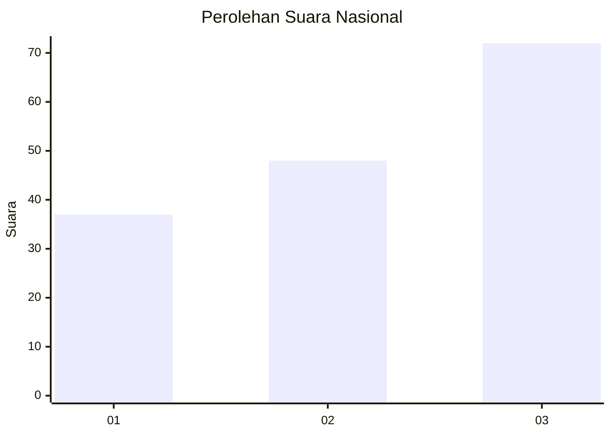
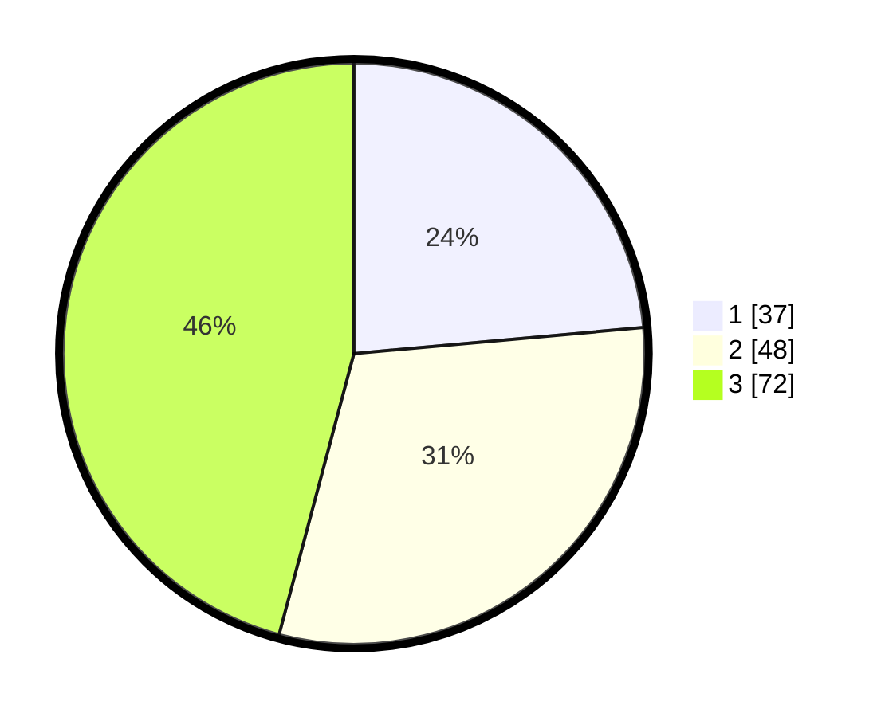

# Hasil

## Grafik

## Tabel

| No.    | Nama Paslon    | Suara | Suara (raw) | Persentase |
|:------ |:-------------- | -----:| -----------:| ----------:|
| 100025 | ANIES MUHAIMIN | 37    | [37][p-1]   | 23,57      |
| 100026 | PRABOWO GIBRAN | 48    | [48][p-2]   | 30,57      |
| 100027 | GANJAR MAHFUD  | 72    | [72][p-3]   | 45,86      |

[p-1]: https://github.com/gigit-pemilu/pemilu-2024/blob/main/pilpres/hitung-suara/sub/31-dki-jakarta/sub/72-jakarta-utara/sub/05-pademangan/sub/1002-pademangan-barat/sub/060-tps/sub/paslon-1.txt
[p-2]: https://github.com/gigit-pemilu/pemilu-2024/blob/main/pilpres/hitung-suara/sub/31-dki-jakarta/sub/72-jakarta-utara/sub/05-pademangan/sub/1002-pademangan-barat/sub/060-tps/sub/paslon-2.txt
[p-3]: https://github.com/gigit-pemilu/pemilu-2024/blob/main/pilpres/hitung-suara/sub/31-dki-jakarta/sub/72-jakarta-utara/sub/05-pademangan/sub/1002-pademangan-barat/sub/060-tps/sub/paslon-3.txt

## Foto C Plano

https://sirekap-obj-formc.kpu.go.id/4744/pemilu/ppwp/31/72/05/10/02/3172051002060-20240214-223114--871edfe2-6a52-4d0d-9a8a-15a485558e4e.jpg

https://sirekap-obj-formc.kpu.go.id/4744/pemilu/ppwp/31/72/05/10/02/3172051002060-20240214-223124--b0d28b66-89c7-4f4c-a4b0-48c1830afddd.jpg

https://sirekap-obj-formc.kpu.go.id/4744/pemilu/ppwp/31/72/05/10/02/3172051002060-20240214-223132--1a7e94c6-edb6-489d-b286-045ef41b62a2.jpg

## Metadata

| Key        | Value               |
| ---------- | ------------------- |
| Time Stamp | 2024-02-21 15:00:00 |

