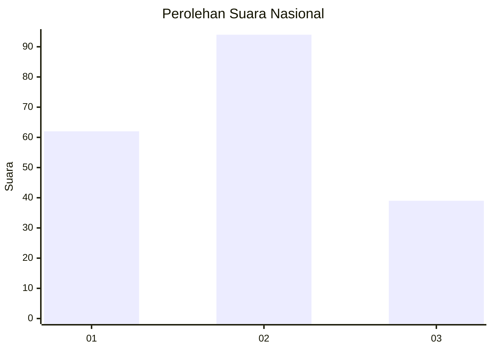
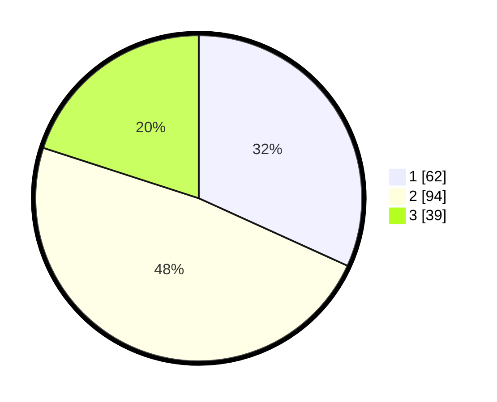

# Hasil

## Grafik

## Tabel

| No.    | Nama Paslon    | Suara | Suara (raw) | Persentase |
|:------ |:-------------- | -----:| -----------:| ----------:|
| 100025 | ANIES MUHAIMIN | 62    | [62][p-1]   | 31,79      |
| 100026 | PRABOWO GIBRAN | 94    | [94][p-2]   | 48,21      |
| 100027 | GANJAR MAHFUD  | 39    | [39][p-3]   | 20,00      |

[p-1]: https://github.com/gigit-pemilu/pemilu-2024/blob/main/pilpres/hitung-suara/sub/31-dki-jakarta/sub/72-jakarta-utara/sub/05-pademangan/sub/1002-pademangan-barat/sub/062-tps/sub/paslon-1.txt
[p-2]: https://github.com/gigit-pemilu/pemilu-2024/blob/main/pilpres/hitung-suara/sub/31-dki-jakarta/sub/72-jakarta-utara/sub/05-pademangan/sub/1002-pademangan-barat/sub/062-tps/sub/paslon-2.txt
[p-3]: https://github.com/gigit-pemilu/pemilu-2024/blob/main/pilpres/hitung-suara/sub/31-dki-jakarta/sub/72-jakarta-utara/sub/05-pademangan/sub/1002-pademangan-barat/sub/062-tps/sub/paslon-3.txt

## Foto C Plano

https://sirekap-obj-formc.kpu.go.id/2b81/pemilu/ppwp/31/72/05/10/02/3172051002062-20240215-205128--46ab25e0-9078-4269-9796-d244415eee85.jpg

https://sirekap-obj-formc.kpu.go.id/2b81/pemilu/ppwp/31/72/05/10/02/3172051002062-20240215-021545--71f9edef-e9a5-4d3b-9580-d0b652fc6311.jpg

https://sirekap-obj-formc.kpu.go.id/2b81/pemilu/ppwp/31/72/05/10/02/3172051002062-20240215-021605--e7db9030-e987-4263-8467-a5eccc73a9b0.jpg

## Metadata

| Key        | Value               |
| ---------- | ------------------- |
| Time Stamp | 2024-02-21 15:00:00 |

