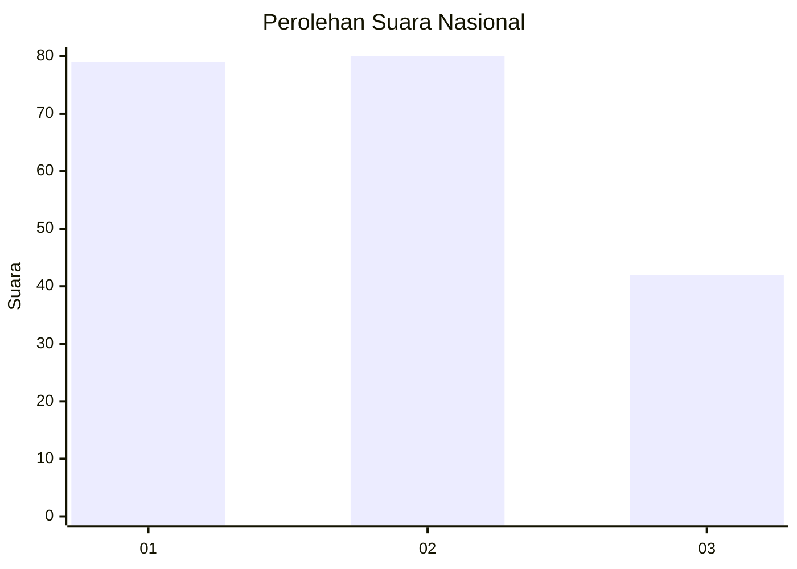
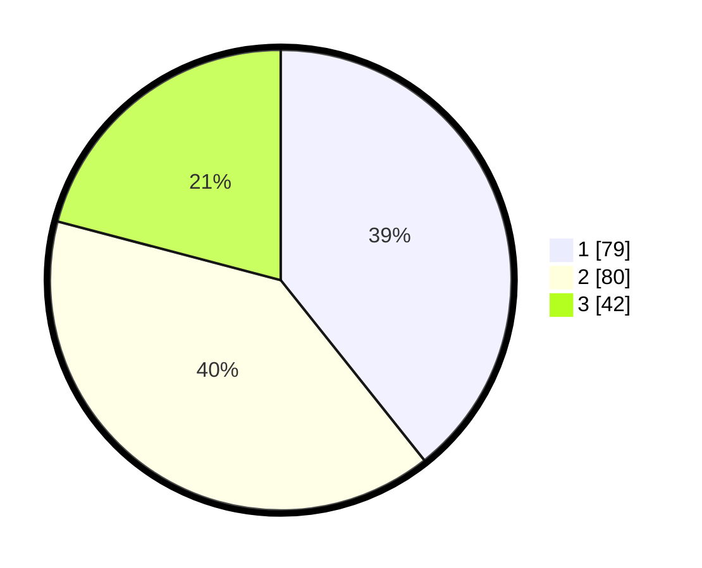

# Hasil

## Grafik

## Tabel

| No.    | Nama Paslon    | Suara | Suara (raw) | Persentase |
|:------ |:-------------- | -----:| -----------:| ----------:|
| 100025 | ANIES MUHAIMIN | 79    | [79][p-1]   | 39,30      |
| 100026 | PRABOWO GIBRAN | 80    | [80][p-2]   | 39,80      |
| 100027 | GANJAR MAHFUD  | 42    | [42][p-3]   | 20,90      |

[p-1]: https://github.com/gigit-pemilu/pemilu-2024/blob/main/pilpres/hitung-suara/sub/31-dki-jakarta/sub/72-jakarta-utara/sub/05-pademangan/sub/1002-pademangan-barat/sub/063-tps/sub/paslon-1.txt
[p-2]: https://github.com/gigit-pemilu/pemilu-2024/blob/main/pilpres/hitung-suara/sub/31-dki-jakarta/sub/72-jakarta-utara/sub/05-pademangan/sub/1002-pademangan-barat/sub/063-tps/sub/paslon-2.txt
[p-3]: https://github.com/gigit-pemilu/pemilu-2024/blob/main/pilpres/hitung-suara/sub/31-dki-jakarta/sub/72-jakarta-utara/sub/05-pademangan/sub/1002-pademangan-barat/sub/063-tps/sub/paslon-3.txt

## Foto C Plano

https://sirekap-obj-formc.kpu.go.id/5387/pemilu/ppwp/31/72/05/10/02/3172051002063-20240215-005919--d9c7f51d-667f-4934-a05f-4164435952fa.jpg

https://sirekap-obj-formc.kpu.go.id/5387/pemilu/ppwp/31/72/05/10/02/3172051002063-20240215-010000--99e6ff53-efdf-4d23-91c3-02a37f22ec9e.jpg

https://sirekap-obj-formc.kpu.go.id/5387/pemilu/ppwp/31/72/05/10/02/3172051002063-20240215-010114--cc5232c5-0fd8-4b86-93e4-f9d9e0338d32.jpg

## Metadata

| Key        | Value               |
| ---------- | ------------------- |
| Time Stamp | 2024-02-21 16:00:00 |

