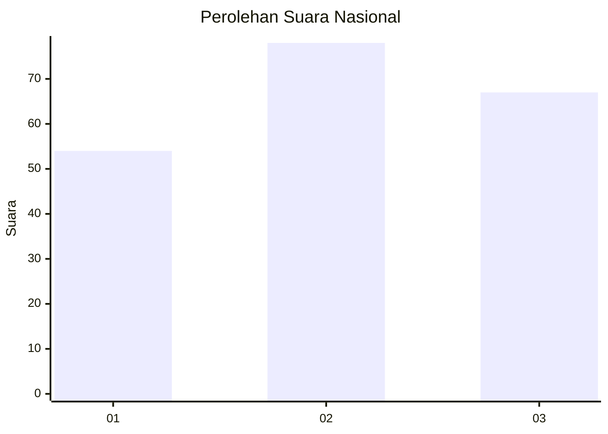
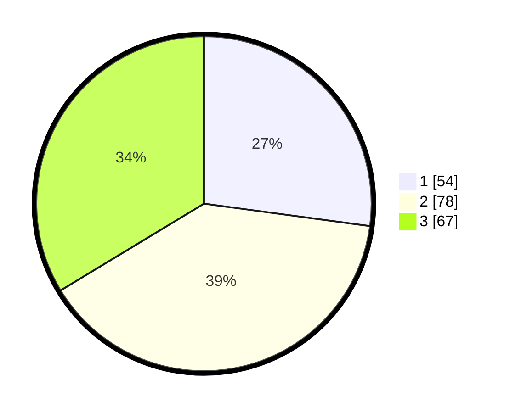

# Hasil

## Grafik

## Tabel

| No.    | Nama Paslon    | Suara | Suara (raw) | Persentase |
|:------ |:-------------- | -----:| -----------:| ----------:|
| 100025 | ANIES MUHAIMIN | 54    | [54][p-1]   | 27,14      |
| 100026 | PRABOWO GIBRAN | 78    | [78][p-2]   | 39,20      |
| 100027 | GANJAR MAHFUD  | 67    | [67][p-3]   | 33,67      |

[p-1]: https://github.com/gigit-pemilu/pemilu-2024/blob/main/pilpres/hitung-suara/sub/31-dki-jakarta/sub/72-jakarta-utara/sub/05-pademangan/sub/1002-pademangan-barat/sub/068-tps/sub/paslon-1.txt
[p-2]: https://github.com/gigit-pemilu/pemilu-2024/blob/main/pilpres/hitung-suara/sub/31-dki-jakarta/sub/72-jakarta-utara/sub/05-pademangan/sub/1002-pademangan-barat/sub/068-tps/sub/paslon-2.txt
[p-3]: https://github.com/gigit-pemilu/pemilu-2024/blob/main/pilpres/hitung-suara/sub/31-dki-jakarta/sub/72-jakarta-utara/sub/05-pademangan/sub/1002-pademangan-barat/sub/068-tps/sub/paslon-3.txt

## Foto C Plano

https://sirekap-obj-formc.kpu.go.id/674d/pemilu/ppwp/31/72/05/10/02/3172051002068-20240214-205120--adfc2195-eb9f-4374-a568-e42071a9bafe.jpg

https://sirekap-obj-formc.kpu.go.id/674d/pemilu/ppwp/31/72/05/10/02/3172051002068-20240214-205125--aae21684-c317-4067-93ed-b39148a02885.jpg

https://sirekap-obj-formc.kpu.go.id/674d/pemilu/ppwp/31/72/05/10/02/3172051002068-20240214-205130--0aa27fa2-267b-4305-ae4c-f9eb7d6d937c.jpg

## Metadata

| Key        | Value               |
| ---------- | ------------------- |
| Time Stamp | 2024-02-21 15:00:00 |

