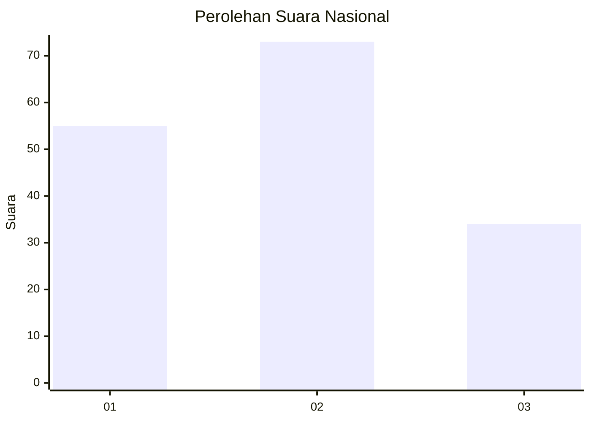
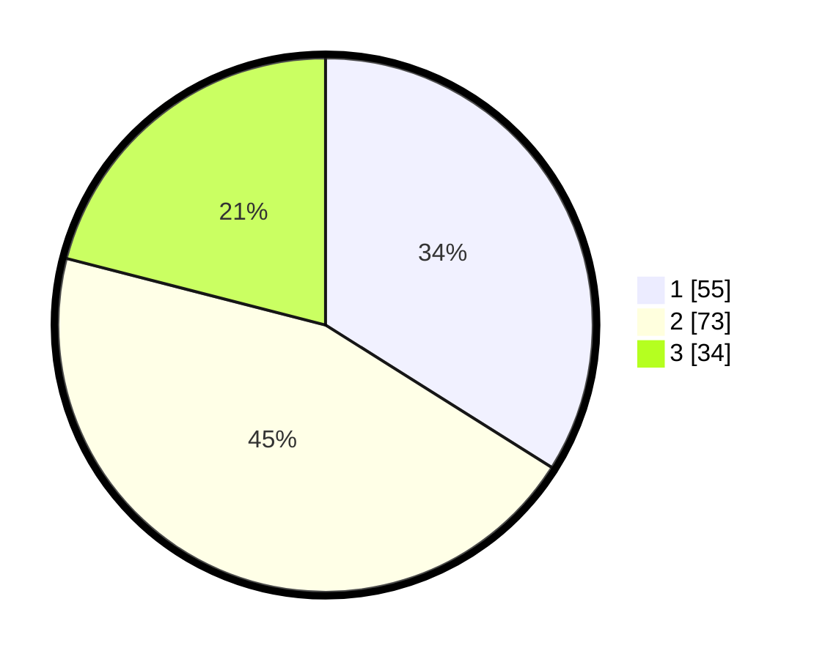

# Hasil

## Grafik

## Tabel

| No.    | Nama Paslon    | Suara | Suara (raw) | Persentase |
|:------ |:-------------- | -----:| -----------:| ----------:|
| 100025 | ANIES MUHAIMIN | 55    | [55][p-1]   | 33,95      |
| 100026 | PRABOWO GIBRAN | 73    | [73][p-2]   | 45,06      |
| 100027 | GANJAR MAHFUD  | 34    | [34][p-3]   | 20,99      |

[p-1]: https://github.com/gigit-pemilu/pemilu-2024/blob/main/pilpres/hitung-suara/sub/31-dki-jakarta/sub/72-jakarta-utara/sub/05-pademangan/sub/1002-pademangan-barat/sub/080-tps/sub/paslon-1.txt
[p-2]: https://github.com/gigit-pemilu/pemilu-2024/blob/main/pilpres/hitung-suara/sub/31-dki-jakarta/sub/72-jakarta-utara/sub/05-pademangan/sub/1002-pademangan-barat/sub/080-tps/sub/paslon-2.txt
[p-3]: https://github.com/gigit-pemilu/pemilu-2024/blob/main/pilpres/hitung-suara/sub/31-dki-jakarta/sub/72-jakarta-utara/sub/05-pademangan/sub/1002-pademangan-barat/sub/080-tps/sub/paslon-3.txt

## Foto C Plano

https://sirekap-obj-formc.kpu.go.id/fb81/pemilu/ppwp/31/72/05/10/02/3172051002080-20240214-205834--93095b5d-41fe-4000-985f-44427a5941e2.jpg

https://sirekap-obj-formc.kpu.go.id/fb81/pemilu/ppwp/31/72/05/10/02/3172051002080-20240214-210024--951f13de-5aa4-4c63-9d6e-245ff6d245ad.jpg

https://sirekap-obj-formc.kpu.go.id/fb81/pemilu/ppwp/31/72/05/10/02/3172051002080-20240214-210155--7b471065-7689-439c-89d0-e520a96c3b16.jpg

## Metadata

| Key        | Value               |
| ---------- | ------------------- |
| Time Stamp | 2024-02-21 20:00:00 |

