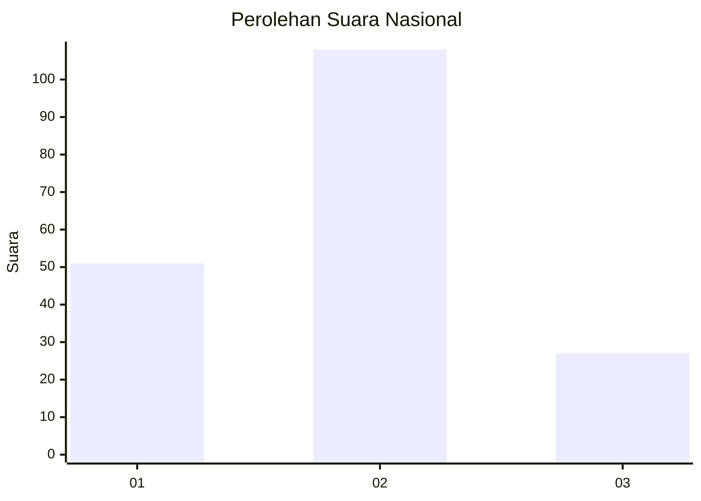
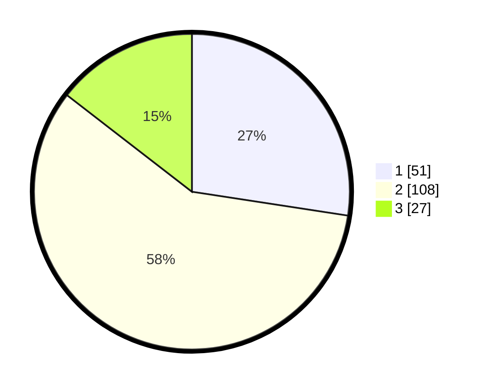

# Hasil

## Grafik

## Tabel

| No.    | Nama Paslon    | Suara | Suara (raw) | Persentase |
|:------ |:-------------- | -----:| -----------:| ----------:|
| 100025 | ANIES MUHAIMIN | 51    | [51][p-1]   | 27,42      |
| 100026 | PRABOWO GIBRAN | 108   | [108][p-2]  | 58,06      |
| 100027 | GANJAR MAHFUD  | 27    | [27][p-3]   | 14,52      |

[p-1]: https://github.com/gigit-pemilu/pemilu-2024/blob/main/pilpres/hitung-suara/sub/31-dki-jakarta/sub/72-jakarta-utara/sub/05-pademangan/sub/1002-pademangan-barat/sub/106-tps/sub/paslon-1.txt
[p-2]: https://github.com/gigit-pemilu/pemilu-2024/blob/main/pilpres/hitung-suara/sub/31-dki-jakarta/sub/72-jakarta-utara/sub/05-pademangan/sub/1002-pademangan-barat/sub/106-tps/sub/paslon-2.txt
[p-3]: https://github.com/gigit-pemilu/pemilu-2024/blob/main/pilpres/hitung-suara/sub/31-dki-jakarta/sub/72-jakarta-utara/sub/05-pademangan/sub/1002-pademangan-barat/sub/106-tps/sub/paslon-3.txt

## Foto C Plano

https://sirekap-obj-formc.kpu.go.id/3270/pemilu/ppwp/31/72/05/10/02/3172051002106-20240214-155656--5aa293a6-ef69-4ca7-9efe-8b434b796ccf.jpg

https://sirekap-obj-formc.kpu.go.id/3270/pemilu/ppwp/31/72/05/10/02/3172051002106-20240214-155530--abeebf1f-a965-4616-87dd-a9d929cc5b80.jpg

https://sirekap-obj-formc.kpu.go.id/3270/pemilu/ppwp/31/72/05/10/02/3172051002106-20240215-000808--ce252c43-95bf-4137-b3a5-64ab27f85ff1.jpg

## Metadata

| Key        | Value               |
| ---------- | ------------------- |
| Time Stamp | 2024-02-15 00:41:44 |

