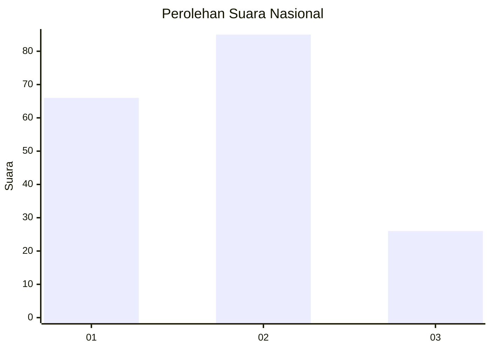
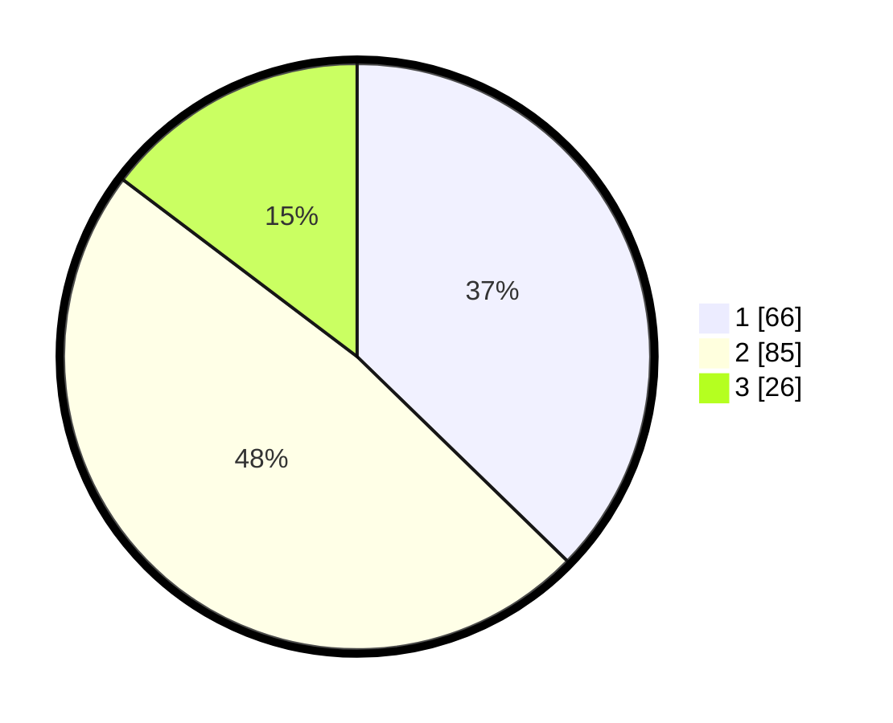

# Hasil

## Grafik

## Tabel

| No.    | Nama Paslon    | Suara | Suara (raw) | Persentase |
|:------ |:-------------- | -----:| -----------:| ----------:|
| 100025 | ANIES MUHAIMIN | 66    | [66][p-1]   | 37,29      |
| 100026 | PRABOWO GIBRAN | 85    | [85][p-2]   | 48,02      |
| 100027 | GANJAR MAHFUD  | 26    | [26][p-3]   | 14,69      |

[p-1]: https://github.com/gigit-pemilu/pemilu-2024/blob/main/pilpres/hitung-suara/sub/31-dki-jakarta/sub/72-jakarta-utara/sub/05-pademangan/sub/1002-pademangan-barat/sub/107-tps/sub/paslon-1.txt
[p-2]: https://github.com/gigit-pemilu/pemilu-2024/blob/main/pilpres/hitung-suara/sub/31-dki-jakarta/sub/72-jakarta-utara/sub/05-pademangan/sub/1002-pademangan-barat/sub/107-tps/sub/paslon-2.txt
[p-3]: https://github.com/gigit-pemilu/pemilu-2024/blob/main/pilpres/hitung-suara/sub/31-dki-jakarta/sub/72-jakarta-utara/sub/05-pademangan/sub/1002-pademangan-barat/sub/107-tps/sub/paslon-3.txt

## Foto C Plano

https://sirekap-obj-formc.kpu.go.id/8674/pemilu/ppwp/31/72/05/10/02/3172051002107-20240214-195948--62d1c3df-67bc-4d90-a1c2-040ee68ab66b.jpg

https://sirekap-obj-formc.kpu.go.id/8674/pemilu/ppwp/31/72/05/10/02/3172051002107-20240214-200216--e5e5a796-0b4d-42ce-a4bd-ecfe917aed61.jpg

https://sirekap-obj-formc.kpu.go.id/8674/pemilu/ppwp/31/72/05/10/02/3172051002107-20240214-200340--2e53d178-23fe-438c-b31e-79d8182988a1.jpg

## Metadata

| Key        | Value               |
| ---------- | ------------------- |
| Time Stamp | 2024-02-21 21:00:04 |

