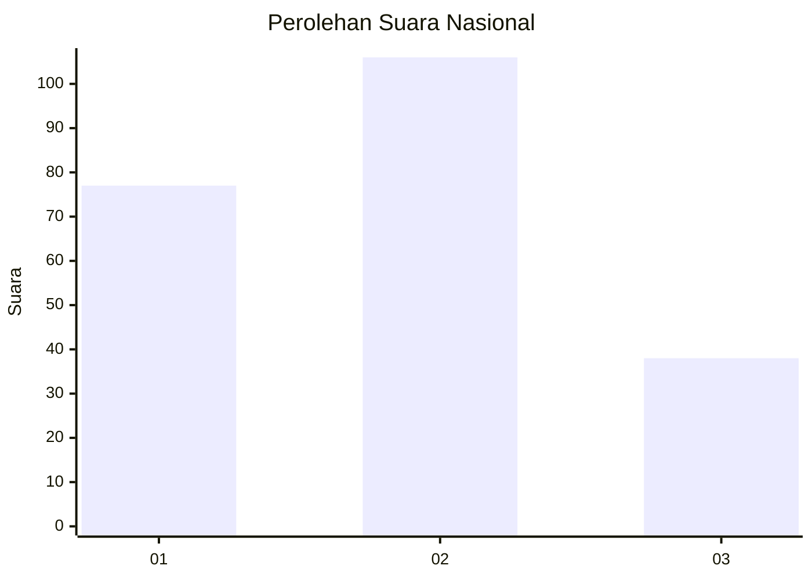
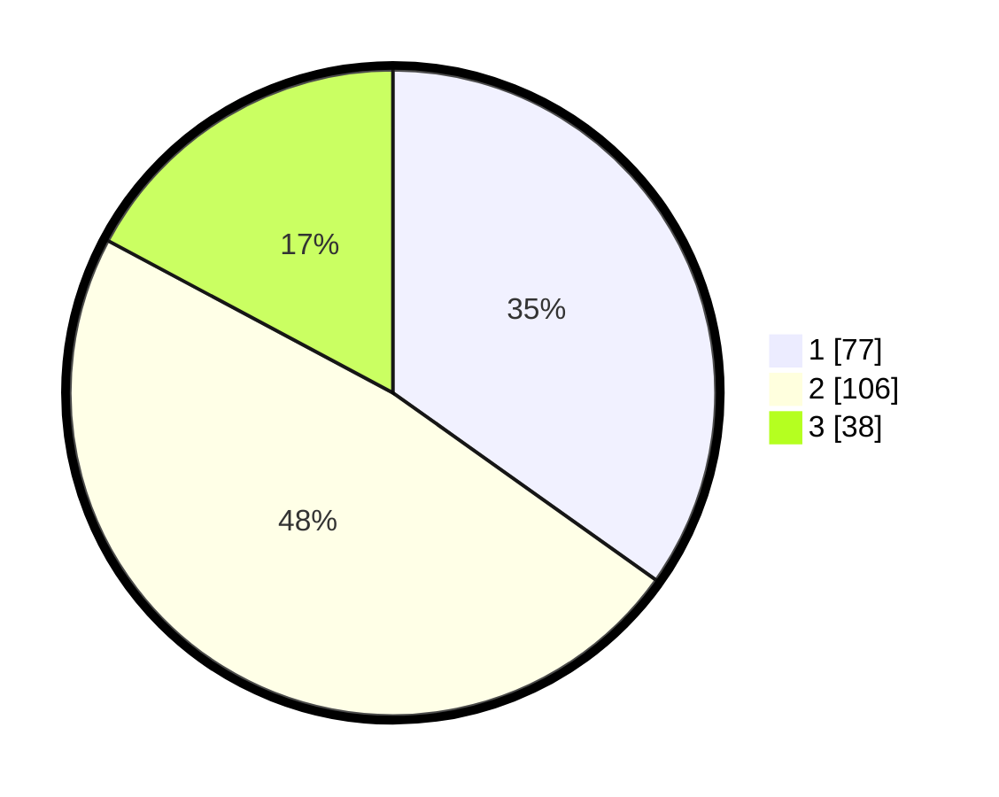

# Hasil

## Grafik

## Tabel

| No.    | Nama Paslon    | Suara | Suara (raw) | Persentase |
|:------ |:-------------- | -----:| -----------:| ----------:|
| 100025 | ANIES MUHAIMIN | 77    | [77][p-1]   | 34,84      |
| 100026 | PRABOWO GIBRAN | 106   | [106][p-2]  | 47,96      |
| 100027 | GANJAR MAHFUD  | 38    | [38][p-3]   | 17,19      |

[p-1]: https://github.com/gigit-pemilu/pemilu-2024/blob/main/pilpres/hitung-suara/sub/31-dki-jakarta/sub/72-jakarta-utara/sub/05-pademangan/sub/1002-pademangan-barat/sub/123-tps/sub/paslon-1.txt
[p-2]: https://github.com/gigit-pemilu/pemilu-2024/blob/main/pilpres/hitung-suara/sub/31-dki-jakarta/sub/72-jakarta-utara/sub/05-pademangan/sub/1002-pademangan-barat/sub/123-tps/sub/paslon-2.txt
[p-3]: https://github.com/gigit-pemilu/pemilu-2024/blob/main/pilpres/hitung-suara/sub/31-dki-jakarta/sub/72-jakarta-utara/sub/05-pademangan/sub/1002-pademangan-barat/sub/123-tps/sub/paslon-3.txt

## Foto C Plano

https://sirekap-obj-formc.kpu.go.id/79e6/pemilu/ppwp/31/72/05/10/02/3172051002123-20240215-004756--c60871b7-0d0b-4b04-9565-f0f1792acbbb.jpg

https://sirekap-obj-formc.kpu.go.id/79e6/pemilu/ppwp/31/72/05/10/02/3172051002123-20240215-004611--7eb1603f-0aa0-4c71-84b1-26e51054d958.jpg

https://sirekap-obj-formc.kpu.go.id/79e6/pemilu/ppwp/31/72/05/10/02/3172051002123-20240215-004910--4f72b6d1-648b-4fb6-8321-ed8aadc48809.jpg

## Metadata

| Key        | Value               |
| ---------- | ------------------- |
| Time Stamp | 2024-02-21 20:00:00 |

