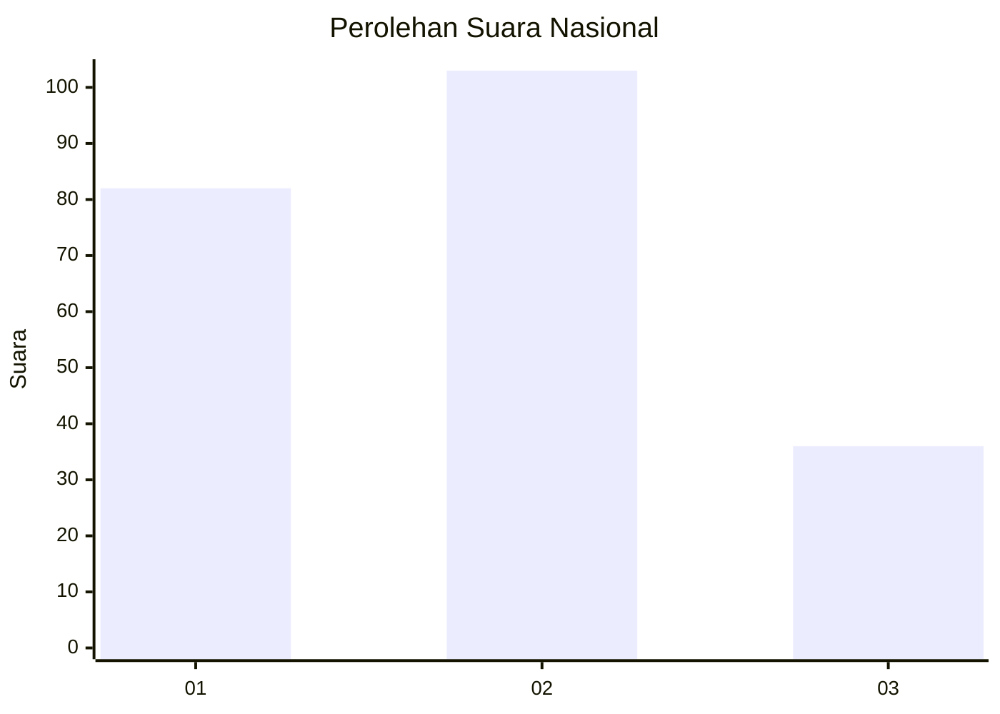
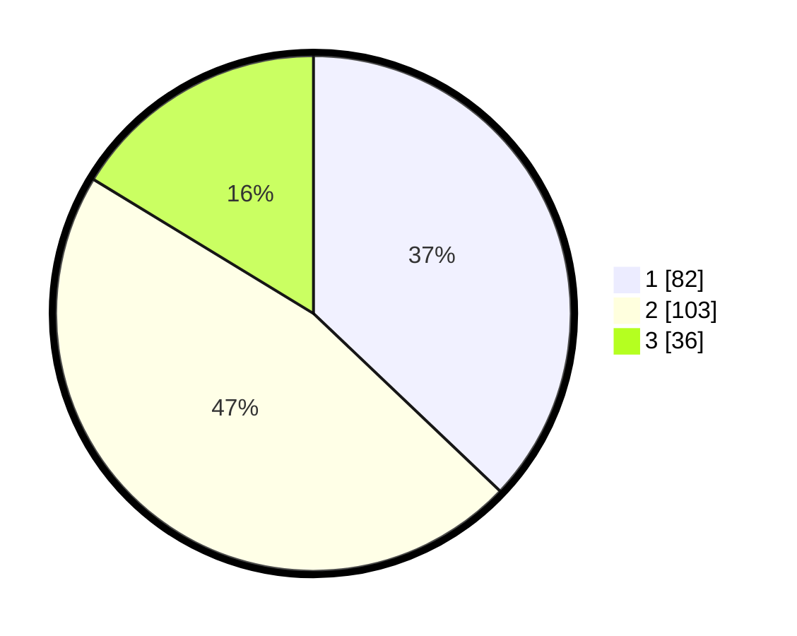

# Hasil

## Grafik

## Tabel

| No.    | Nama Paslon    | Suara | Suara (raw) | Persentase |
|:------ |:-------------- | -----:| -----------:| ----------:|
| 100025 | ANIES MUHAIMIN | 82    | [82][p-1]   | 37,10      |
| 100026 | PRABOWO GIBRAN | 103   | [103][p-2]  | 46,61      |
| 100027 | GANJAR MAHFUD  | 36    | [36][p-3]   | 16,29      |

[p-1]: https://github.com/gigit-pemilu/pemilu-2024/blob/main/pilpres/hitung-suara/sub/31-dki-jakarta/sub/72-jakarta-utara/sub/05-pademangan/sub/1002-pademangan-barat/sub/134-tps/sub/paslon-1.txt
[p-2]: https://github.com/gigit-pemilu/pemilu-2024/blob/main/pilpres/hitung-suara/sub/31-dki-jakarta/sub/72-jakarta-utara/sub/05-pademangan/sub/1002-pademangan-barat/sub/134-tps/sub/paslon-2.txt
[p-3]: https://github.com/gigit-pemilu/pemilu-2024/blob/main/pilpres/hitung-suara/sub/31-dki-jakarta/sub/72-jakarta-utara/sub/05-pademangan/sub/1002-pademangan-barat/sub/134-tps/sub/paslon-3.txt

## Foto C Plano

https://sirekap-obj-formc.kpu.go.id/234a/pemilu/ppwp/31/72/05/10/02/3172051002134-20240215-025351--0de74586-8a52-4c03-94b2-2959ea581166.jpg

https://sirekap-obj-formc.kpu.go.id/234a/pemilu/ppwp/31/72/05/10/02/3172051002134-20240215-025522--452e4c83-7276-4ab7-b49a-6e09a584c4da.jpg

https://sirekap-obj-formc.kpu.go.id/234a/pemilu/ppwp/31/72/05/10/02/3172051002134-20240214-223154--c966650c-154d-451d-9251-0c497cff66e7.jpg

## Metadata

| Key        | Value               |
| ---------- | ------------------- |
| Time Stamp | 2024-02-15 21:01:18 |

