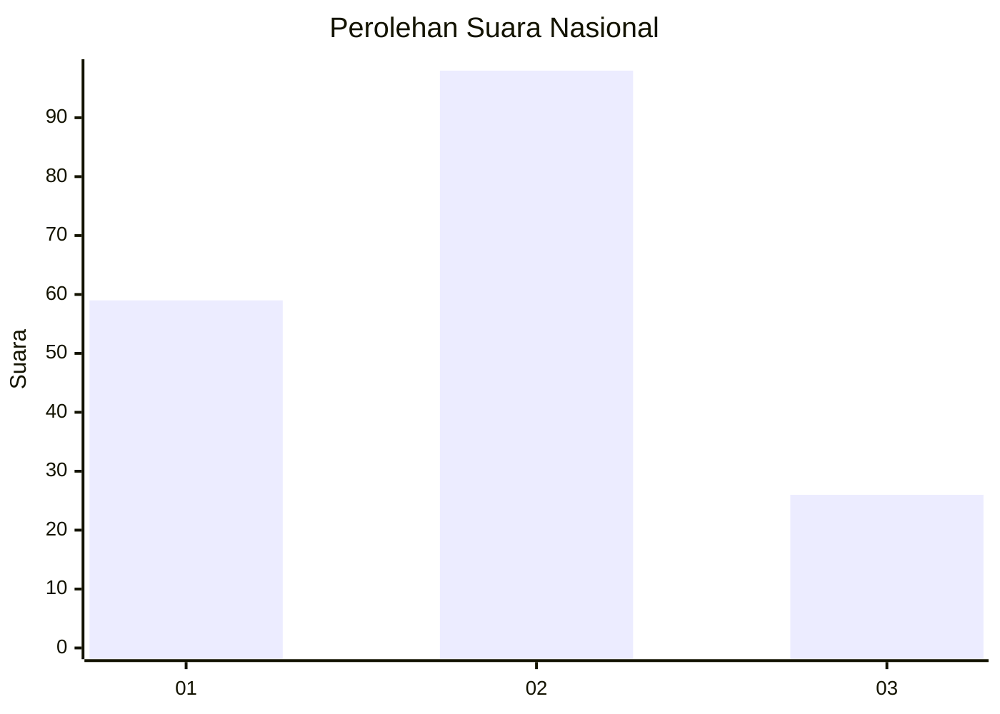
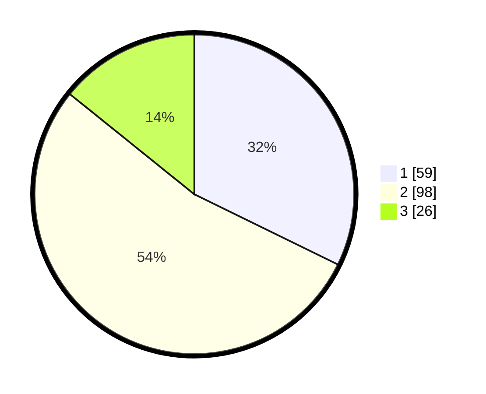

# Hasil

## Grafik

## Tabel

| No.    | Nama Paslon    | Suara | Suara (raw) | Persentase |
|:------ |:-------------- | -----:| -----------:| ----------:|
| 100025 | ANIES MUHAIMIN | 59    | [59][p-1]   | 32,24      |
| 100026 | PRABOWO GIBRAN | 98    | [98][p-2]   | 53,55      |
| 100027 | GANJAR MAHFUD  | 26    | [26][p-3]   | 14,21      |

[p-1]: https://github.com/gigit-pemilu/pemilu-2024/blob/main/pilpres/hitung-suara/sub/31-dki-jakarta/sub/72-jakarta-utara/sub/05-pademangan/sub/1002-pademangan-barat/sub/178-tps/sub/paslon-1.txt
[p-2]: https://github.com/gigit-pemilu/pemilu-2024/blob/main/pilpres/hitung-suara/sub/31-dki-jakarta/sub/72-jakarta-utara/sub/05-pademangan/sub/1002-pademangan-barat/sub/178-tps/sub/paslon-2.txt
[p-3]: https://github.com/gigit-pemilu/pemilu-2024/blob/main/pilpres/hitung-suara/sub/31-dki-jakarta/sub/72-jakarta-utara/sub/05-pademangan/sub/1002-pademangan-barat/sub/178-tps/sub/paslon-3.txt

## Foto C Plano

https://sirekap-obj-formc.kpu.go.id/9f36/pemilu/ppwp/31/72/05/10/02/3172051002178-20240216-075340--10177593-0c80-4ed4-b860-635b3ed3c6f6.jpg

https://sirekap-obj-formc.kpu.go.id/9f36/pemilu/ppwp/31/72/05/10/02/3172051002178-20240216-075737--61036781-0ee5-453b-a8a1-281996af56e1.jpg

https://sirekap-obj-formc.kpu.go.id/9f36/pemilu/ppwp/31/72/05/10/02/3172051002178-20240216-075925--7b293729-a9f5-4c77-8c1d-6660b6a2f901.jpg

## Metadata

| Key        | Value               |
| ---------- | ------------------- |
| Time Stamp | 2024-02-21 16:00:00 |

