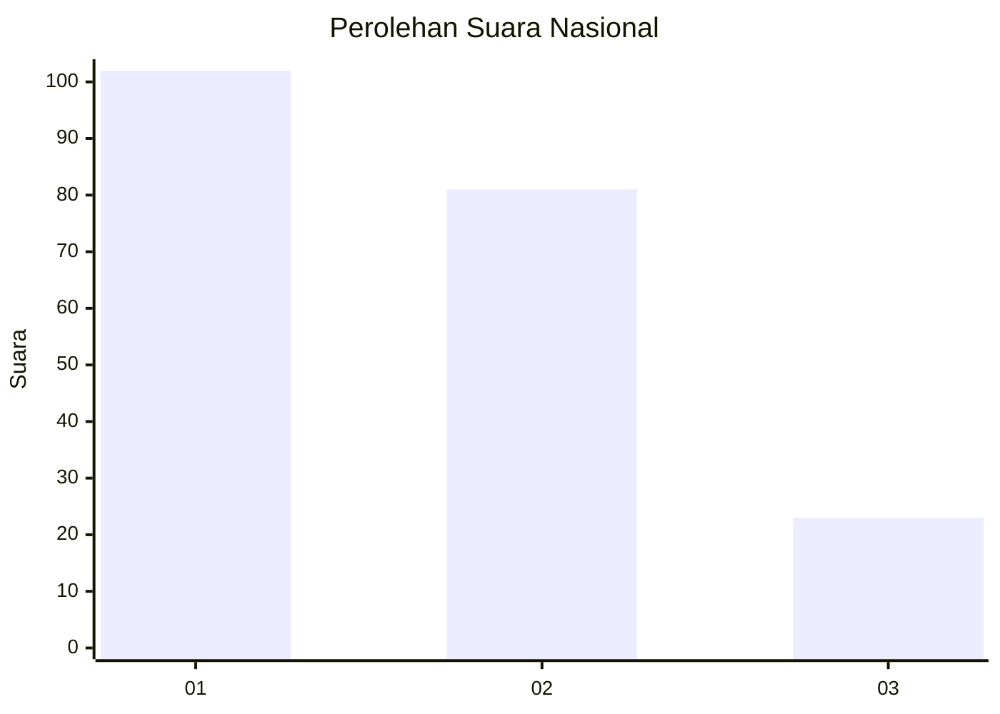
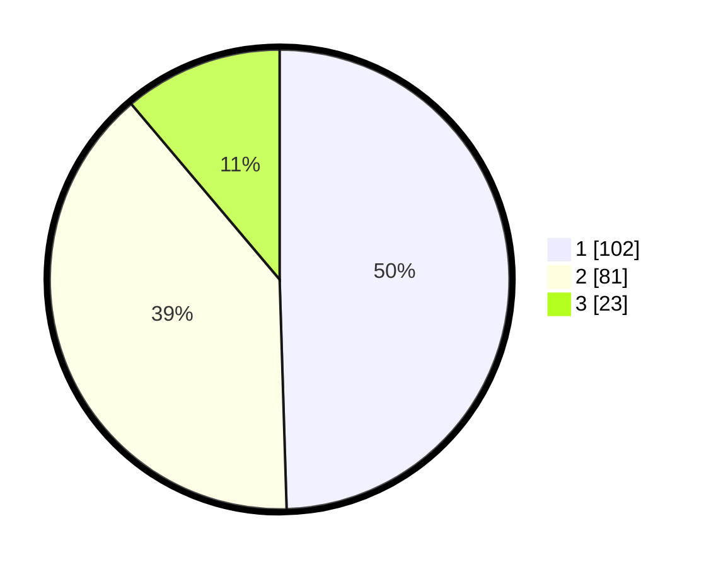

# Hasil

## Grafik

## Tabel

| No.    | Nama Paslon    | Suara | Suara (raw) | Persentase |
|:------ |:-------------- | -----:| -----------:| ----------:|
| 100025 | ANIES MUHAIMIN | 102   | [102][p-1]  | 49,51      |
| 100026 | PRABOWO GIBRAN | 81    | [81][p-2]   | 39,32      |
| 100027 | GANJAR MAHFUD  | 23    | [23][p-3]   | 11,17      |

[p-1]: https://github.com/gigit-pemilu/pemilu-2024/blob/main/pilpres/hitung-suara/sub/31-dki-jakarta/sub/72-jakarta-utara/sub/05-pademangan/sub/1002-pademangan-barat/sub/181-tps/sub/paslon-1.txt
[p-2]: https://github.com/gigit-pemilu/pemilu-2024/blob/main/pilpres/hitung-suara/sub/31-dki-jakarta/sub/72-jakarta-utara/sub/05-pademangan/sub/1002-pademangan-barat/sub/181-tps/sub/paslon-2.txt
[p-3]: https://github.com/gigit-pemilu/pemilu-2024/blob/main/pilpres/hitung-suara/sub/31-dki-jakarta/sub/72-jakarta-utara/sub/05-pademangan/sub/1002-pademangan-barat/sub/181-tps/sub/paslon-3.txt

## Foto C Plano

https://sirekap-obj-formc.kpu.go.id/9901/pemilu/ppwp/31/72/05/10/02/3172051002181-20240215-025146--4c4eca16-b65e-4861-b456-0a43b94b44cd.jpg

https://sirekap-obj-formc.kpu.go.id/9901/pemilu/ppwp/31/72/05/10/02/3172051002181-20240215-165728--3bb9d75e-519d-42cb-909d-122d4153a287.jpg

https://sirekap-obj-formc.kpu.go.id/9901/pemilu/ppwp/31/72/05/10/02/3172051002181-20240215-165826--e73c070d-cec5-465e-98e1-39c21a8a7852.jpg

## Metadata

| Key        | Value               |
| ---------- | ------------------- |
| Time Stamp | 2024-02-21 16:00:00 |

