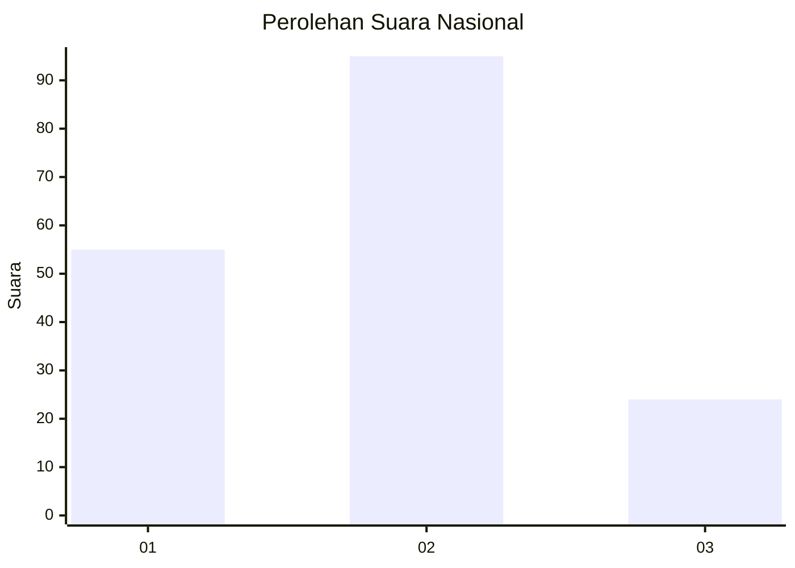
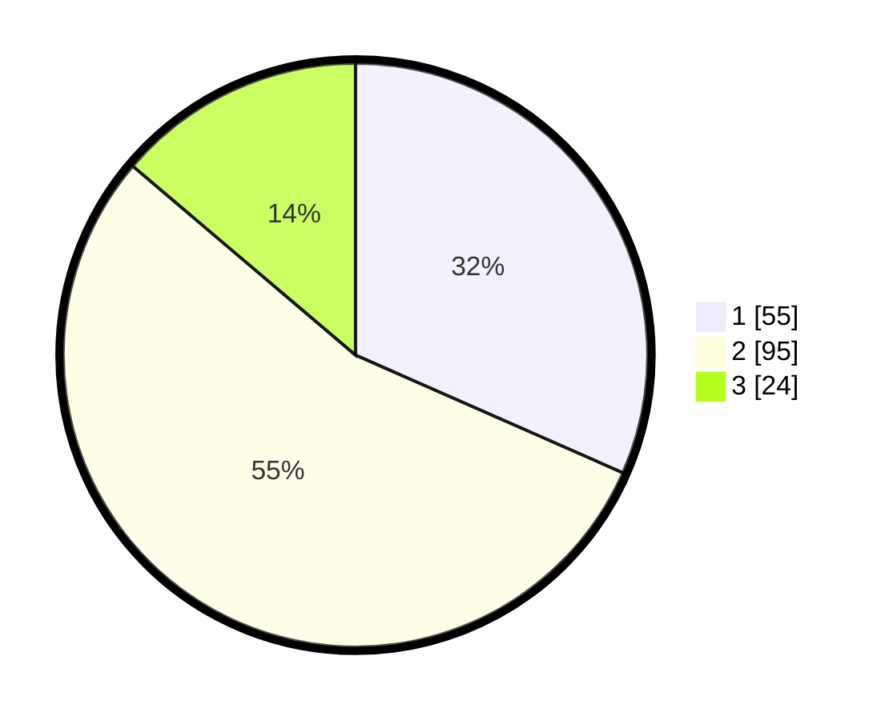

# Hasil

## Grafik

## Tabel

| No.    | Nama Paslon    | Suara | Suara (raw) | Persentase |
|:------ |:-------------- | -----:| -----------:| ----------:|
| 100025 | ANIES MUHAIMIN | 55    | [55][p-1]   | 31,61      |
| 100026 | PRABOWO GIBRAN | 95    | [95][p-2]   | 54,60      |
| 100027 | GANJAR MAHFUD  | 24    | [24][p-3]   | 13,79      |

[p-1]: https://github.com/gigit-pemilu/pemilu-2024/blob/main/pilpres/hitung-suara/sub/31-dki-jakarta/sub/72-jakarta-utara/sub/05-pademangan/sub/1002-pademangan-barat/sub/182-tps/sub/paslon-1.txt
[p-2]: https://github.com/gigit-pemilu/pemilu-2024/blob/main/pilpres/hitung-suara/sub/31-dki-jakarta/sub/72-jakarta-utara/sub/05-pademangan/sub/1002-pademangan-barat/sub/182-tps/sub/paslon-2.txt
[p-3]: https://github.com/gigit-pemilu/pemilu-2024/blob/main/pilpres/hitung-suara/sub/31-dki-jakarta/sub/72-jakarta-utara/sub/05-pademangan/sub/1002-pademangan-barat/sub/182-tps/sub/paslon-3.txt

## Foto C Plano

https://sirekap-obj-formc.kpu.go.id/202a/pemilu/ppwp/31/72/05/10/02/3172051002182-20240214-205009--112c7fb8-440e-4053-8957-ee056c3fd48e.jpg

https://sirekap-obj-formc.kpu.go.id/202a/pemilu/ppwp/31/72/05/10/02/3172051002182-20240214-205015--651d87c0-b306-47ca-b3e3-974685844825.jpg

https://sirekap-obj-formc.kpu.go.id/202a/pemilu/ppwp/31/72/05/10/02/3172051002182-20240214-205022--4ef041ec-b8a0-4d90-adbb-09fe94a4ad78.jpg

## Metadata

| Key        | Value               |
| ---------- | ------------------- |
| Time Stamp | 2024-02-21 16:00:00 |

