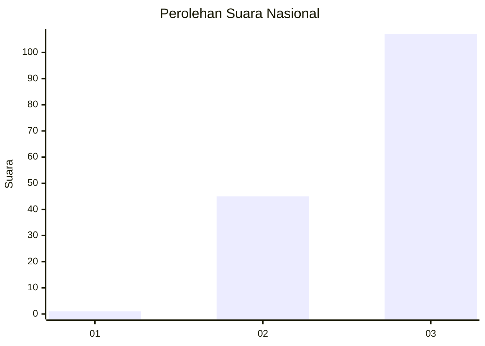
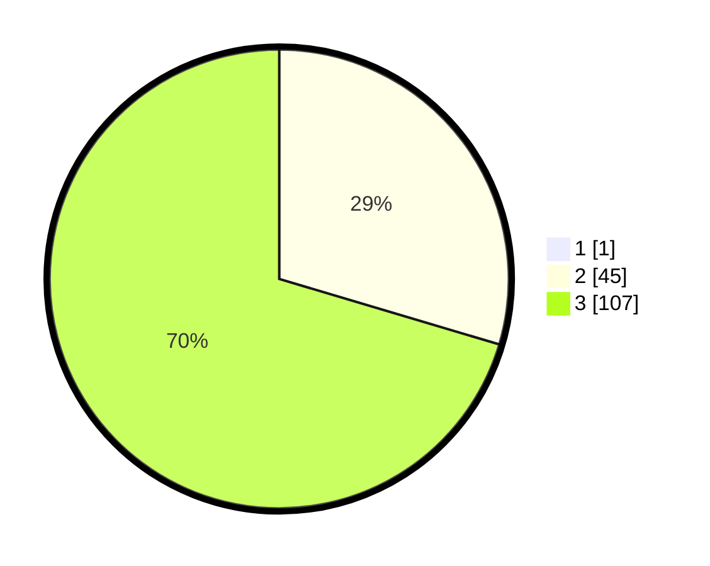

# Hasil

## Grafik

## Tabel

| No.    | Nama Paslon    | Suara | Suara (raw) | Persentase |
|:------ |:-------------- | -----:| -----------:| ----------:|
| 100025 | ANIES MUHAIMIN | 1     | [1][p-1]    | 0,65       |
| 100026 | PRABOWO GIBRAN | 45    | [45][p-2]   | 29,41      |
| 100027 | GANJAR MAHFUD  | 107   | [107][p-3]  | 69,93      |

[p-1]: https://github.com/gigit-pemilu/pemilu-2024/blob/main/pilpres/hitung-suara/sub/31-dki-jakarta/sub/72-jakarta-utara/sub/05-pademangan/sub/1002-pademangan-barat/sub/229-tps/sub/paslon-1.txt
[p-2]: https://github.com/gigit-pemilu/pemilu-2024/blob/main/pilpres/hitung-suara/sub/31-dki-jakarta/sub/72-jakarta-utara/sub/05-pademangan/sub/1002-pademangan-barat/sub/229-tps/sub/paslon-2.txt
[p-3]: https://github.com/gigit-pemilu/pemilu-2024/blob/main/pilpres/hitung-suara/sub/31-dki-jakarta/sub/72-jakarta-utara/sub/05-pademangan/sub/1002-pademangan-barat/sub/229-tps/sub/paslon-3.txt

## Foto C Plano

https://sirekap-obj-formc.kpu.go.id/6bd3/pemilu/ppwp/31/72/05/10/02/3172051002229-20240214-220805--64e4a284-1738-4c54-acea-7f23bfcf3a58.jpg

https://sirekap-obj-formc.kpu.go.id/6bd3/pemilu/ppwp/31/72/05/10/02/3172051002229-20240214-220912--5ff9cb51-6d50-4a0a-a650-c22943aab745.jpg

https://sirekap-obj-formc.kpu.go.id/6bd3/pemilu/ppwp/31/72/05/10/02/3172051002229-20240214-221020--c665d552-728c-49fe-84f2-281d05f8e7fb.jpg

## Metadata

| Key        | Value               |
| ---------- | ------------------- |
| Time Stamp | 2024-02-15 16:30:25 |

