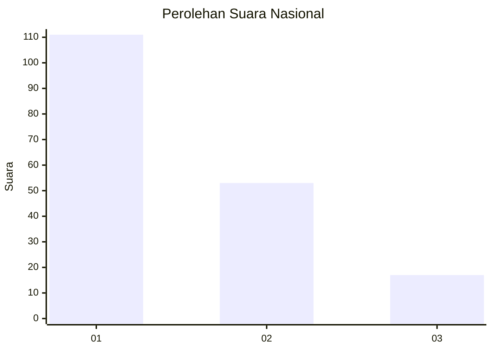
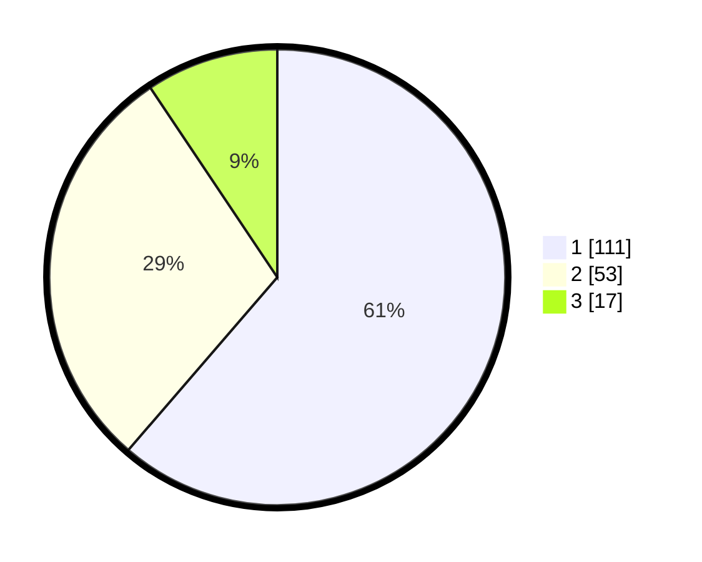

# Hasil

## Grafik

## Tabel

| No.    | Nama Paslon    | Suara | Suara (raw) | Persentase |
|:------ |:-------------- | -----:| -----------:| ----------:|
| 100025 | ANIES MUHAIMIN | 111   | [111][p-1]  | 61,33      |
| 100026 | PRABOWO GIBRAN | 53    | [53][p-2]   | 29,28      |
| 100027 | GANJAR MAHFUD  | 17    | [17][p-3]   | 9,39       |

[p-1]: https://github.com/gigit-pemilu/pemilu-2024/blob/main/pilpres/hitung-suara/sub/31-dki-jakarta/sub/72-jakarta-utara/sub/05-pademangan/sub/1002-pademangan-barat/sub/232-tps/sub/paslon-1.txt
[p-2]: https://github.com/gigit-pemilu/pemilu-2024/blob/main/pilpres/hitung-suara/sub/31-dki-jakarta/sub/72-jakarta-utara/sub/05-pademangan/sub/1002-pademangan-barat/sub/232-tps/sub/paslon-2.txt
[p-3]: https://github.com/gigit-pemilu/pemilu-2024/blob/main/pilpres/hitung-suara/sub/31-dki-jakarta/sub/72-jakarta-utara/sub/05-pademangan/sub/1002-pademangan-barat/sub/232-tps/sub/paslon-3.txt

## Foto C Plano

https://sirekap-obj-formc.kpu.go.id/0469/pemilu/ppwp/31/72/05/10/02/3172051002232-20240214-232911--673a2c23-e241-44fe-9b59-3d88b74fa5c7.jpg

https://sirekap-obj-formc.kpu.go.id/0469/pemilu/ppwp/31/72/05/10/02/3172051002232-20240214-233011--91ebade5-1f6a-4000-86c1-baee2c3bca8c.jpg

https://sirekap-obj-formc.kpu.go.id/0469/pemilu/ppwp/31/72/05/10/02/3172051002232-20240214-233102--e5e7e921-34cb-4a46-9553-35a48fa6b158.jpg

## Metadata

| Key        | Value               |
| ---------- | ------------------- |
| Time Stamp | 2024-02-21 20:00:00 |

