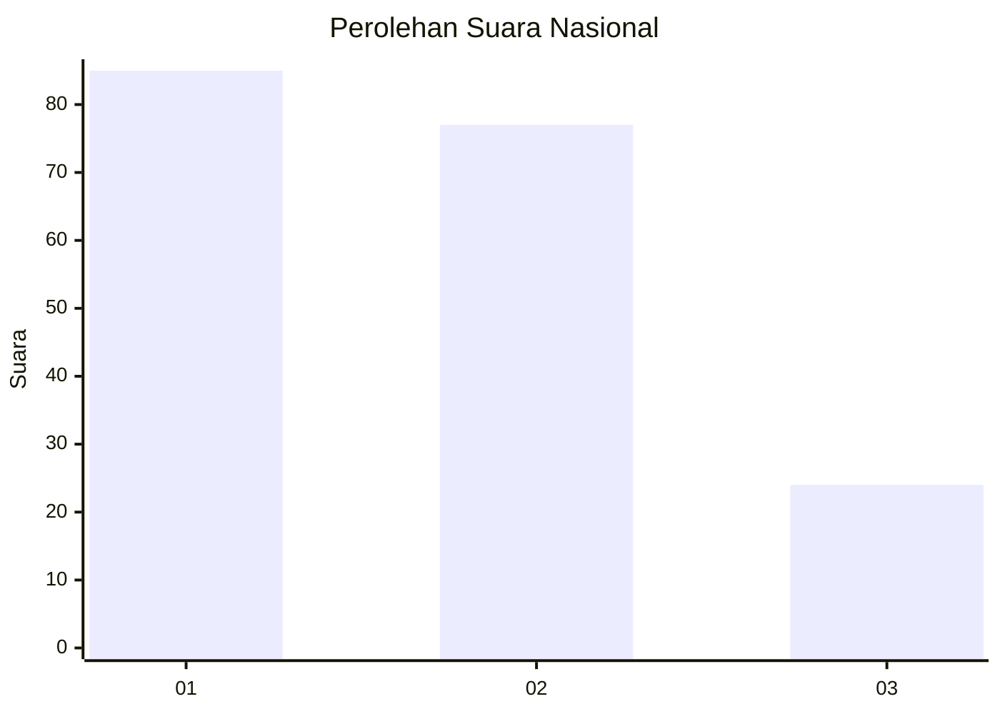
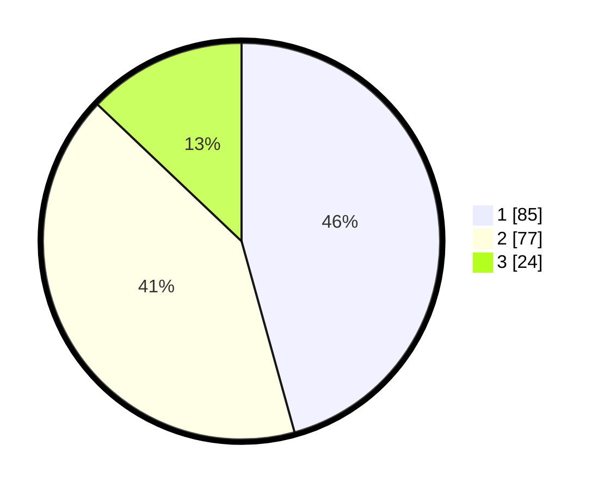

# Hasil

## Grafik

## Tabel

| No.    | Nama Paslon    | Suara | Suara (raw) | Persentase |
|:------ |:-------------- | -----:| -----------:| ----------:|
| 100025 | ANIES MUHAIMIN | 85    | [85][p-1]   | 45,70      |
| 100026 | PRABOWO GIBRAN | 77    | [77][p-2]   | 41,40      |
| 100027 | GANJAR MAHFUD  | 24    | [24][p-3]   | 12,90      |

[p-1]: https://github.com/gigit-pemilu/pemilu-2024/blob/main/pilpres/hitung-suara/sub/31-dki-jakarta/sub/72-jakarta-utara/sub/05-pademangan/sub/1002-pademangan-barat/sub/238-tps/sub/paslon-1.txt
[p-2]: https://github.com/gigit-pemilu/pemilu-2024/blob/main/pilpres/hitung-suara/sub/31-dki-jakarta/sub/72-jakarta-utara/sub/05-pademangan/sub/1002-pademangan-barat/sub/238-tps/sub/paslon-2.txt
[p-3]: https://github.com/gigit-pemilu/pemilu-2024/blob/main/pilpres/hitung-suara/sub/31-dki-jakarta/sub/72-jakarta-utara/sub/05-pademangan/sub/1002-pademangan-barat/sub/238-tps/sub/paslon-3.txt

## Foto C Plano

https://sirekap-obj-formc.kpu.go.id/277e/pemilu/ppwp/31/72/05/10/02/3172051002238-20240215-021202--5b1e3e4c-b030-4a71-b06e-0903d0b13825.jpg

https://sirekap-obj-formc.kpu.go.id/277e/pemilu/ppwp/31/72/05/10/02/3172051002238-20240215-021321--3cdbf9d9-6cf1-4bc9-8781-ba429c757e0d.jpg

https://sirekap-obj-formc.kpu.go.id/277e/pemilu/ppwp/31/72/05/10/02/3172051002238-20240215-021416--a3bd1c63-5876-4634-b77f-e1bf0ff2d9f0.jpg

## Metadata

| Key        | Value               |
| ---------- | ------------------- |
| Time Stamp | 2024-02-21 16:00:00 |

